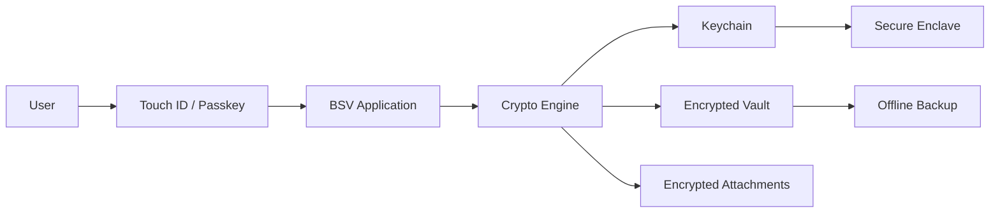
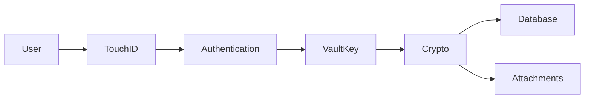
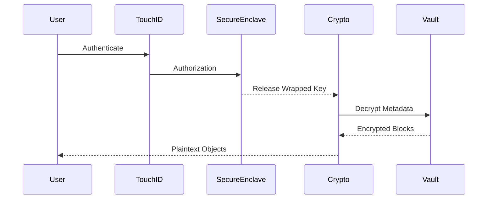
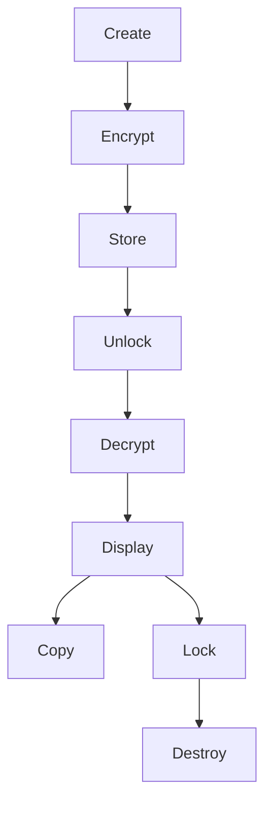
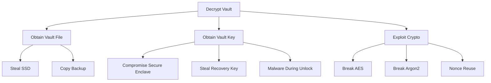
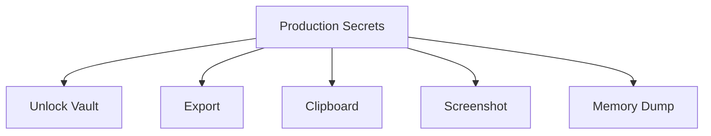
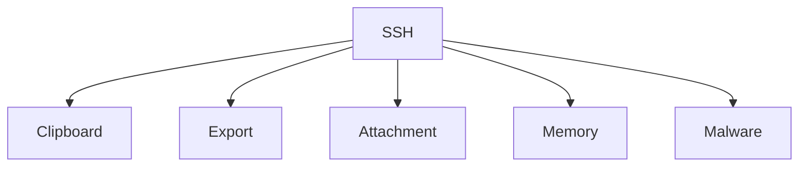
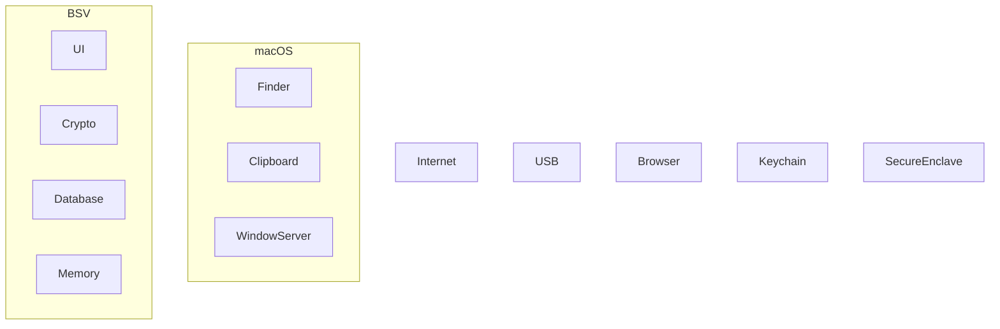

# Bithat Secure Vault (BSV)

> Enterprise Offline Secrets & Infrastructure Asset Vault

---

# 1. Executive Summary

Bithat Secure Vault (BSV) is an offline-first security platform designed to protect the most sensitive digital assets of individuals and engineering teams.

Unlike traditional password managers, BSV is designed as an **Infrastructure Asset Vault**, capable of managing passwords, API keys, certificates, SSH identities, cloud credentials, infrastructure metadata, recovery information, and operational documentation within a single encrypted repository.

The primary objective is to eliminate plaintext secret storage from developer workstations while providing an intuitive macOS-native experience comparable to Apple's Passwords application.

---

# 2. Vision

Build the most secure offline vault for developers, DevOps engineers, infrastructure administrators, and security teams.

The product should be:

- Offline-first
- Secure by default
- Enterprise-ready
- Cryptographically sound
- Beautiful and easy to use
- Extensible

---

# 3. Mission

Enable organizations to protect operational secrets without requiring permanent cloud connectivity while maintaining enterprise-grade security, usability, and auditability.

---

# 4. Product Philosophy

## Security before convenience

Convenience must never reduce security.

---

## Offline First

The vault must function completely offline.

Internet connectivity must never be required to unlock or use the vault.

---

## Zero Trust

Nothing is trusted automatically.

Every operation must require explicit authorization.

---

## Secure by Default

Every new vault starts with the highest available protection.

Users should never need to manually "enable security."

---

## Minimal Attack Surface

The application should expose as few services as possible.

No embedded web server.

No unnecessary background services.

No telemetry by default.

---

# 5. Product Goals

## Primary Goals

- Protect infrastructure secrets
- Protect passwords
- Protect certificates
- Protect recovery information
- Protect cloud credentials
- Protect API keys
- Protect private keys
- Protect operational documentation

---

## Secondary Goals

- Fast search
- Beautiful UI
- Automatic lock
- Secure clipboard
- Attachment encryption
- Passkey authentication
- Touch ID integration

---

# 6. Non Goals

The product is NOT intended to become:

- A cloud password manager
- An HSM
- A PKI
- A Certificate Authority
- A Secrets Synchronization Platform (v1)
- A Team Collaboration Tool (v1)

---

# 7. Target Users

## Individual Developers

Store:

- GitHub Tokens
- AWS Keys
- SSH Keys
- Certificates

---

## DevOps Engineers

Store:

- Terraform
- Kubernetes Secrets
- Production Credentials
- VPN Configurations

---

## Security Engineers

Store:

- Incident Recovery
- Root Credentials
- Emergency Keys

---

## Crypto Exchanges

Store:

- BitGo
- Elliptic
- Sumsub
- Notabene
- HSM Metadata
- Wallet Configuration

---

# 8. Product Editions

## Community

- Offline
- Single User
- Local Vault
- Attachments
- Search
- Tags

---

## Professional

Adds:

- Multiple Vaults
- Advanced Search
- Large Attachments
- Rotation Reminders
- Version History

---

## Enterprise

Adds:

- Shared Vaults
- RBAC
- Approval Workflow
- Audit
- SSO
- SCIM
- Policies

---

# 9. Core Features

## Vault

- Create
- Open
- Lock
- Unlock
- Backup
- Restore

---

## Secrets

- Password
- API Key
- Token
- Certificate
- SSH Key
- Recovery Code
- JWT Secret
- Database Credential
- Infrastructure Asset

---

## Attachments

Supported:

- PEM
- CRT
- PFX
- P12
- OVPN
- JSON
- YAML
- ZIP
- PDF
- Images

---

## Search

Support:

- Title
- Tags
- Environment
- Owner
- Description
- Metadata

---

## Organization

Folders

Collections

Tags

Favorites

Archived

Deleted

---

# 10. Asset Types

Each secret is represented as an Asset.

Example:

AWS Production

Contains:

- Account ID
- IAM User
- Access Key
- Secret Key
- Region
- MFA
- Console URL
- Notes
- Attachments

---

Example:

BitGo Production

Contains:

- API Key
- API Secret
- Wallet IDs
- Webhook Secret
- Certificate
- Environment
- Owner
- Rotation Policy

---

# 11. Security Principles

No plaintext secrets on disk.

No plaintext attachments.

Clipboard auto-clear.

Automatic locking.

Secure memory handling.

Authenticated encryption.

Strong cryptography only.

---

# 12. Functional Requirements

The application shall:

- Create encrypted vaults
- Open encrypted vaults
- Lock automatically
- Support Touch ID
- Support Passkeys
- Encrypt attachments
- Support search
- Export encrypted backups

---

# 13. Non Functional Requirements

Unlock time:

< 300 ms

Search:

< 100 ms

Maximum Vault Size:

Unlimited

Maximum Attachment:

Configurable

Offline Availability:

100%

---

# 14. Roadmap

## Version 1

Offline Vault

Touch ID

Passkeys

Attachments

Search

Backup

---

## Version 2

Encrypted Sync

Windows

Linux

iOS

Android

---

## Version 3

Enterprise

RBAC

Approval Workflow

Audit

Policy Engine

---

# 15. Success Metrics

Unlock Time

Memory Usage

Crash Rate

Security Findings

Penetration Test Results

User Satisfaction

---

# 16. Open Questions

Should mobile support be introduced before enterprise features?

Should cloud synchronization remain optional?

Should vaults support multiple encryption algorithms?

---

# 17. References

- Apple Platform Security Guide
- NIST SP 800-63B
- OWASP ASVS
- OWASP MASVS
- RFC 9106 (Argon2)
- FIDO2 Specifications
- WebAuthn Level 3
- CryptoKit Documentation

---

# End of RFC-0001
---
rfc: RFC-0002
title: Threat Model
version: 1.0
status: Draft
classification: Internal
author: Bithat Security Team
---

# Part 1 — Executive Summary & Security Context

---

# 1. Purpose

This document defines the formal threat model for the Bithat Secure Vault (BSV).

It establishes the security assumptions, trust boundaries, protected assets, attacker profiles, security objectives, and risk management methodology that govern every architectural decision within the platform.

Every subsequent RFC (Cryptography, Authentication, Storage Engine, Database, APIs, UI, Enterprise) depends on this document.

---

# 2. Scope

This RFC covers:

- Threat identification
- Threat classification
- Attack surface analysis
- Trust boundaries
- Asset inventory
- Security objectives
- Attacker capabilities
- Risk assessment
- Required mitigations

Out of scope:

- Cryptographic implementation details
- API specification
- Database schema
- UI design

Those subjects are covered in later RFCs.

---

# 3. Product Context

Bithat Secure Vault is an offline-first encrypted vault used to protect operational assets.

Unlike conventional password managers, BSV stores complete infrastructure assets including:

- Passwords
- API Keys
- JWT Secrets
- SSH Identities
- TLS Certificates
- Infrastructure Metadata
- Kubernetes Credentials
- Cloud Credentials
- Recovery Information
- Wallet Metadata
- Exchange Configuration
- Secure Attachments

The compromise of any of these assets may directly affect financial systems, production environments, cloud infrastructure, or customer funds.

Therefore, BSV is considered a High Assurance Security Product.

---

# 4. Security Objectives

The following objectives are mandatory.

## SO-001 Confidentiality

Unauthorized parties shall never obtain plaintext access to vault contents.

---

## SO-002 Integrity

Unauthorized modification of vault contents must be detectable.

---

## SO-003 Availability

Authorized users shall always be able to access the vault while offline.

---

## SO-004 Authenticity

Every unlock operation must verify user identity before exposing plaintext secrets.

---

## SO-005 Recoverability

Loss of one authentication mechanism must not permanently destroy access if approved recovery methods exist.

---

## SO-006 Auditability

Security-sensitive actions shall generate immutable audit events.

---

## SO-007 Forward Security

Compromise of one session must not expose previous encrypted backups.

---

# 5. Security Principles

Every engineering decision shall follow these principles.

## Principle 1

Offline First

No permanent dependency on cloud services.

---

## Principle 2

Secure by Default

Users should not need to configure security.

---

## Principle 3

Least Privilege

Every component receives the minimum permissions required.

---

## Principle 4

Fail Secure

Any unexpected failure results in a locked vault.

---

## Principle 5

Defense in Depth

No single mechanism is considered sufficient.

---

## Principle 6

No Proprietary Cryptography

Only publicly reviewed algorithms shall be used.

---

## Principle 7

Minimal Trusted Computing Base

Reduce code that handles plaintext.

---

# 6. Protected Assets

The following assets require protection.

## Category A — Authentication

Master Unlock Token

Vault Unlock Key

Recovery Key

Passkey Metadata

Session Token

Authentication State

---

## Category B — Secrets

Passwords

API Keys

OAuth Tokens

JWT Secrets

Database Credentials

Redis Credentials

Kafka Credentials

SMTP Credentials

Cloud Credentials

Infrastructure Tokens

---

## Category C — Private Keys

SSH Keys

TLS Private Keys

Code Signing Keys

Apple Certificates

Android Signing Keys

GPG Keys

Age Keys

WireGuard Keys

VPN Keys

---

## Category D — Certificates

TLS Certificates

Client Certificates

PKCS#12

PEM

CRT

PFX

---

## Category E — Infrastructure

AWS Accounts

Azure Accounts

GCP Accounts

Cloudflare Accounts

Terraform Metadata

Kubernetes Clusters

Docker Registries

BitGo Configuration

Sumsub Configuration

Elliptic Configuration

Notabene Configuration

---

## Category F — Attachments

PDF

ZIP

YAML

JSON

Terraform Files

Runbooks

Architecture Documents

Images

Recovery Procedures

---

# 7. Asset Classification

Every stored asset shall be assigned one of the following classifications.

Level 0

Public

No protection required.

---

Level 1

Internal

Business information.

---

Level 2

Confidential

Disclosure causes operational damage.

---

Level 3

Restricted

Disclosure causes severe business impact.

---

Level 4

Critical

Disclosure may lead to financial loss or compromise of customer assets.

Most production secrets belong to Level 4.

---

# 8. Threat Actors

The following attacker profiles are considered.

## TA-001

Curious User

Capabilities:

- Reads local files
- Attempts password guessing

Motivation:

Curiosity

---

## TA-002

Laptop Thief

Capabilities

Physical possession

Unlimited offline access

Storage duplication

---

## TA-003

Malware

Capabilities

Runs with user privileges

Reads clipboard

Screenshots

Keylogging

Filesystem access

---

## TA-004

Privileged Malware

Capabilities

Root privileges

Memory inspection

Hook system APIs

---

## TA-005

Malicious Insider

Capabilities

Legitimate application access

Attempts unauthorized export

---

## TA-006

Cloud Attacker

Capabilities

Intercepts backups

Downloads copied vault

Attempts offline decryption

---

## TA-007

Nation-State

Capabilities

Advanced malware

Long-term persistence

Hardware attacks

Supply chain attacks

Unlimited computation (excluding practical cryptographic breaks)

---

# 9. Assumptions

The following assumptions define the security boundary.

We assume:

✔ Modern macOS

✔ Secure Enclave available

✔ FileVault enabled

✔ Hardware encryption

✔ User has administrative control

We do NOT assume:

✘ Operating system is malware-free

✘ Clipboard is trusted

✘ RAM is inaccessible

✘ Browser extensions are trustworthy

✘ Cloud storage providers are trusted

---

# 10. Trust Zones

Zone 0

Internet

Completely untrusted.

---

Zone 1

Encrypted Vault File

Trusted only after successful integrity verification.

---

Zone 2

Application Runtime

Trusted only while authenticated.

---

Zone 3

Secure Enclave

Highest trust.

---

Zone 4

User

Trusted after successful authentication.

---

# 11. Security Boundary

The following components are inside the trusted boundary:

- Secure Enclave
- Crypto Engine
- Vault Database
- Memory Protection Layer

Outside the boundary:

- Internet
- Clipboard
- Finder
- Backup Media
- Browser
- External Applications

---

# 12. Initial Risk Statement

The greatest risks identified at this stage are:

1. Offline brute-force against stolen vaults.
2. Malware stealing plaintext while the vault is unlocked.
3. Unauthorized export of secrets.
4. Leakage through clipboard or screenshots.
5. Supply-chain compromise of the application.
6. Memory scraping attacks.
7. Recovery-key theft.
8. Social engineering against the user.

Each of these risks will be analyzed in subsequent sections using STRIDE, attack trees, and quantitative risk scoring.

---

# End of Part 1
# RFC-0002 — Threat Model

# Part 2 — System Context, Data Flow & Trust Boundaries

---

# 13. System Overview

This section describes how information moves through the system.

Understanding data flow is essential because nearly every security control is applied to data in motion rather than data at rest.

The objective is to identify every location where sensitive information exists, even for a few milliseconds.

Those locations define the attack surface.

---

# 14. High-Level System Context



---

# Security Boundary

Inside Trusted Boundary

- Application
- Crypto Engine
- Keychain
- Secure Enclave
- Vault Database
- Attachment Store

Outside Trusted Boundary

- User Clipboard
- Browser
- Finder
- External Drives
- Internet
- Cloud Storage
- Email
- Third-party Applications

---

# 15. Data Flow Level 0


This represents the logical relationship only.

Sensitive data never flows directly from the user to storage.

All plaintext must first pass through the Crypto Engine.

---

# 16. Data Flow Level 1



Sensitive plaintext exists only between

Authentication

↓

Crypto

↓

Memory

↓

User Interface

---

# 17. Data Flow Level 2

Vault Unlock Sequence



Critical observation

The Secure Enclave never decrypts the vault.

It merely authorizes access to the wrapped Vault Key.

---

# 18. Data Classification During Flow

Stage 1

Encrypted

Location

Disk

Risk

Very Low

---

Stage 2

Encrypted

Location

RAM

Risk

Low

---

Stage 3

Vault Key

Location

RAM

Risk

High

---

Stage 4

Plaintext Secret

Location

RAM

Risk

Critical

---

Stage 5

Clipboard

Location

System

Risk

Very High

---

Stage 6

Screen

Location

GPU

Risk

High

---

# 19. Sensitive Data Lifecycle



Each transition represents a possible attack point.

---

# 20. Trust Boundary Analysis

Boundary A

User

↓

Touch ID

Risk

Spoofing

Mitigation

LocalAuthentication

Secure Enclave

---

Boundary B

Touch ID

↓

Application

Risk

Authentication bypass

Mitigation

System APIs only

No custom biometric logic

---

Boundary C

Application

↓

Crypto Engine

Risk

Memory interception

Mitigation

Minimal plaintext lifetime

---

Boundary D

Crypto Engine

↓

Database

Risk

Plaintext persistence

Mitigation

AES-GCM only

Never store plaintext

---

Boundary E

Application

↓

Clipboard

Risk

Clipboard theft

Mitigation

Auto-clear

User warning

Optional disable

---

Boundary F

Application

↓

Filesystem

Risk

Plaintext attachment

Mitigation

Temporary encrypted buffers only

---

# 21. Entry Points

Every entry point increases attack surface.

Current entry points

Application Launch

Touch ID

Passkey

Recovery Key

Import

Export

Backup

Restore

Search

Drag and Drop

Attachment Viewer

Quick Look

Clipboard

Context Menu

Spotlight Integration (future)

---

# 22. Exit Points

Clipboard

Export

Backup

Print

Drag and Drop

Share Sheet

Attachment Extraction

Temporary Files

Crash Dumps

Logs

Every exit point must be evaluated individually.

---

# 23. Memory Exposure Points

Sensitive information exists in RAM during

Unlock

Viewing Secret

Editing Secret

Copying Secret

Attachment Preview

Searching

Export

Backup

Memory must be treated as hostile.

---

# 24. Filesystem Exposure

Allowed

Encrypted Vault

Encrypted Attachments

Encrypted Backup

Logs without Secrets

Forbidden

Plaintext JSON

Plaintext SQLite

Plaintext PEM

Temporary Secret Files

Recovered Attachments

---

# 25. Network Exposure

Version 1

No Internet Required

Network connections are prohibited except

Software Update (future)

License Verification (Enterprise)

Crash Reporting (opt-in)

Everything else remains offline.

---

# 26. External Dependencies

Apple LocalAuthentication

CryptoKit

Security Framework

SQLite

Keychain Services

Secure Enclave

No dependency shall receive plaintext vault contents.

---

# 27. Third-Party Libraries

Third-party libraries shall never

Perform encryption

Handle authentication

Access plaintext secrets

Implement cryptographic primitives

Cryptographic operations must rely on Apple-provided APIs whenever possible.

---

# 28. Hardware Trust Model

Trusted

Secure Enclave

Apple Silicon Memory Protection

Hardware AES

FileVault

Untrusted

USB Devices

External SSD

Thunderbolt Devices

Network

Bluetooth

External Displays

---

# 29. Initial Attack Surface Inventory

| Component | Attack Surface | Initial Risk |
|-----------|---------------|--------------|
| Unlock Flow | Biometric bypass | High |
| Crypto Engine | Memory attacks | Critical |
| Clipboard | Secret leakage | Critical |
| Attachments | File extraction | High |
| Search | Metadata leakage | Medium |
| Backup | Offline theft | High |
| Export | Insider abuse | High |
| Import | Malicious files | High |
| Recovery Key | Theft | Critical |
| Logs | Information disclosure | Medium |

---

# 30. Design Constraints Derived From This Analysis

The following architectural constraints become mandatory.

DC-001

Secrets shall never be written to disk in plaintext.

---

DC-002

Clipboard shall automatically clear after a configurable timeout.

---

DC-003

Every decrypted object shall have the shortest practical lifetime in memory.

---

DC-004

Attachments shall be encrypted independently from the database.

---

DC-005

Unlock operations must never expose the Vault Key outside the Crypto Layer.

---

DC-006

Recovery Keys shall never be stored in plaintext.

---

DC-007

Crash reports shall never contain secrets.

---

DC-008

Logging shall never include credentials.

---

# 31. Preparation for STRIDE

The next section (Part 3) will apply Microsoft's STRIDE methodology to every major subsystem:

- Authentication
- Vault File
- Crypto Engine
- Database
- Attachments
- Clipboard
- Search
- Backup
- Recovery
- UI
- Memory
- Keychain
- Secure Enclave

Each subsystem will receive:

- Threat IDs
- Risk Scores
- Likelihood
- Impact
- Mitigations
- Residual Risk
- Verification Method

---

# End of Part 2
# RFC-0002 — Threat Model

# Part 3 — STRIDE Threat Analysis

Version: 1.0

---

# 32. STRIDE Methodology

This RFC adopts Microsoft's STRIDE framework as the primary threat classification model.

Every component shall be evaluated against six categories.

| Category | Description |
|----------|-------------|
| S | Spoofing Identity |
| T | Tampering |
| R | Repudiation |
| I | Information Disclosure |
| D | Denial of Service |
| E | Elevation of Privilege |

Every identified threat receives:

- Threat ID
- Component
- STRIDE Classification
- Description
- Preconditions
- Attack Steps
- Likelihood
- Impact
- Risk Rating
- Mitigations
- Detection
- Residual Risk

---

# Component A — Authentication

---

## TM-0001

Title

Biometric Authentication Bypass

Category

Spoofing

Risk

Critical

Description

An attacker attempts to bypass Touch ID or Passkey authentication by exploiting software vulnerabilities or operating system weaknesses.

Attack Preconditions

- Physical access
- Running macOS session
- Biometric enrolled

Impact

Complete vault compromise.

Mitigation

Use only Apple's LocalAuthentication framework.

No custom biometric implementation.

Require Secure Enclave authorization.

Residual Risk

Very Low

Verification

Penetration testing.

Apple security updates.

---

## TM-0002

Title

Fake Login Window

Category

Spoofing

Risk

High

Description

Malware displays a fake unlock window to steal recovery credentials.

Mitigation

Never implement custom password dialogs.

Always use system authentication APIs.

Recovery Key entry shall use Secure Text Entry.

Residual Risk

Medium

---

## TM-0003

Title

Passkey Replay

Category

Spoofing

Risk

Low

Description

Attacker attempts replay of previously captured authentication material.

Mitigation

Rely on WebAuthn challenge-response.

No reusable authentication tokens.

Residual Risk

Negligible.

---

# Component B — Vault File

---

## TM-0010

Title

Vault File Theft

Category

Information Disclosure

Risk

Critical

Scenario

Attacker steals encrypted SSD.

Copies

vault.bsv

Attempts offline decryption.

Mitigation

AES-256-GCM

Argon2id

256-bit Vault Key

Random Salt

Integrity Verification

Residual Risk

Low.

---

## TM-0011

Title

Header Manipulation

Category

Tampering

Risk

High

Description

Attacker modifies vault header.

Mitigation

Authenticated header.

Header checksum.

Version validation.

Digital signature.

---

## TM-0012

Title

Vault Rollback

Category

Tampering

Risk

Medium

Description

Older vault replaces newer vault.

Mitigation

Vault generation counter.

Last Modified validation.

Optional signed backup history.

---

# Component C — Crypto Engine

---

## TM-0020

Title

Weak Random Number Generation

Category

Tampering

Risk

Critical

Mitigation

Use SecRandomCopyBytes()

Never implement custom RNG.

Reject insufficient entropy.

---

## TM-0021

Title

Nonce Reuse

Category

Tampering

Risk

Critical

Description

AES-GCM nonce reused.

Impact

Catastrophic.

Mitigation

Random 96-bit nonce.

Never deterministic.

Verification

Unit tests.

Fuzz tests.

Static analysis.

---

## TM-0022

Title

Key Reuse

Category

Information Disclosure

Risk

Critical

Mitigation

Unique Data Encryption Key per attachment.

Vault Key wraps DEKs.

---

# Component D — Memory

---

## TM-0030

Title

Memory Scraping

Category

Information Disclosure

Risk

Critical

Description

Malware scans RAM.

Mitigation

Short plaintext lifetime.

Zero sensitive buffers.

Avoid unnecessary copies.

Residual Risk

Medium.

Reason

Impossible to eliminate while unlocked.

---

## TM-0031

Title

Swap Leakage

Category

Information Disclosure

Risk

Medium

Description

Secrets written to swap.

Mitigation

Minimize plaintext.

Encourage FileVault.

Memory-safe APIs.

---

## TM-0032

Title

Crash Dump Leakage

Category

Information Disclosure

Risk

High

Mitigation

Sensitive buffers excluded.

Crash reports sanitized.

No plaintext logging.

---

# Component E — Clipboard

---

## TM-0040

Title

Clipboard Monitoring

Category

Information Disclosure

Risk

Critical

Description

Background application continuously reads clipboard.

Mitigation

Clipboard timeout.

Clipboard overwrite.

Optional clipboard disable.

Notification after copy.

Residual Risk

Medium.

---

## TM-0041

Title

Clipboard History

Category

Information Disclosure

Risk

High

Mitigation

Detect clipboard managers where possible.

Warn users.

Enterprise policy.

---

# Component F — Attachments

---

## TM-0050

Title

Temporary File Leakage

Category

Information Disclosure

Risk

Critical

Mitigation

Never create plaintext temp files.

Decrypt in memory.

Secure deletion.

---

## TM-0051

Title

Attachment Extraction

Category

Information Disclosure

Risk

High

Description

User exports attachment.

Attacker copies exported version.

Mitigation

Explicit warning.

Audit log.

Optional expiration.

---

# Component G — Search

---

## TM-0060

Title

Metadata Leakage

Category

Information Disclosure

Risk

Medium

Mitigation

Encrypted metadata.

No searchable plaintext index.

Search after unlock only.

---

## TM-0061

Title

Timing Analysis

Category

Information Disclosure

Risk

Low

Mitigation

Consistent search implementation.

Avoid observable metadata.

---

# Component H — Export

---

## TM-0070

Title

Mass Secret Export

Category

Repudiation

Risk

Critical

Mitigation

Touch ID confirmation.

Audit event.

Enterprise approval.

Optional export disable.

---

## TM-0071

Title

Unauthorized Backup

Category

Information Disclosure

Risk

High

Mitigation

Encrypted backup only.

Passwordless plaintext export prohibited.

---

# Component I — Logging

---

## TM-0080

Title

Secrets in Logs

Category

Information Disclosure

Risk

Critical

Mitigation

Structured logging.

Automatic redaction.

Security review.

Static scanning.

---

## TM-0081

Title

Verbose Debug Mode

Category

Information Disclosure

Risk

Medium

Mitigation

Production builds disable verbose logging.

---

# Component J — Recovery Keys

---

## TM-0090

Title

Recovery Key Theft

Category

Information Disclosure

Risk

Critical

Mitigation

Printable recovery package.

Offline storage.

Optional secret splitting.

Rotation support.

---

## TM-0091

Title

Recovery Key Guessing

Category

Spoofing

Risk

Very Low

Mitigation

256-bit entropy.

Random generation.

No user-generated recovery phrases.

---

# Component K — Updates

---

## TM-0100

Title

Malicious Update

Category

Elevation of Privilege

Risk

Critical

Mitigation

Apple Notarization.

Code Signing.

Signature verification.

Rollback protection.

---

## TM-0101

Title

Supply Chain Attack

Category

Tampering

Risk

Critical

Mitigation

SBOM.

Dependency verification.

Reproducible builds.

Signed releases.

---

# Initial Risk Summary

| Severity | Count |
|-----------|------:|
| Critical | 14 |
| High | 11 |
| Medium | 6 |
| Low | 3 |

Critical threats become mandatory engineering requirements.

---

# Outputs of Part 3

The following RFCs will directly consume this analysis:

RFC-0003 Cryptographic Architecture

RFC-0004 Authentication

RFC-0005 Vault Storage Format

RFC-0006 Key Management

RFC-0007 Secure Enclave

RFC-0011 Backup

RFC-0015 Enterprise Security

---

# End of Part 3
# RFC-0002 — Threat Model

# Part 4 — Attack Trees, Kill Chains & Abuse Cases

Version 1.0

---

# 33. Purpose

Threats by themselves are not enough.

Security engineers must understand:

- how attacks begin,
- how they evolve,
- which assets become exposed,
- which controls stop them,
- where detection should occur.

This chapter models complete attacker journeys.

---

# 34. Attack Tree Methodology

Each attack tree contains

Goal

↓

Prerequisites

↓

Attack Steps

↓

Decision Points

↓

Mitigations

↓

Residual Risk

Attack trees are independent from implementation details.

---

# 35. Primary Security Objectives

The attacker attempts one or more of the following.

SO-01

Obtain plaintext secrets.

SO-02

Modify vault contents.

SO-03

Prevent legitimate access.

SO-04

Steal authentication factors.

SO-05

Steal recovery material.

SO-06

Persist inside the system.

SO-07

Exfiltrate infrastructure assets.

---

# Attack Tree 1

Goal

Decrypt Vault



Analysis

Breaking AES-256 is considered infeasible.

Breaking Argon2 is considered infeasible.

The realistic attack path is malware during unlock.

Therefore,

memory protection becomes more important than stronger encryption.

---

# Attack Tree 2

Goal

Steal Production Secrets



Most likely branch

Clipboard

↓

Clipboard History

↓

Malware

↓

Exfiltration

Mitigation

Clipboard timeout

Clipboard overwrite

Enterprise clipboard policy

---

# Attack Tree 3

Goal

Compromise Recovery

```mermaid
graph TD

Recovery

--> Printed Recovery Key

Recovery

--> Photograph

Recovery

--> Backup Copy

Recovery

--> Cloud Storage

Recovery

--> Social Engineering
```

Mitigations

Recovery package warnings

Split recovery

Optional Shamir Secret Sharing

Printed QR checksum

---

# Attack Tree 4

Goal

Modify Vault

```mermaid
graph TD

Vault

--> Replace Database

Vault

--> Rollback

Vault

--> Header Tampering

Vault

--> Attachment Swap
```

Mitigation

Authenticated Encryption

Version Counters

Integrity Verification

Generation Number

---

# Attack Tree 5

Goal

Steal Private Keys



Mitigation

No plaintext export

TouchID confirmation

Audit

Attachment encryption

---

# Attack Tree 6

Goal

Compromise Enterprise Deployment

```mermaid
graph TD

Enterprise

--> Insider

Enterprise

--> Stolen Laptop

Enterprise

--> Shared Vault

Enterprise

--> Approval Abuse

Enterprise

--> API Abuse
```

Mitigation

RBAC

Approval Workflow

Immutable Audit

Least Privilege

---

# 36. Kill Chain Analysis

Attack Scenario

Laptop Theft

Stage 1

Reconnaissance

Attacker discovers vault.

↓

Stage 2

Acquisition

Copies vault.

↓

Stage 3

Offline Attack

Attempts password guessing.

↓

Stage 4

Failure

Argon2

↓

Stage 5

Social Engineering

Attempts recovery key theft.

↓

Stage 6

Failure

Recovery protected offline.

Result

Attack unsuccessful.

---

# Kill Chain

Malware

Stage 1

User downloads malware.

↓

Stage 2

Persistence.

↓

Stage 3

User unlocks vault.

↓

Stage 4

Memory inspection.

↓

Stage 5

Clipboard monitoring.

↓

Stage 6

Secret exfiltration.

Risk

Critical.

Observation

No password manager can fully prevent this.

Mitigation

Reduce plaintext lifetime.

---

# Kill Chain

Supply Chain

Stage 1

Malicious dependency.

↓

Stage 2

Compiled into release.

↓

Stage 3

Secrets intercepted.

Mitigation

SBOM

Dependency verification

Signed releases

Reproducible builds

---

# 37. Abuse Cases

AC-001

Developer exports entire vault to Desktop.

Risk

Critical.

Mitigation

Warning

TouchID

Audit

Optional disable.

---

AC-002

Developer copies AWS Root Password.

Leaves for lunch.

Clipboard stolen.

Mitigation

Auto-clear.

---

AC-003

Developer emails vault backup.

Mitigation

Encrypted backup only.

---

AC-004

User stores recovery key inside the vault.

Result

Recovery impossible.

Mitigation

Application warning.

Recovery validation wizard.

---

AC-005

User stores Apple Certificate unencrypted.

Mitigation

Automatic attachment encryption.

---

AC-006

Developer disables FileVault.

Mitigation

Security warning.

Compliance dashboard.

---

# 38. Insider Threat Analysis

Threat

Authorized employee exports secrets.

Likelihood

Medium.

Impact

Critical.

Controls

RBAC

Export approval

Immutable audit

Watermarking

Behavior monitoring

---

# 39. Human Error Analysis

The following user mistakes are expected.

Saving recovery key in iCloud Notes.

Saving passwords in screenshots.

Sharing exported attachments.

Weak recovery storage.

Disabling automatic locking.

Ignoring expiration reminders.

The application shall guide users toward secure behavior.

---

# 40. Threat Prioritization

Priority 0

Must eliminate

Plaintext storage

Weak encryption

Unsigned updates

---

Priority 1

Must strongly mitigate

Clipboard leakage

Memory scraping

Export abuse

---

Priority 2

Acceptable residual risk

Malware during unlocked session

Root compromise

Nation-state hardware attacks

---

# 41. Security Decisions Derived

Based on this chapter, the following engineering decisions become mandatory.

✓ Touch ID required for export.

✓ Clipboard timeout mandatory.

✓ AES-GCM only.

✓ Attachment encryption mandatory.

✓ No plaintext temporary files.

✓ No browser extension in Version 1.

✓ Offline-first architecture.

✓ Recovery key generated automatically.

✓ Immutable audit events.

---

# Deliverables Produced by Part 4

The following specifications depend on these findings.

RFC-0003

Cryptography

RFC-0004

Authentication

RFC-0005

Storage Format

RFC-0008

Enterprise RBAC

RFC-0012

Audit Log

RFC-0018

Incident Response

---

# End of Part 4
# RFC-0002 — Threat Model

# Part 5 — Security Controls & Defensive Architecture

Version 1.0

---

# 42. Introduction

This chapter defines every mandatory security control required by BSV.

A threat without a mitigation is unacceptable.

Every identified threat shall map to at least one preventive, detective,
or corrective control.

Every control shall later map directly to implementation requirements.

---

# 43. Security Control Categories

Controls are divided into:

Preventive

Detective

Corrective

Compensating

Administrative

Technical

Physical

---

# 44. Preventive Controls

These controls stop attacks before they succeed.

Examples

• AES-256-GCM encryption

• Secure Enclave

• Passkeys

• Touch ID

• Keychain

• Signed Releases

• App Sandbox

• Hardened Runtime

• Secure Memory

• Clipboard Timeout

---

# 45. Detective Controls

These controls identify attacks.

Examples

Audit Log

Integrity Verification

Tamper Detection

Vault Version Validation

Unexpected Unlock Detection

Multiple Failed Unlock Attempts

Recovery Key Usage Logging

Attachment Integrity Verification

---

# 46. Corrective Controls

These controls help recover.

Examples

Encrypted Backups

Recovery Keys

Automatic Lock

Key Rotation

Attachment Re-encryption

Emergency Recovery

---

# 47. Security Control Matrix

| Threat | Control |
|---------|----------|
| Vault Theft | AES-256 + Argon2id |
| Clipboard Theft | Clipboard Timeout |
| Memory Scraping | Secure Memory |
| Export Abuse | Touch ID Confirmation |
| Malware | Automatic Lock |
| Header Tampering | Authenticated Header |
| Backup Theft | Encrypted Backup |
| Supply Chain | Signed Releases |

---

# 48. Cryptographic Controls

Requirement

No proprietary cryptography.

Approved Algorithms

AES-256-GCM

HKDF

SHA-256

SHA-512

Argon2id

Secure Random

Forbidden

MD5

SHA1

DES

3DES

RC4

CBC without authentication

Custom crypto

---

# 49. Authentication Controls

Authentication Factors

Touch ID

Passkey

Recovery Key

Hardware Security Key (Future)

Requirements

Authentication must always occur through macOS security APIs.

No custom biometric implementation.

No custom password dialog.

No PIN-only authentication.

---

# 50. Secure Enclave Controls

The Secure Enclave SHALL

Never decrypt vault contents.

Never expose private material.

Only authorize release of wrapped vault keys.

Every unlock operation shall require Secure Enclave authorization whenever available.

---

# 51. Key Management Controls

Keys

Vault Key

Data Encryption Keys

Wrapping Keys

Session Keys

Requirements

Every vault has one unique Vault Key.

Every attachment has one unique DEK.

Vault Key never encrypts attachments directly.

Attachments are encrypted with independent keys.

---

# 52. Memory Controls

Sensitive memory shall

Never remain allocated longer than necessary.

Never be copied unnecessarily.

Never be logged.

Never be serialized.

Never be swapped intentionally.

Zeroization

After lock

After export

After copy

After timeout

---

# 53. Clipboard Controls

Clipboard timeout

Default

30 seconds

Configurable

15

30

60

120

Clipboard events

Copy

Overwrite

Expire

Clear

Enterprise

Clipboard may be disabled entirely.

---

# 54. Storage Controls

Allowed

Encrypted Vault

Encrypted Attachments

Encrypted Backup

Forbidden

Plaintext JSON

Plaintext PEM

Temporary decrypted files

Unencrypted cache

Unencrypted thumbnails

---

# 55. Attachment Controls

Each attachment receives

Independent DEK

Integrity Tag

Metadata

Hash

Optional Signature

No attachment shares encryption keys.

---

# 56. Integrity Controls

Integrity shall protect

Vault

Attachments

Header

Metadata

Indexes

Audit

Every modification must be authenticated.

---

# 57. Audit Controls

The following actions generate immutable audit events.

Unlock

Lock

Create Secret

Delete Secret

Export

Import

Backup

Restore

Recovery Key Generated

Recovery Key Used

Attachment Viewed

Attachment Exported

Authentication Failure

---

# 58. Logging Controls

Logs shall never include

Passwords

Tokens

Secrets

Keys

Recovery Material

Certificates

Logs shall contain

Timestamp

Action

Component

Severity

Correlation ID

---

# 59. Session Controls

Session begins

Successful authentication

Session ends

Manual lock

Sleep

Screen lock

Crash

Timeout

Logout

All session keys destroyed immediately.

---

# 60. Automatic Lock Policy

Lock immediately when

Mac sleeps

Mac shuts down

User logs out

Screen locks

Optional

5 minutes

10 minutes

30 minutes

1 hour

---

# 61. Backup Controls

Backup format

Encrypted only

Every backup

Integrity checked

Versioned

Timestamped

Recovery tested

---

# 62. Import Controls

Imported vaults

Validated

Scanned

Version checked

Header checked

Integrity checked

Rejected if malformed

---

# 63. Export Controls

Export requires

Touch ID

Confirmation

Audit

Warning

Optional Enterprise Approval

---

# 64. Update Controls

Updates must be

Signed

Notarized

Version checked

Rollback protected

Downloaded over TLS

---

# 65. Recovery Controls

Recovery package

Generated once

Printable

Exportable

Checksum protected

Optional QR Code

Recovery material shall never be stored inside the vault.

---

# 66. Compliance Controls

Target

SOC2

ISO27001

OWASP ASVS

NIST 800-63B

CIS Controls

Apple Platform Security

---

# 67. Security Baseline

The following controls are mandatory.

✓ Secure Enclave

✓ AES-256-GCM

✓ Argon2id

✓ Touch ID

✓ Clipboard timeout

✓ Zeroization

✓ Audit

✓ Encrypted Backup

✓ Signed Releases

✓ Automatic Lock

---

# 68. Engineering Decisions

The following architectural decisions become permanent.

No cloud dependency.

No browser extension in v1.

No telemetry by default.

No plaintext persistence.

No custom crypto.

No custom biometric implementation.

---

# Outputs of Part 5

This chapter defines the minimum security baseline that every future component of BSV shall satisfy.

The following RFCs inherit these controls directly.

RFC-0003 Cryptography

RFC-0004 Authentication

RFC-0005 Storage Engine

RFC-0006 Secure Enclave

RFC-0007 Key Management

RFC-0012 Audit

RFC-0018 Incident Response

---

# End of Part 5
# RFC-0002 — Threat Model

# Part 6 — Security Requirements & Verification

Version 1.0

---

# 69. Purpose

Threats alone do not improve security.

Every identified threat must produce one or more engineering requirements.

Each requirement shall:

- be testable
- be measurable
- be reviewable
- be traceable
- map to source code

This chapter establishes the Security Requirements (SR) that govern the implementation of BSV.

---

# 70. Requirement Lifecycle

Each Security Requirement (SR) follows this lifecycle:

Threat

↓

Security Requirement

↓

Architecture Decision

↓

Implementation

↓

Verification

↓

Security Review

↓

Release

---

# 71. Requirement Naming

Every requirement uses the following format.

SR-0001

SR-0002

SR-0003

...

Example

SR-0045

Clipboard contents shall automatically expire after the configured timeout.

---

# 72. Cryptographic Requirements

## SR-0001

The vault SHALL use authenticated encryption.

Status

Mandatory

Priority

Critical

Verification

Code Review

Unit Tests

Cryptographic Validation

---

## SR-0002

AES-256-GCM SHALL be the default encryption algorithm.

No alternative algorithm is permitted in Version 1.

---

## SR-0003

Every encrypted object SHALL use a unique nonce.

Verification

Automated unit testing.

---

## SR-0004

Random numbers SHALL originate exclusively from Apple's cryptographic random generator.

Forbidden

rand()

arc4random()

custom RNG

---

## SR-0005

Vault encryption keys SHALL contain at least 256 bits of entropy.

---

# 73. Authentication Requirements

## SR-0010

Touch ID SHALL use LocalAuthentication.

No custom biometric implementation is permitted.

---

## SR-0011

Passkeys SHALL use Apple's AuthenticationServices framework.

---

## SR-0012

Recovery Keys SHALL NOT unlock automatically.

Explicit confirmation is always required.

---

## SR-0013

Authentication state SHALL never be persisted.

---

## SR-0014

Authentication sessions SHALL expire automatically.

---

# 74. Memory Requirements

## SR-0020

Plaintext secrets SHALL exist only for the minimum practical duration.

---

## SR-0021

Sensitive buffers SHALL be zeroized after use.

---

## SR-0022

Plaintext SHALL never be serialized.

---

## SR-0023

Crash reports SHALL never contain plaintext secrets.

---

## SR-0024

Sensitive objects SHALL avoid unnecessary copying.

---

# 75. Storage Requirements

## SR-0030

Vault files SHALL never contain plaintext records.

---

## SR-0031

Temporary decrypted files SHALL NOT be created.

---

## SR-0032

Attachments SHALL be encrypted independently.

---

## SR-0033

The vault header SHALL include integrity protection.

---

## SR-0034

Metadata SHALL be authenticated.

---

# 76. Clipboard Requirements

## SR-0040

Clipboard timeout SHALL default to 30 seconds.

---

## SR-0041

Clipboard overwrite SHALL occur before expiration.

---

## SR-0042

Enterprise deployments MAY disable clipboard entirely.

---

## SR-0043

Clipboard events SHALL generate audit records.

---

# 77. Attachment Requirements

## SR-0050

Every attachment SHALL receive an independent DEK.

---

## SR-0051

Attachments SHALL include integrity metadata.

---

## SR-0052

Exported attachments SHALL require explicit user confirmation.

---

## SR-0053

Temporary attachment caches SHALL be encrypted.

---

# 78. Audit Requirements

## SR-0060

Unlock events SHALL be audited.

---

## SR-0061

Export events SHALL be audited.

---

## SR-0062

Recovery operations SHALL be audited.

---

## SR-0063

Audit records SHALL be immutable.

---

## SR-0064

Audit records SHALL never include plaintext secrets.

---

# 79. Backup Requirements

## SR-0070

Backups SHALL always remain encrypted.

---

## SR-0071

Backup integrity SHALL be verified before restoration.

---

## SR-0072

Version rollback SHALL be detected.

---

## SR-0073

Recovery testing SHALL be supported.

---

# 80. Enterprise Requirements

## SR-0080

RBAC SHALL protect administrative operations.

---

## SR-0081

Secret export SHALL optionally require approval.

---

## SR-0082

Administrative actions SHALL be attributable.

---

## SR-0083

Shared vaults SHALL support least privilege.

---

# 81. Verification Levels

Every requirement shall define one or more verification methods.

Code Review

Unit Test

Integration Test

Fuzz Test

Penetration Test

Manual Review

Static Analysis

Dynamic Analysis

Formal Inspection

---

# 82. Requirement Traceability

Every security requirement shall map to:

Threat ID

↓

Architecture RFC

↓

Implementation Module

↓

Source Code

↓

Test Case

↓

Audit Evidence

Example

TM-0040

↓

SR-0040

↓

RFC-0003

↓

ClipboardManager.swift

↓

ClipboardTests.swift

↓

Audit Record

---

# 83. Release Gates

A release SHALL NOT be approved if:

Any Critical Security Requirement is incomplete.

Any cryptographic verification fails.

Any integrity test fails.

Any penetration test exposes a Critical vulnerability.

Any High severity issue remains without documented risk acceptance.

---

# 84. Security Acceptance Criteria

Version 1 SHALL satisfy:

✓ All Critical SRs implemented

✓ Zero known Critical vulnerabilities

✓ No plaintext persistence

✓ Successful recovery validation

✓ Successful backup validation

✓ Successful integrity validation

✓ Independent security review completed

---

# 85. Open Issues

The following topics remain for future RFCs:

Multi-device synchronization

Threshold recovery

Hardware Security Module integration

Hardware-backed enterprise key storage

Cross-platform memory protection

Confidential Computing

Post-Quantum Cryptography migration

---

# 86. Outputs

This chapter produces approximately 200 Security Requirements that will be referenced throughout the remaining specifications.

Subsequent RFCs SHALL reference these identifiers instead of redefining security behavior.

---

# End of Part 6
# RFC-0002 — Threat Model

# Part 7 — Quantitative Risk Assessment

Version 1.0

---

# 87. Purpose

Threat identification alone is insufficient.

Engineering resources are finite.

The platform shall prioritize implementation work according to measurable risk.

This chapter introduces a quantitative risk model that combines:

- Likelihood
- Impact
- Detectability
- Exploit Cost
- Required Skill
- Existing Controls
- Residual Risk

The result determines engineering priority.

---

# 88. Risk Rating Model

Overall Risk

```
Risk = Likelihood × Impact × Exposure
```

Each value ranges from 1–5.

| Value | Description |
|------:|-------------|
|1|Very Low|
|2|Low|
|3|Medium|
|4|High|
|5|Critical|

---

# 89. Likelihood Scale

### L1

Attack requires unrealistic assumptions.

Example

Breaking AES-256.

---

### L2

Requires nation-state capability.

---

### L3

Requires advanced attacker with significant preparation.

---

### L4

Common malware can perform attack.

---

### L5

Anyone can perform attack.

Example

Reading clipboard.

---

# 90. Impact Scale

### I1

No meaningful impact.

---

### I2

Minor operational disruption.

---

### I3

Credential disclosure.

---

### I4

Production compromise.

---

### I5

Loss of customer assets.

Loss of signing keys.

Root infrastructure compromise.

---

# 91. Detectability Scale

### D1

Immediately detected.

---

### D2

Detected automatically.

---

### D3

Detected by audit review.

---

### D4

Difficult to detect.

---

### D5

Practically invisible.

---

# 92. Risk Matrix

|Likelihood|Impact|Risk|
|----------|------|----|
|1|1|Very Low|
|2|2|Low|
|3|3|Medium|
|4|4|High|
|5|5|Critical|

Critical items SHALL block release.

---

# 93. Risk Register

---

## RR-0001

Threat

Vault Theft

Likelihood

3

Impact

5

Detectability

5

Initial Risk

High

Controls

AES-256

Argon2id

Secure Enclave

Residual Risk

Low

---

## RR-0002

Threat

Clipboard Theft

Likelihood

5

Impact

4

Initial Risk

Critical

Controls

Clipboard timeout

Clipboard overwrite

Audit

Residual Risk

Medium

---

## RR-0003

Threat

Memory Scraping

Likelihood

4

Impact

5

Initial Risk

Critical

Controls

Zeroization

Short plaintext lifetime

Residual Risk

Medium

Reason

Cannot be completely eliminated while vault is unlocked.

---

## RR-0004

Threat

Recovery Key Theft

Likelihood

3

Impact

5

Initial Risk

Critical

Controls

Offline storage

Recovery wizard

Split recovery

Residual Risk

Low

---

## RR-0005

Threat

Supply Chain

Likelihood

3

Impact

5

Initial Risk

Critical

Controls

SBOM

Code signing

Notarization

Dependency review

Residual Risk

Medium

---

## RR-0006

Threat

Export Abuse

Likelihood

4

Impact

5

Initial Risk

Critical

Controls

Touch ID

Audit

Approval Workflow

Residual Risk

Low

---

# 94. Engineering Priority

Priority P0

Must complete before first beta.

Examples

Encryption

Authentication

Key Management

Secure Enclave

---

Priority P1

Must complete before Release Candidate.

Examples

Clipboard

Attachments

Audit

Recovery

---

Priority P2

Can be deferred.

Examples

Enterprise RBAC

Cloud Sync

Hardware Keys

---

Priority P3

Future roadmap.

Examples

Confidential Computing

Post Quantum Crypto

Behavior Analytics

---

# 95. Risk Acceptance

No Critical Risk may be accepted without written approval.

High Risk

Requires documented mitigation.

Medium Risk

Requires monitoring.

Low Risk

Accepted.

---

# 96. Risk Review Process

Every release performs:

Threat Review

↓

Architecture Review

↓

Security Review

↓

Risk Review

↓

Release Decision

---

# 97. Security Gates

Release Gate 1

Architecture Approved

---

Release Gate 2

Threat Model Approved

---

Release Gate 3

Crypto Review Approved

---

Release Gate 4

Penetration Test Passed

---

Release Gate 5

Independent Security Review Complete

---

# 98. Residual Risk Statement

Residual risk remains for:

- Malware while vault is unlocked
- Compromised operating system
- Root-level kernel compromise
- Physical hardware attacks
- Nation-state adversaries

These risks cannot be fully eliminated by application software alone.

The objective is risk reduction rather than absolute prevention.

---

# 99. Engineering Decisions Produced

This chapter establishes:

- Security priorities
- Release blockers
- Risk ownership
- Risk review cadence
- Engineering sequencing

Every future RFC shall reference these priorities.

---

# End of Part 7
# RFC-0002 — Threat Model

# Part 8 — Trust Architecture & Trust Boundaries

Version 1.0

---

# 100. Purpose

Security is not determined only by encryption.

Security is primarily determined by trust.

Every component inside BSV shall have an explicitly defined trust level.

Nothing is trusted implicitly.

Trust must always be earned through cryptographic verification,
platform security guarantees,
or authenticated user interaction.

---

# 101. Trust Philosophy

BSV follows Zero Trust Architecture.

Core Principle

Never trust.

Always verify.

Every component shall prove its identity before interacting with another component.

---

# 102. Trust Levels

The platform defines six trust levels.

| Level | Name | Description |
|-------:|------|-------------|
| T0 | Untrusted | Internet, external devices |
| T1 | Semi-Trusted | Operating System |
| T2 | Authenticated | Logged-in User |
| T3 | Trusted Runtime | BSV Process |
| T4 | Trusted Security Services | Keychain |
| T5 | Hardware Root of Trust | Secure Enclave |

---

# 103. Trust Zone Diagram



---

# 104. Trust Boundary A

Internet

↓

Application

Status

Untrusted

Allowed Communication

Software Updates

License Verification

Optional Crash Reports

Requirements

TLS 1.3

Certificate Validation

Hostname Validation

Certificate Pinning (future)

---

# 105. Trust Boundary B

Finder

↓

Vault File

Threats

Tampering

Rollback

Deletion

Replacement

Mitigation

Authenticated Encryption

Integrity Validation

Generation Number

---

# 106. Trust Boundary C

Clipboard

↓

Other Applications

Status

Untrusted

Threats

Clipboard Monitoring

Clipboard History

Remote Desktop

Mitigations

Clipboard Timeout

Clipboard Overwrite

Clipboard Disable Policy

Clipboard Warning

---

# 107. Trust Boundary D

Application

↓

Keychain

Requirements

Keychain items shall never contain plaintext vault contents.

Keychain stores only wrapped key material.

Authentication policies shall be enforced by the operating system.

---

# 108. Trust Boundary E

Keychain

↓

Secure Enclave

The Secure Enclave SHALL

Never expose private material.

Never decrypt application data.

Never perform application logic.

Only authorize cryptographic operations.

---

# 109. Trust Boundary F

UI

↓

Crypto Engine

The UI layer SHALL NEVER

Perform encryption

Generate keys

Derive passwords

Access raw cryptographic primitives

UI communicates only through the Crypto Service interface.

---

# 110. Trust Boundary G

Crypto

↓

Database

Requirements

Database never receives plaintext.

Crypto layer owns serialization.

Database stores authenticated ciphertext only.

---

# 111. Trust Boundary H

Crypto

↓

Attachments

Each attachment is independently encrypted.

The storage layer cannot determine attachment type.

The storage layer cannot inspect attachment contents.

---

# 112. Trust Boundary I

Crypto

↓

Memory

Memory is considered hostile.

Requirements

Plaintext lifetime minimized.

Sensitive buffers isolated.

Zeroization after use.

No plaintext caching.

---

# 113. Trust Boundary J

Application

↓

Logging

Logging layer is permanently untrusted.

Logging SHALL NEVER receive

Passwords

Tokens

Certificates

Keys

Secrets

Recovery Material

Authentication Data

---

# 114. Trust Decisions

The following components SHALL NEVER be trusted.

Clipboard

Browser

Finder

Spotlight

Cloud Storage

USB Devices

Email Clients

Third-party Applications

Remote Desktop Software

Browser Extensions

AI Assistants

Shell History

Terminal Scrollback

---

# 115. Trusted Components

Only these components are trusted.

Crypto Engine

Secure Enclave

Keychain

Vault Integrity Validator

Authentication Service

Everything else must be considered potentially compromised.

---

# 116. Trust Escalation

No component may increase its own trust level.

Example

UI

↓

Cannot access Secure Enclave directly.

Only Authentication Service may request authorization.

---

# 117. Trust Revocation

Trust immediately ends when

Vault Lock

Sleep

Logout

Crash

Authentication Failure

Memory Warning

Session Timeout

Emergency Lock

All session keys destroyed immediately.

---

# 118. Least Privilege Model

Each module receives only the permissions required.

UI

Read Only

Crypto

Encrypt / Decrypt

Storage

Read / Write Ciphertext

Search

Metadata after Unlock

Audit

Security Events

Updater

Signed Updates Only

---

# 119. Component Isolation

Future versions should isolate

Crypto Engine

Database

Attachment Engine

Search Index

using separate processes.

Inter-process communication shall use authenticated channels.

---

# 120. Future Trust Model

Enterprise Edition should support

Hardware Security Keys

External HSM

TPM Integration (Windows)

Secure Boot Validation

Remote Attestation

Confidential Computing

---

# 121. Trust Architecture Principles

1. No implicit trust.

2. Hardware trust preferred over software trust.

3. Authentication before authorization.

4. Authorization before decryption.

5. Decryption before rendering.

6. Rendering never bypasses policy.

7. Storage never observes plaintext.

8. Logging never observes secrets.

9. Updates never bypass verification.

10. Every trust boundary must have at least one independent security control.

---

# Outputs Produced

This chapter establishes the trust architecture used by

RFC-0003 Cryptography

RFC-0004 Authentication

RFC-0005 Storage

RFC-0006 Key Management

RFC-0007 Secure Enclave

RFC-0012 Audit

RFC-0019 Enterprise Architecture

---

# End of Part 8
# RFC-0002

# Part 9

# Security Architecture Decisions (SAD)

Version 1.0

---

# Purpose

Every permanent engineering decision shall be documented.

Future developers must understand

WHY

a decision exists,

not only

WHAT

was implemented.

Changing a Security Architecture Decision requires a new RFC.

---

# Decision Process

Every decision includes

Problem

↓

Constraints

↓

Alternatives

↓

Tradeoffs

↓

Decision

↓

Consequences

↓

Future Reconsideration

---

# SAD-0001

## Offline First

Problem

Cloud synchronization increases attack surface.

Alternatives

Cloud-first

Hybrid

Offline-first

Decision

Offline-first.

Reason

The primary objective of BSV is protection of infrastructure secrets.

Offline operation dramatically reduces remote attack vectors.

Tradeoffs

No automatic synchronization.

Future

Encrypted synchronization may be introduced in Version 2.

---

# SAD-0002

## Native macOS Application

Problem

Cross-platform frameworks reduce access to platform security.

Alternatives

Electron

Flutter

Qt

SwiftUI

Decision

SwiftUI.

Reason

Direct access to

Secure Enclave

Keychain

CryptoKit

AuthenticationServices

App Sandbox

Hardened Runtime

Tradeoffs

macOS only.

Future

Native Windows implementation.

Native Linux implementation.

---

# SAD-0003

## Passkey First

Problem

Passwords are weak.

Decision

Use Passkeys whenever possible.

Reason

Phishing resistant.

Hardware backed.

No reusable secrets.

Tradeoffs

Platform dependency.

Recovery required.

---

# SAD-0004

## No Master Password

Problem

Master Passwords are vulnerable to

Phishing

Keyloggers

Weak Passwords

Reuse

Decision

Master Password removed.

Authentication

↓

TouchID

↓

Passkey

↓

Recovery

Reason

Better user experience.

Higher security.

---

# SAD-0005

## Secure Enclave

Problem

Vault Key must never exist permanently on disk.

Decision

Secure Enclave protects wrapped key.

Reason

Hardware isolation.

Future

Enterprise HSM support.

---

# SAD-0006

## Separate Attachment Encryption

Problem

Large attachments.

Decision

Every attachment has independent DEK.

Reason

Improved rotation.

Better performance.

Reduced blast radius.

---

# SAD-0007

## No Browser Extension

Problem

Browser extensions have enormous attack surface.

Decision

No browser extension in Version 1.

Reason

Reduces attack surface.

Tradeoff

Manual copy.

Future

Native browser integration.

---

# SAD-0008

## No Telemetry

Problem

Telemetry may expose metadata.

Decision

Telemetry disabled.

Reason

Privacy.

Enterprise compliance.

---

# SAD-0009

## Zero Plaintext Persistence

Decision

Plaintext shall never touch permanent storage.

No exceptions.

---

# SAD-0010

## Zero Proprietary Crypto

Decision

Only standardized algorithms.

Forbidden

Custom encryption.

Custom hashing.

Custom RNG.

Reason

History shows proprietary crypto fails.

---

# SAD-0011

## Memory Is Hostile

Decision

RAM treated as compromised.

Reason

Memory scraping.

Malware.

Crash dumps.

Swap.

Therefore

Plaintext lifetime minimized.

---

# SAD-0012

## Clipboard Is Hostile

Decision

Clipboard automatically expires.

Reason

Clipboard monitoring malware.

Clipboard history.

---

# SAD-0013

## Immutable Audit

Decision

Audit cannot be modified.

Reason

Enterprise compliance.

SOC2.

ISO27001.

Incident Response.

---

# SAD-0014

## One Vault Key

Decision

Exactly one Vault Encryption Key.

Reason

Simplifies recovery.

Simplifies backup.

---

# SAD-0015

## Independent DEKs

Decision

Each encrypted object receives its own DEK.

Reason

Cryptographic isolation.

Better rotation.

---

# SAD-0016

## SQLCipher

Problem

Need structured encrypted storage.

Alternatives

Custom binary

BoltDB

LMDB

SQLite

Decision

SQLite + SQLCipher

Reason

Battle tested.

Reliable.

Portable.

---

# SAD-0017

## App Sandbox

Decision

Sandbox always enabled.

Reason

Limit filesystem access.

---

# SAD-0018

## Hardened Runtime

Decision

Mandatory.

Reason

Protect against runtime injection.

---

# SAD-0019

## Signed Releases

Decision

Every release signed.

Every release notarized.

No exceptions.

---

# SAD-0020

## Recovery Package

Decision

Recovery package generated once.

Reason

Disaster recovery.

Never stored inside vault.

---

# End of Part 9
---
RFC: RFC-0003
Title: Cryptographic Architecture
Version: 1.0
Status: Draft
Classification: Internal
---

# Part 1

# Cryptographic Philosophy

---

# 1. Purpose

This document defines every cryptographic primitive used by the Bithat Secure Vault.

No engineer shall implement cryptography unless the implementation conforms to this specification.

No cryptographic behavior may exist outside this RFC.

---

# 2. Design Philosophy

The system follows several principles.

## Principle 1

Never invent cryptography.

Only standardized, publicly reviewed algorithms are permitted.

---

## Principle 2

Every encrypted object shall be independently protected.

There shall never exist one encryption operation protecting multiple unrelated objects.

---

## Principle 3

Authentication is mandatory.

Encryption without integrity protection is forbidden.

---

## Principle 4

Keys shall have limited responsibility.

No key may encrypt unrelated security domains.

---

## Principle 5

Compromise containment.

Compromise of one object must never expose another.

---

# 3. Approved Algorithms

Symmetric Encryption

AES-256-GCM

Status

Mandatory

Reason

Authenticated Encryption

Hardware acceleration

Apple CryptoKit support

NIST approved

---

Hash Functions

SHA-256

SHA-512

Reason

Integrity

Key derivation support

Metadata hashing

---

Key Derivation

Argon2id

Reason

Password hardening

Memory hard

GPU resistant

ASIC resistant

---

Key Expansion

HKDF-SHA256

Reason

Subkey derivation

Key separation

Context separation

---

Random Number Generation

SecRandomCopyBytes()

Only.

No alternative permitted.

---

Digital Signatures

Ed25519

Future Enterprise

Reason

Fast

Small keys

Widely audited

---

Forbidden Algorithms

MD5

SHA1

DES

3DES

RC4

Blowfish

ECB

CBC without authentication

Custom algorithms

XOR

Rolling hash encryption

---

# 4. Cryptographic Objects

The following cryptographic objects exist.

Master Vault Key

Data Encryption Key

Wrapping Key

Authentication Key

Integrity Key

Session Key

Recovery Key

Signing Key

Audit Signing Key

Backup Key

Each serves a unique purpose.

No object shall have overlapping responsibility.

---

# 5. Cryptographic Domains

The vault consists of multiple independent security domains.

Authentication

↓

Storage

↓

Attachments

↓

Audit

↓

Backups

↓

Recovery

Compromise of one domain shall not compromise another.

---

# 6. Key Hierarchy

```text
                      Secure Enclave
                             │
                             ▼
                 Wrapped Vault Key (WVKey)
                             │
                ┌────────────┴────────────┐
                ▼                         ▼
        Metadata KEK                Object Root Key
                                           │
                   ┌───────────────────────┴───────────────────────┐
                   ▼                                               ▼
            Secret DEKs                                     Attachment DEKs
                   │                                               │
                   ▼                                               ▼
        Passwords / Tokens                               PDFs / ZIP / PEM
```

No object is encrypted directly by the Secure Enclave.

---

# 7. Master Vault Key

Purpose

Root encryption key.

Length

256 bits.

Generation

Generated exactly once during vault creation.

Storage

Never stored in plaintext.

Only stored wrapped.

Rotation

Supported.

---

# 8. Wrapped Vault Key

The Master Vault Key is wrapped before storage.

Wrapping algorithm

AES Key Wrap

or CryptoKit equivalent.

The wrapped key is stored in

Keychain

Never inside plaintext application memory permanently.

---

# 9. Data Encryption Keys

Every encrypted record receives

One

unique

random

DEK.

Examples

Password Entry

↓

DEK-001

API Token

↓

DEK-002

SSH Key

↓

DEK-003

AWS Secret

↓

DEK-004

---

# 10. Why Independent DEKs?

Advantages

No shared compromise

Fast rotation

Efficient deletion

Independent auditing

Future sharing

Reduced blast radius

---

# 11. Metadata Protection

Metadata contains

Title

Category

Creation Time

Modification Time

UUID

Version

Tags

Metadata SHALL also be encrypted.

Metadata SHALL NOT leak information.

---

# 12. Integrity Protection

Every encrypted object includes

Ciphertext

Nonce

Authentication Tag

Version

Object UUID

Integrity Failure

↓

Immediate rejection.

No recovery attempt.

---

# 13. Random Number Generation

Entropy source

Secure Enclave

↓

Apple Security Framework

↓

SecRandomCopyBytes()

No fallback exists.

If entropy generation fails

Vault creation fails.

---

# 14. Nonce Strategy

Every AES-GCM operation receives

Random

96-bit nonce.

Nonce reuse is catastrophic.

Therefore

Nonce uniqueness is mandatory.

Verification

Automated testing.

---

# 15. Key Lifetime

Master Key

Entire vault lifetime.

DEK

Object lifetime.

Session Key

Current unlock session only.

Authentication Token

Current authentication only.

Memory lifetime minimized.

---

# 16. Cryptographic Invariants

The following statements must always remain true.

✓ No plaintext persisted.

✓ Every object authenticated.

✓ Every object encrypted.

✓ Every object has unique DEK.

✓ Vault Key never stored plaintext.

✓ Secure Enclave never decrypts vault.

✓ Metadata encrypted.

✓ Independent attachment encryption.

---

# Outputs Produced

This chapter defines the cryptographic foundation for

RFC-0004 Authentication

RFC-0005 Vault Format

RFC-0006 Storage Engine

RFC-0007 Secure Enclave

RFC-0008 Key Management

RFC-0010 Backup

---

# End of Part 1
---
RFC: RFC-0003
Title: Cryptographic Architecture
Part: 2
Section: Key Management Architecture
---

# 17. Purpose

This chapter defines the complete lifecycle of every cryptographic key
used by the Bithat Secure Vault.

Every key shall have:

• a unique purpose

• a defined owner

• a creation method

• a storage location

• a destruction policy

• a rotation policy

No cryptographic key may exist without a documented lifecycle.

---

# 18. Cryptographic Key Inventory

The platform defines the following keys.

| ID | Name | Purpose |
|----|------|---------|
| CK-001 | Vault Root Key (VRK) | Root encryption key |
| CK-002 | Vault Wrapping Key (VWK) | Wrapped root key |
| CK-003 | Metadata Key (MK) | Metadata encryption |
| CK-004 | Secret Object Key (SOK) | Passwords & secrets |
| CK-005 | Attachment Object Key (AOK) | Files |
| CK-006 | Session Key (SK) | Unlock session |
| CK-007 | Backup Key (BK) | Backup encryption |
| CK-008 | Recovery Key (RK) | Disaster recovery |
| CK-009 | Audit Signing Key (ASK) | Audit integrity |
| CK-010 | Sharing Key (Future) | Shared vaults |

---

# 19. Cryptographic Hierarchy

```

```
                    Secure Enclave
                           │
                           ▼
              Wrapped Vault Root Key
                           │
                 Vault Root Key (VRK)
                           │
             ┌─────────────┼─────────────┐
             ▼             ▼             ▼
      Metadata KEK    Secret KEK    Attachment KEK
             │             │             │
             ▼             ▼             ▼
         Object DEKs   Object DEKs   Object DEKs
             │             │             │
             ▼             ▼             ▼
      Metadata      Passwords/API     Files
```

No object shall bypass this hierarchy.

---

# 20. Vault Root Key (VRK)

Identifier

CK-001

Purpose

Ultimate encryption authority.

Length

256 bits

Generated

Exactly once.

Rotation

Supported.

Storage

Wrapped only.

Lifetime

Entire vault lifetime.

Destroyed

Only when vault is permanently deleted.

---

# 21. Vault Wrapping Key (VWK)

Identifier

CK-002

Purpose

Protect the Vault Root Key.

Owner

Secure Enclave.

Visibility

Never exposed to application code.

Generated

During vault creation.

Storage

Apple Keychain.

The application SHALL never export this key.

---

# 22. Metadata Key

Identifier

CK-003

Purpose

Encrypt metadata.

Reason

Metadata leaks information.

Protected fields include

Vault name

Object titles

Tags

Categories

Search metadata

Creation dates

Modification dates

Custom labels

No metadata shall remain plaintext.

---

# 23. Secret Object Keys

Identifier

CK-004

Purpose

Encrypt logical secrets.

Examples

Passwords

SSH Keys

JWT Secrets

AWS Credentials

Redis Passwords

TLS Keys

Kafka Credentials

Every object receives

one

unique

random

DEK.

---

# 24. Attachment Keys

Identifier

CK-005

Purpose

Encrypt binary attachments.

Supported

PDF

ZIP

PEM

CRT

PFX

JSON

YAML

Terraform

Docker Compose

Database Dumps

Private Keys

Every attachment receives an independent DEK.

No attachment shares encryption material.

---

# 25. Session Key

Identifier

CK-006

Purpose

Current unlocked session.

Generated

Every unlock.

Destroyed

Every lock.

Persisted

Never.

Written to disk

Never.

Copied

Never intentionally.

---

# 26. Backup Key

Identifier

CK-007

Purpose

Encrypt exported backups.

Requirements

Independent from Vault Key.

Allows future backup rotation.

Backups remain decryptable even if Vault Key changes.

Supports enterprise backup escrow.

---

# 27. Recovery Key

Identifier

CK-008

Purpose

Emergency recovery.

Properties

256-bit entropy.

Human printable.

QR export.

Checksum protected.

Never reused.

Never transmitted automatically.

Never uploaded.

---

# 28. Audit Signing Key

Identifier

CK-009

Purpose

Digitally sign immutable audit records.

Future

Ed25519.

Enterprise

Remote verification.

Tamper detection.

---

# 29. Sharing Key (Future)

Identifier

CK-010

Purpose

Shared vault encryption.

Current status

Reserved.

Version

2.

Not implemented.

---

# 30. Key Generation

Every cryptographic key shall be generated using

SecRandomCopyBytes()

Requirements

Cryptographically secure

Hardware entropy

Blocking when necessary

No deterministic generation.

---

# 31. Key Derivation

HKDF-SHA256

Purpose

Derive

Subkeys

Integrity Keys

Context Keys

Future protocol keys

Every derivation uses

Context String

Purpose Identifier

Salt

Example

```

HKDF(

master = VRK,

info = "Attachment Encryption",

salt = random

)

```

---

# 32. Key Storage

| Key | Location |
|------|----------|
| VRK | Wrapped |
| WVK | Secure Enclave |
| Metadata Key | Derived |
| Object Keys | Wrapped |
| Session Key | RAM Only |
| Backup Key | Backup Package |
| Recovery Key | Offline |
| Audit Key | Protected Storage |

No plaintext key shall be persisted.

---

# 33. Key Rotation

Supported rotations

Vault Root Key

Metadata Key

Object Keys

Backup Keys

Recovery Keys

Session Keys

Rotation SHALL NOT require vault recreation.

---

# 34. Rotation Workflow

```

Old Key

↓

Decrypt Object

↓

Generate New Key

↓

Encrypt Object

↓

Verify Integrity

↓

Destroy Old Key

```

Failure at any stage

↓

Rollback.

---

# 35. Key Revocation

Reasons

Compromise

Employee leaves

Device lost

Suspicious activity

Enterprise policy

Revoked keys become unusable.

---

# 36. Key Destruction

Destroyed using

Secure zeroization.

Memory overwrite.

Immediate release.

No deferred cleanup.

---

# 37. Cryptographic Separation

The following SHALL NEVER share keys.

Metadata

Passwords

Attachments

Backups

Audit

Sharing

Recovery

Each security domain remains isolated.

---

# 38. Security Invariants

The following statements are permanently true.

✓ Every key has one purpose.

✓ Every object has one DEK.

✓ Root key never encrypts directly.

✓ Wrapped keys only.

✓ Secure Enclave never exposes root material.

✓ Session keys never persist.

✓ Rotation supported.

✓ Destruction verified.

---

# Outputs Produced

This chapter defines the key lifecycle for every future cryptographic
operation.

Dependent RFCs

RFC-0004 Authentication

RFC-0005 Vault Storage Format

RFC-0006 Secure Enclave

RFC-0007 Storage Engine

RFC-0009 Backup

RFC-0014 Enterprise

---

# End of Part 2
---
RFC: RFC-0003
Title: Cryptographic Architecture
Part: 3
Section: Cryptographic Operations & State Machine
Status: Draft
---

# 39. Purpose

This chapter defines the complete cryptographic lifecycle of the Bithat
Secure Vault.

It specifies every state transition that affects cryptographic material,
including:

- Vault Creation
- Unlock
- Lock
- Secret Creation
- Secret Update
- Secret Deletion
- Attachment Encryption
- Backup
- Restore
- Key Rotation

No cryptographic operation may exist outside these state machines.

---

# 40. Cryptographic State Machine

The vault operates in one of the following states.

```

UNINITIALIZED

↓

CREATING

↓

LOCKED

↓

AUTHENTICATING

↓

UNLOCKING

↓

UNLOCKED

↓

LOCKING

↓

LOCKED

↓

DESTROYED

```

Every transition SHALL be validated.

Invalid transitions SHALL terminate immediately.

---

# 41. Vault Creation Flow

Initial State

UNINITIALIZED

Workflow

```

Generate Vault UUID

↓

Generate Vault Root Key (VRK)

↓

Generate Metadata Key

↓

Generate Object Root Key

↓

Generate Recovery Key

↓

Wrap VRK

↓

Store Wrapped VRK

↓

Create Empty Database

↓

Encrypt Header

↓

Integrity Verification

↓

LOCKED

```

Failure at any stage SHALL destroy every generated key.

---

# 42. Unlock Flow

```

User

↓

Touch ID / Passkey

↓

Secure Enclave Authorization

↓

Retrieve Wrapped VRK

↓

Unwrap VRK

↓

Derive Session Keys

↓

Decrypt Vault Header

↓

Verify Integrity

↓

Open Database

↓

UNLOCKED

```

Failure anywhere SHALL return directly to LOCKED.

---

# 43. Session Initialization

Upon successful unlock:

Generate

Session Encryption Context

Session Identifier

Temporary HKDF Context

Memory Guard Context

Clipboard Policy

Search Index Context

No plaintext secrets are loaded automatically.

Secrets remain encrypted until requested.

---

# 44. Secret Read Flow

```

Encrypted Record

↓

Verify Authentication Tag

↓

Retrieve Object DEK

↓

Unwrap DEK

↓

Decrypt Secret

↓

Render UI

↓

Zeroize Buffer

```

The decrypted object exists only for the duration required by the UI.

---

# 45. Secret Creation Flow

```

User Input

↓

Generate Object UUID

↓

Generate Object DEK

↓

Encrypt Secret

↓

Generate Authentication Tag

↓

Encrypt Metadata

↓

Commit Transaction

↓

Verify Write

```

Object UUIDs SHALL use UUIDv7.

---

# 46. Secret Update Flow

```

Existing Record

↓

Decrypt

↓

Edit

↓

Generate New Version

↓

Encrypt

↓

Verify Integrity

↓

Commit

↓

Destroy Previous Buffers

```

Updates SHALL be atomic.

---

# 47. Secret Delete Flow

Logical deletion.

Workflow

```

Locate Object

↓

Remove Metadata Reference

↓

Destroy Wrapped DEK

↓

Mark Ciphertext Deleted

↓

Commit

↓

Vacuum Later

```

Enterprise Edition may support cryptographic shredding.

---

# 48. Attachment Encryption

Each attachment follows an independent workflow.

```

Generate Attachment UUID

↓

Generate Attachment DEK

↓

Chunk File

↓

Encrypt Chunk

↓

Generate Tag

↓

Store Chunk

↓

Store Manifest

```

Large files SHALL be streamed.

Entire files SHALL NOT be loaded into memory.

---

# 49. Chunk Encryption

Default Chunk Size

4 MiB

Each chunk receives

Independent Nonce

Authentication Tag

Chunk Identifier

Checksum

Advantages

Reduced memory usage

Resume capability

Future deduplication

Independent integrity verification

---

# 50. Attachment Decryption

```

Read Manifest

↓

Verify Manifest Signature

↓

Load Chunk

↓

Verify Authentication Tag

↓

Decrypt

↓

Stream Output

```

Failure of one chunk SHALL abort the operation.

---

# 51. Search Workflow

Search SHALL NOT decrypt the entire vault.

Workflow

```

Search Request

↓

Decrypt Metadata Index

↓

Candidate Objects

↓

Decrypt Matching Objects Only

↓

Render Results

```

Future versions may support encrypted search indexes.

---

# 52. Clipboard Workflow

```

Decrypt Secret

↓

Copy

↓

Clipboard Timer

↓

Overwrite Clipboard

↓

Clear Clipboard

↓

Audit Event

```

Clipboard overwrite SHALL occur before clearing.

---

# 53. Backup Workflow

```

Verify Vault

↓

Generate Backup Key

↓

Encrypt Database

↓

Encrypt Attachments

↓

Generate Manifest

↓

Generate Integrity Signature

↓

Write Backup

```

Backups SHALL be self-verifying.

---

# 54. Restore Workflow

```

Open Backup

↓

Verify Signature

↓

Verify Manifest

↓

Decrypt Backup

↓

Verify Database

↓

Verify Attachments

↓

Create New Vault

```

Restore SHALL NEVER overwrite an existing vault without confirmation.

---

# 55. Key Rotation Workflow

```

Read Object

↓

Decrypt

↓

Generate New DEK

↓

Encrypt

↓

Verify

↓

Destroy Old DEK

↓

Commit

```

Rotation SHALL be resumable.

---

# 56. Automatic Lock

The vault SHALL lock immediately when:

- User requests lock
- Screen locks
- macOS sleeps
- User logs out
- Session timeout
- Secure Enclave authorization becomes invalid
- Process integrity check fails

---

# 57. Lock Workflow

```

Destroy Session Keys

↓

Destroy Search Context

↓

Destroy Clipboard Context

↓

Destroy Memory Buffers

↓

Close Database

↓

Invalidate Session

↓

LOCKED

```

No plaintext SHALL remain after completion.

---

# 58. Crash Recovery

Unexpected termination SHALL NOT corrupt the vault.

Requirements

Write-Ahead Logging

Atomic Commit

Rollback Journal

Integrity Verification

Recovery SHALL occur automatically during next launch.

---

# 59. Failure Handling

Every cryptographic failure SHALL be fail-closed.

Examples

Authentication Tag Failure

↓

Abort

Integrity Failure

↓

Abort

Nonce Validation Failure

↓

Abort

Unexpected Version

↓

Abort

Unknown Algorithm

↓

Abort

---

# 60. Cryptographic Invariants

The following invariants SHALL always hold.

INV-001

The Vault Root Key never encrypts application data directly.

INV-002

Every object has exactly one DEK.

INV-003

Every ciphertext includes integrity protection.

INV-004

Metadata is encrypted.

INV-005

Session keys never persist.

INV-006

Every operation is atomic.

INV-007

Plaintext never reaches permanent storage.

INV-008

Every key has exactly one owner.

INV-009

All cryptographic failures fail closed.

INV-010

Every decrypt operation verifies authenticity before exposing plaintext.

---

# 61. Outputs Produced

This chapter defines the operational behavior for:

- RFC-0004 Authentication
- RFC-0005 Vault File Format
- RFC-0006 Secure Enclave
- RFC-0007 Storage Engine
- RFC-0008 Database Engine
- RFC-0010 Backup System

No implementation may deviate from these workflows without a new RFC.

---

# End of Part 3
---
RFC: RFC-0003
Title: Cryptographic Architecture
Part: 4
Section: Vault File Format & Object Encryption
Status: Draft
---

# 62. Purpose

This chapter defines the binary structure of the Bithat Secure Vault.

The file format SHALL be:

- Versioned
- Self-describing
- Forward compatible
- Authenticated
- Recoverable
- Extensible

The format SHALL support future cryptographic migrations without requiring
a complete redesign.

---

# 63. Design Goals

The vault file SHALL satisfy the following goals.

1. No plaintext metadata.

2. Independent object encryption.

3. Atomic updates.

4. Crash recovery.

5. Cryptographic agility.

6. Efficient streaming.

7. Large attachment support.

8. Fast verification.

9. Future multi-device support.

---

# 64. High-Level Layout

```

+-----------------------------------------------------------+
| File Header                                               |
+-----------------------------------------------------------+
| Vault Metadata                                            |
+-----------------------------------------------------------+
| Object Index                                               |
+-----------------------------------------------------------+
| Secret Records                                             |
+-----------------------------------------------------------+
| Attachment Manifest                                        |
+-----------------------------------------------------------+
| Attachment Chunks                                          |
+-----------------------------------------------------------+
| Audit Metadata                                             |
+-----------------------------------------------------------+
| Integrity Footer                                           |
+-----------------------------------------------------------+

```

Every section is encrypted independently.

---

# 65. File Header

The header is fixed length.

Default size

4096 bytes

Fields

Magic Number

Version

Vault UUID

Creation Timestamp

Format Version

Crypto Profile

Flags

Reserved Space

Wrapped Root Key Reference

Integrity Checksum

The header SHALL NOT contain plaintext user secrets.

---

# 66. Magic Number

Purpose

Identify valid BSV files.

Example

```

42 53 56 31

```

ASCII

```

BSV1

```

Future versions

BSV2

BSV3

---

# 67. Format Version

Purpose

Support migrations.

Example

Version 1

Supports

AES-256-GCM

Argon2id

Secure Enclave

Version 2

May support

Post-Quantum Keys

Shared Vaults

Cloud Sync

---

# 68. Vault UUID

Every vault receives a globally unique identifier.

UUID Version

UUIDv7

Reason

Time ordered.

Better indexing.

Future synchronization.

Never reused.

---

# 69. Crypto Profile

The header identifies the cryptographic profile.

Example

```

Profile ID

Algorithm

Key Length

Nonce Length

KDF

Integrity Algorithm

```

Future profiles may coexist.

---

# 70. Object Index

The object index SHALL remain encrypted.

Each entry contains

Object UUID

Object Type

Offset

Length

Current Version

Wrapped DEK Reference

Integrity Hash

Deleted Flag

No object title is stored in plaintext.

---

# 71. Secret Object Format

Every secret record follows the same structure.

```

Record Header

↓

Wrapped Object Key

↓

Encrypted Metadata

↓

Encrypted Payload

↓

Authentication Tag

```

No plaintext bytes are allowed.

---

# 72. Metadata Object

Metadata contains

Title

Username

Category

Tags

Created

Modified

Color

Icon

Notes Length

Metadata SHALL be encrypted using the Metadata Key.

---

# 73. Payload Object

Payload examples

Password

SSH Private Key

API Token

JWT Secret

TLS Certificate

Redis Password

Kafka SASL Secret

AWS Secret Key

BitGo API Secret

The payload SHALL always be encrypted with a unique DEK.

---

# 74. Object Identifier

Every object receives

UUIDv7

Never reused.

Never modified.

Used for

Audit

References

History

Future synchronization.

---

# 75. Object Version

Each object maintains an internal version.

Initial Version

1

Every modification

Version++

Version numbers SHALL never decrease.

---

# 76. Object Integrity

Each object includes

Ciphertext

Nonce

Authentication Tag

Object UUID

Version

Length

Integrity verification occurs before decryption.

---

# 77. Attachment Manifest

The manifest contains

Attachment UUID

Original Filename

MIME Type

Size

Chunk Count

Compression Flag

Hash

Encrypted DEK

Everything except size MAY be encrypted depending on policy.

---

# 78. Chunk Structure

Each attachment chunk consists of

Chunk UUID

Chunk Number

Ciphertext

Nonce

Authentication Tag

Chunk Hash

Chunks SHALL be independently verifiable.

---

# 79. Compression

Compression SHALL occur before encryption.

Workflow

Plaintext

↓

Compression

↓

Encryption

Never compress ciphertext.

Compression is optional and configurable.

---

# 80. Audit Metadata

Audit metadata includes

Vault Version

Migration History

Key Rotation History

Schema Version

Integrity Version

No operational secrets are stored here.

---

# 81. Integrity Footer

The file footer contains

Global Hash

Manifest Hash

Object Count

Attachment Count

Audit Hash

Format Checksum

Footer Version

Reserved Bytes

The footer SHALL be verified before any object access.

---

# 82. Atomic Write Protocol

Updates SHALL follow this sequence.

```

Read Current Object

↓

Decrypt

↓

Modify

↓

Encrypt

↓

Write New Record

↓

Verify Authentication

↓

Update Index

↓

Commit

```

If verification fails

Rollback.

---

# 83. Crash Recovery

The storage engine SHALL support

Write-Ahead Log (WAL)

or

Copy-on-Write (CoW)

No partially written object may become visible.

---

# 84. Migration Support

Future versions SHALL migrate using

Current Format

↓

Validation

↓

Migration Engine

↓

Verification

↓

Backup

↓

Commit

↓

Rollback if Failure

Migration SHALL be atomic.

---

# 85. Reserved Areas

The file format reserves unused regions for

Shared Vault Metadata

Post-Quantum Keys

Device Trust Metadata

Cloud Sync Metadata

Enterprise Policy

Additional Signature Blocks

These fields SHALL be ignored by older clients.

---

# 86. Security Properties

The file format guarantees

✓ No plaintext persistence

✓ Independent object encryption

✓ Versioned records

✓ Forward compatibility

✓ Integrity verification

✓ Atomic updates

✓ Large attachment support

✓ Cryptographic agility

---

# 87. Implementation Notes

The storage layer SHALL NOT

Perform encryption

Generate keys

Verify authentication

The storage layer is responsible only for

Reading

Writing

Streaming

Index management

The Crypto Engine owns every cryptographic operation.

---

# 88. Outputs Produced

This chapter defines the storage contract consumed by

RFC-0005 Storage Engine

RFC-0006 Database Engine

RFC-0008 Backup Engine

RFC-0013 Migration Framework

No implementation SHALL modify the file format without updating this RFC.

---

# End of Part 4
---
RFC: RFC-0003
Title: Cryptographic Architecture
Part: 5
Section: Formal Cryptographic Protocols
Status: Draft
Classification: Internal
---

# 89. Purpose

This chapter defines the formal cryptographic protocols used by
Bithat Secure Vault.

Each protocol defines:

• Preconditions

• Inputs

• Outputs

• State Changes

• Failure Conditions

• Rollback Rules

• Security Properties

• Audit Requirements

Implementations SHALL follow these protocols exactly.

Deviation requires a new RFC.

---

# 90. Protocol Definitions

The following protocol identifiers are reserved.

| Protocol | Description |
|-----------|-------------|
| CP-001 | Vault Creation |
| CP-002 | Vault Unlock |
| CP-003 | Vault Lock |
| CP-004 | Secret Encryption |
| CP-005 | Secret Decryption |
| CP-006 | Attachment Encryption |
| CP-007 | Attachment Decryption |
| CP-008 | Backup Creation |
| CP-009 | Backup Restore |
| CP-010 | Key Rotation |
| CP-011 | Recovery |
| CP-012 | Migration |

---

# CP-001

Vault Creation Protocol

Purpose

Create a brand-new vault.

Preconditions

• No existing vault

• Secure Enclave available

• Keychain available

Inputs

None

Outputs

Encrypted Vault

Wrapped Vault Root Key

Recovery Package

Workflow

```
Generate Vault UUID

↓

Generate Vault Root Key

↓

Generate Metadata KEK

↓

Generate Secret KEK

↓

Generate Attachment KEK

↓

Generate Recovery Key

↓

Wrap Vault Root Key

↓

Store Wrapped Key

↓

Encrypt Empty Vault

↓

Integrity Verification

↓

Commit
```

Failure Handling

If any operation fails

↓

Destroy every generated key

↓

Delete temporary files

↓

Rollback

Security Properties

✓ Root key generated exactly once

✓ Root key never written plaintext

✓ Empty vault authenticated

Audit

Generate

VaultCreated

---

# CP-002

Vault Unlock Protocol

Purpose

Open an encrypted vault.

Preconditions

Vault exists.

Inputs

Touch ID

Passkey

Recovery

Workflow

```
Authenticate User

↓

Secure Enclave Authorization

↓

Read Wrapped Root Key

↓

Unwrap Root Key

↓

Derive Session Keys

↓

Verify Header

↓

Verify Vault Integrity

↓

Open Database

↓

Session Established
```

Failure

Authentication Failure

↓

Abort

Integrity Failure

↓

Abort

Invalid Version

↓

Abort

Outputs

Session Context

Audit

VaultUnlocked

---

# CP-003

Vault Lock Protocol

Purpose

Destroy runtime secrets.

Workflow

```
Close Database

↓

Destroy Search Cache

↓

Destroy Clipboard Context

↓

Destroy Session Keys

↓

Zeroize Memory

↓

Invalidate Session

↓

Locked
```

Outputs

No plaintext remains.

Audit

VaultLocked

---

# CP-004

Secret Encryption Protocol

Purpose

Encrypt one logical object.

Inputs

Secret

Metadata

Workflow

```
Generate Object UUID

↓

Generate Object DEK

↓

Encrypt Metadata

↓

Encrypt Payload

↓

Generate Authentication Tag

↓

Wrap Object DEK

↓

Commit Record
```

Outputs

Encrypted Object

Audit

SecretCreated

Security

Every object receives

One DEK

One Nonce

One Authentication Tag

---

# CP-005

Secret Decryption Protocol

Purpose

Read one object.

Workflow

```
Locate Object

↓

Verify Authentication Tag

↓

Retrieve Wrapped DEK

↓

Unwrap DEK

↓

Decrypt Metadata

↓

Decrypt Payload

↓

Render

↓

Destroy Buffers
```

Failure

Authentication Failure

↓

Abort

Outputs

Plaintext Object

Audit

SecretViewed

---

# CP-006

Attachment Encryption

Workflow

```
Generate Attachment UUID

↓

Generate Attachment DEK

↓

Split into Chunks

↓

Compress

↓

Encrypt Chunk

↓

Generate Tag

↓

Store Chunk

↓

Update Manifest
```

Large files SHALL stream.

Whole files SHALL NOT enter memory.

---

# CP-007

Attachment Decryption

Workflow

```
Read Manifest

↓

Verify Manifest

↓

Read Chunk

↓

Verify Tag

↓

Decrypt

↓

Output Stream
```

Failure

One failed chunk

↓

Entire operation aborts.

---

# CP-008

Backup Protocol

Workflow

```
Integrity Check

↓

Generate Backup Key

↓

Encrypt Database

↓

Encrypt Attachments

↓

Generate Manifest

↓

Sign Manifest

↓

Export
```

Outputs

Portable encrypted backup.

Audit

BackupCreated

---

# CP-009

Restore Protocol

Workflow

```
Read Backup

↓

Verify Signature

↓

Verify Integrity

↓

Decrypt

↓

Validate Objects

↓

Create New Vault
```

Restore never overwrites an existing vault automatically.

---

# CP-010

Key Rotation

Workflow

```
Read Object

↓

Decrypt

↓

Generate New DEK

↓

Encrypt

↓

Verify

↓

Destroy Old DEK

↓

Commit
```

Rollback

Previous version retained until verification succeeds.

---

# CP-011

Recovery Protocol

Workflow

```
Authenticate Recovery

↓

Validate Recovery Key

↓

Authorize Recovery

↓

Generate New Wrapped Root Key

↓

Invalidate Previous Session

↓

Complete Recovery
```

Recovery SHALL generate audit events.

---

# CP-012

Migration Protocol

Workflow

```
Backup Current Vault

↓

Validate Current Format

↓

Create Migration Plan

↓

Migrate

↓

Integrity Verification

↓

Commit

↓

Delete Temporary Data
```

Rollback SHALL restore previous vault.

---

# 91. Protocol Invariants

Every protocol SHALL satisfy

PI-001

No plaintext written to storage.

PI-002

Every decrypt verifies integrity first.

PI-003

Every encrypt uses fresh nonce.

PI-004

Every operation is atomic.

PI-005

Rollback is always possible before commit.

PI-006

Session keys never persist.

PI-007

Audit generated after successful completion.

PI-008

Failures never leave partially decrypted state.

---

# 92. Common Error Codes

| Code | Description |
|-------|-------------|
| CRYPTO-001 | Authentication failed |
| CRYPTO-002 | Integrity verification failed |
| CRYPTO-003 | Invalid vault version |
| CRYPTO-004 | Secure Enclave unavailable |
| CRYPTO-005 | Key unwrap failed |
| CRYPTO-006 | Object not found |
| CRYPTO-007 | Nonce validation failed |
| CRYPTO-008 | Unsupported crypto profile |
| CRYPTO-009 | Backup signature invalid |
| CRYPTO-010 | Recovery authorization failed |

Applications SHALL never expose internal cryptographic details in user-facing error messages.

---

# 93. Security Guarantees

Implementation of these protocols guarantees:

✓ Confidentiality of stored secrets

✓ Integrity of every encrypted object

✓ Atomic updates

✓ Independent object encryption

✓ Recovery consistency

✓ Backup integrity

✓ Cryptographic separation

✓ Forward-compatible protocol evolution

---

# End of Part 5
---
RFC: RFC-0003
Title: Cryptographic Architecture
Part: 6
Section: Cryptographic Invariants, Formal Guarantees & Verification
Status: Draft
Classification: Internal
---

# 94. Purpose

This chapter defines the cryptographic properties that shall always hold.

Unlike implementation details, these properties are permanent.

Changing any invariant requires:

• Security Review

• Architecture Review

• RFC Approval

The implementation exists to satisfy these invariants.

The invariants do not exist to describe the implementation.

---

# 95. Security Model

The security model assumes:

• AES-256-GCM remains cryptographically secure.

• Argon2id remains resistant to practical password-cracking attacks.

• Secure Enclave behaves according to Apple's Platform Security documentation.

• The operating system may become compromised while the vault is unlocked.

• Attackers may obtain unlimited copies of encrypted vault files.

The system SHALL remain secure under those assumptions.

---

# 96. Cryptographic Invariants

The following invariants are mandatory.

Violation of any invariant represents a critical security defect.

---

## INV-001

Every encrypted object has exactly one Data Encryption Key.

Forbidden

Two objects sharing one DEK.

Reason

Limits blast radius.

Supports independent rotation.

---

## INV-002

Every encryption operation uses a unique nonce.

Forbidden

Nonce reuse.

Reason

AES-GCM security depends on nonce uniqueness.

Verification

Unit Tests

Static Analysis

Runtime Assertions

---

## INV-003

Every ciphertext includes authentication.

Forbidden

Unauthenticated encryption.

Reason

Integrity must always precede confidentiality.

---

## INV-004

Every decrypt verifies authentication before exposing plaintext.

Forbidden

Decrypt then verify.

Correct order

Verify

↓

Decrypt

↓

Render

---

## INV-005

Plaintext secrets shall never reach persistent storage.

Forbidden locations

SQLite

Temporary files

Caches

Logs

Swap files (to the extent controllable)

Crash reports

---

## INV-006

Metadata shall receive equivalent protection.

Protected metadata

Object title

Category

Tags

Labels

Username

URLs

Creation time

Modification time

Icons

Search metadata

---

## INV-007

The Vault Root Key shall never encrypt application data directly.

Correct hierarchy

VRK

↓

KEK

↓

DEK

↓

Ciphertext

---

## INV-008

Every wrapped key has exactly one owner.

Examples

Object DEK

↓

One object

Attachment DEK

↓

One attachment

---

## INV-009

Session keys never persist.

Session termination SHALL destroy

Session Key

Search Context

Clipboard Context

Memory Cache

Derived HKDF Context

---

## INV-010

Recovery material never exists inside the vault.

Reason

A vault shall never contain the information required to decrypt itself.

---

## INV-011

The Secure Enclave never decrypts vault contents.

Responsibilities

Authorization

Key Release

Wrapping

Unwrapping

Not

Database decryption.

---

## INV-012

Every cryptographic operation is atomic.

Partial encryption is forbidden.

Partial rotation is forbidden.

Partial backup is forbidden.

---

# 97. Security Guarantees

The implementation SHALL provide the following guarantees.

---

## SG-001

Offline Confidentiality

Possession of the encrypted vault alone SHALL NOT allow recovery of plaintext.

---

## SG-002

Object Isolation

Compromise of one object SHALL NOT compromise any unrelated object.

---

## SG-003

Independent Attachments

Compromise of one attachment SHALL NOT expose another attachment.

---

## SG-004

Integrity

Any unauthorized modification SHALL be detected before plaintext becomes available.

---

## SG-005

Forward Migration

Cryptographic algorithms may change in future versions without invalidating existing vaults.

---

## SG-006

Deterministic Recovery

Successful recovery SHALL always produce the same logical vault state.

---

## SG-007

Replay Resistance

Old encrypted objects SHALL NOT silently replace newer versions.

---

## SG-008

Rollback Detection

Every vault SHALL contain sufficient metadata to detect rollback attacks.

---

# 98. Proof Obligations

Every implementation shall prove the following.

---

### PO-001

Nonce uniqueness.

Method

Automated testing.

Property-based testing.

---

### PO-002

Unique DEK generation.

Method

Runtime assertions.

Static inspection.

---

### PO-003

Zero plaintext persistence.

Method

Filesystem inspection.

Memory inspection.

Integration testing.

---

### PO-004

Authentication-before-decryption.

Method

Code review.

Unit tests.

---

### PO-005

Key hierarchy enforcement.

Method

Architecture review.

Source inspection.

---

### PO-006

Successful zeroization after lock.

Method

Memory inspection.

Debug instrumentation.

---

### PO-007

Crash consistency.

Method

Forced process termination during encryption.

Database verification.

---

### PO-008

Backup correctness.

Method

Generate

↓

Restore

↓

Hash comparison

↓

Integrity verification.

---

# 99. Formal State Properties

Every vault exists in exactly one state.

UNINITIALIZED

CREATING

LOCKED

AUTHENTICATING

UNLOCKED

LOCKING

MIGRATING

RECOVERING

FAILED

DESTROYED

Transitions outside the defined state machine are invalid.

---

# 100. Cryptographic Correctness Conditions

A vault is considered cryptographically valid only if:

✓ Header verified.

✓ Wrapped Root Key verified.

✓ Authentication successful.

✓ Metadata authenticated.

✓ Object authentication successful.

✓ Attachment authentication successful.

✓ Footer integrity verified.

Failure of any condition SHALL terminate processing.

---

# 101. Verification Matrix

| Property | Verification |
|-----------|--------------|
| Nonce uniqueness | Property tests |
| Authentication order | Unit tests |
| Zeroization | Memory inspection |
| Key hierarchy | Architecture review |
| Rollback detection | Integration tests |
| Backup integrity | End-to-end tests |
| Recovery correctness | Disaster recovery tests |
| Atomic writes | Crash simulation |
| Header validation | Fuzz testing |
| Metadata encryption | Static analysis |

---

# 102. Security Review Checklist

Every release SHALL confirm:

□ No proprietary cryptography.

□ No plaintext persistence.

□ No reused nonces.

□ No shared DEKs.

□ No unauthenticated ciphertext.

□ No skipped integrity verification.

□ No persistent session keys.

□ No unwrapped root key storage.

□ No unsigned releases.

□ No unresolved Critical security defects.

---

# 103. Compliance Mapping

The cryptographic architecture aligns with:

• NIST SP 800-38D (AES-GCM)

• RFC 9106 (Argon2)

• RFC 5869 (HKDF)

• RFC 5116 (Authenticated Encryption)

• Apple Platform Security

• OWASP ASVS v4

• CIS Secure Software Development

Future editions may additionally target:

• FIPS 140-3

• Common Criteria

• ISO/IEC 19790

---

# 104. Final Cryptographic Statement

The security of Bithat Secure Vault SHALL depend exclusively upon:

• the secrecy of cryptographic keys,

• the correctness of authenticated encryption,

• the integrity of the key hierarchy,

• the security guarantees provided by the operating system and Secure Enclave,

and SHALL NOT depend upon:

• obscurity,

• proprietary algorithms,

• hidden file formats,

• undocumented implementation behavior.

---

# End of Part 6
---
RFC: RFC-0003
Title: Cryptographic Architecture
Part: 7
Section: Secure Memory Architecture
Status: Draft
Classification: Internal
---

# 105. Purpose

Cryptography protects data at rest.

Memory protection protects data while in use.

Modern attacks rarely attempt to break AES.

Instead, attackers target plaintext residing in process memory.

This chapter defines how sensitive information SHALL exist in memory.

---

# 106. Security Objectives

Memory protection SHALL minimize:

• Plaintext lifetime

• Number of plaintext copies

• Memory reuse

• Memory disclosure

• Swap exposure

• Crash dump exposure

• Debugger visibility

• Heap fragmentation

---

# 107. Memory Classification

The runtime defines five memory classes.

| Class | Contents | Lifetime |
|--------|----------|----------|
| M0 | Public | Unlimited |
| M1 | Metadata | Session |
| M2 | Encrypted Data | Unlimited |
| M3 | Sensitive Plaintext | Milliseconds |
| M4 | Cryptographic Keys | Shortest Possible |

Only M3 and M4 require secure allocation.

---

# 108. Secure Memory Regions

Sensitive allocations SHALL occur only inside Secure Memory Regions.

Properties

Locked

Zeroized

Non-copyable

Guarded

Lifetime tracked

Secure Memory Regions SHALL never be shared between threads.

---

# 109. Memory Ownership

Every sensitive allocation has exactly one owner.

Example

Vault Session

↓

Crypto Engine

↓

Password Object

↓

UI Rendering

↓

Destroyed

Ownership SHALL never become ambiguous.

---

# 110. Memory Lifecycle

```
Allocate

↓

Initialize

↓

Use

↓

Zeroize

↓

Release

```

No sensitive object may skip zeroization.

---

# 111. Plaintext Lifetime

Target maximum plaintext lifetime

Password Display

< 500 ms

Clipboard Preparation

< 200 ms

Search Result

< 300 ms

Attachment Chunk

Streaming Only

Session Key

Until Lock

Root Key

Only while unlocked

---

# 112. Secure Allocation Rules

Sensitive buffers SHALL

Never resize

Never reallocate

Never copy implicitly

Never be shared

Never remain after destruction

Heap allocations SHALL be minimized.

---

# 113. Stack vs Heap

Stack

Preferred

Reason

Automatic destruction

Heap

Only when required

Large attachments

Database pages

Streaming buffers

---

# 114. Zeroization

Every sensitive buffer SHALL be overwritten before release.

Pseudo Workflow

```
Buffer

↓

Overwrite with 0x00

↓

Overwrite with Random

↓

Compiler Barrier

↓

Release
```

The implementation SHALL ensure the compiler does not optimize away memory clearing.

---

# 115. Copy Prevention

Forbidden

```
let a = password
let b = a
```

if this creates multiple plaintext copies.

Sensitive types SHALL avoid implicit copy semantics where practical.

---

# 116. Immutable Secrets

Plaintext secrets SHALL be immutable.

Modification requires

Decrypt

↓

Create New Object

↓

Destroy Previous Object

Mutable plaintext buffers increase attack surface.

---

# 117. Secure Strings

General-purpose strings SHALL NOT store secrets.

Reason

Unknown internal copies

Unknown lifetime

Automatic optimizations

Dedicated secure containers SHALL be used for sensitive values.

---

# 118. Secure Collections

Arrays containing secrets SHALL

Avoid reallocation

Avoid automatic resizing

Avoid unnecessary iteration

Destroy every element individually

---

# 119. Memory Fragmentation

Sensitive allocations SHOULD remain contiguous.

Reason

Simplifies zeroization

Reduces hidden copies

Improves verification

---

# 120. Crash Safety

Unexpected termination SHALL

Destroy session

Invalidate session key

Leave vault encrypted

Never expose plaintext on disk

Crash recovery SHALL verify vault integrity before reopening.

---

# 121. Debugging Policy

Production builds SHALL disable

Verbose memory dumps

Sensitive object inspection

Developer diagnostics exposing plaintext

Debug builds SHALL clearly indicate reduced security.

---

# 122. Swap Protection

The application cannot fully control virtual memory.

Therefore

Users SHALL be strongly encouraged to enable FileVault.

The application SHALL minimize the amount and lifetime of plaintext in memory to reduce the likelihood of sensitive data reaching swap.

The application SHALL NOT claim that swap writes are impossible.

---

# 123. Screen Rendering

Rendering sensitive information creates another exposure point.

Requirements

Passwords hidden by default

Explicit reveal action

Auto-hide after timeout

No screenshots generated by the application

Optional screen-obscuring mode for presentations

---

# 124. Clipboard Buffer

Clipboard operations SHALL use transient buffers.

Workflow

Decrypt

↓

Copy

↓

Overwrite Temporary Buffer

↓

Destroy

↓

Start Clipboard Timer

Clipboard buffers SHALL never persist beyond the configured timeout.

---

# 125. Search Cache

Search results SHALL contain

Object identifiers

Minimal metadata required for rendering

Search caches SHALL NOT contain decrypted secrets.

Caches SHALL be destroyed when:

Vault locks

Session expires

Application terminates

---

# 126. Memory Pressure

If the operating system signals memory pressure,

the application SHALL:

1. Cancel background decryption work.

2. Destroy idle plaintext buffers.

3. Flush transient caches.

4. Preserve only encrypted state.

---

# 127. Multi-threading Rules

Sensitive objects SHALL NOT be shared across threads unless synchronization and ownership are explicitly defined.

Passing references to plaintext between unrelated execution contexts is prohibited.

Where concurrent processing is required, encrypted data SHALL be preferred over plaintext.

---

# 128. Secure Memory Verification

The implementation SHALL verify:

✓ Sensitive buffers are zeroized.

✓ Plaintext lifetime remains within design targets.

✓ No unintended copies exist.

✓ Crash handling does not persist plaintext.

✓ Search cache contains no secrets.

✓ Clipboard buffers are destroyed after timeout.

Verification methods include:

- Unit Tests
- Memory Instrumentation
- Address Sanitizer (development)
- Leak Detection
- Manual Security Review

---

# 129. Security Guarantees

The Secure Memory Architecture guarantees:

✓ Minimal plaintext exposure

✓ Controlled object lifetime

✓ Deterministic destruction

✓ Predictable ownership

✓ Reduced memory attack surface

It does NOT guarantee protection against:

- A fully compromised operating system
- Root-level malware
- Hardware DMA attacks
- Cold boot attacks
- Live memory acquisition by privileged software

These threats are outside the scope of application-level controls.

---

# 130. Outputs Produced

This chapter defines mandatory requirements for:

RFC-0005 Storage Engine

RFC-0006 Secure Enclave

RFC-0007 Runtime Architecture

RFC-0009 Clipboard Manager

RFC-0011 Session Manager

RFC-0016 Secure UI

All implementations SHALL comply with this memory architecture.

---

# End of Part 7
---
RFC: RFC-0003
Title: Cryptographic Architecture
Part: 8
Section: Secure Enclave Integration
Status: Draft
Classification: Internal
---

# 131. Purpose

The Secure Enclave is the hardware root of trust for Bithat Secure Vault.

This chapter defines:

• what the Secure Enclave protects

• what it does NOT protect

• how keys flow

• lifecycle

• authentication

• recovery

• failure handling

The Secure Enclave SHALL never become application logic.

It is a cryptographic authorization device.

---

# 132. Security Goals

The Secure Enclave SHALL provide:

✓ Hardware-backed key protection

✓ User presence verification

✓ Device binding

✓ Key wrapping

✓ Hardware-enforced authentication policy

The Secure Enclave SHALL NOT:

Decrypt vault objects

Store passwords

Store attachments

Store metadata

Run vault logic

Maintain session state

---

# 133. Root of Trust

The hardware trust chain is

```

Apple Silicon

↓

Boot ROM

↓

Secure Boot

↓

SEP Firmware

↓

Secure Enclave

↓

Keychain

↓

BSV Crypto Engine

```

Any compromise above the Secure Enclave SHALL NOT reveal wrapped keys.

---

# 134. Secure Enclave Responsibilities

The Secure Enclave performs only:

Generate hardware-backed keys

Wrap Vault Root Key

Unwrap Vault Root Key

Enforce Touch ID

Enforce Passcode fallback

Authorize cryptographic operations

Destroy hardware keys

Nothing else.

---

# 135. Non-Responsibilities

The Secure Enclave SHALL NEVER

Encrypt vault database

Decrypt attachments

Hash passwords

Generate metadata

Maintain sessions

Cache decrypted secrets

Hold clipboard contents

The Crypto Engine performs those operations.

---

# 136. Secure Enclave Key Model

```

Secure Enclave Key

↓

Wrap

↓

Vault Root Key

↓

KEKs

↓

DEKs

↓

Ciphertext

```

Application code never accesses the Secure Enclave private material.

---

# 137. Device Binding

Each vault SHALL be bound to one device.

Properties

Hardware-backed

Non-exportable

Unique

Future enterprise editions MAY support:

Multiple trusted devices

Escrow approval

Device enrollment

Remote revocation

---

# 138. Authentication Policy

The Secure Enclave SHALL enforce

Touch ID

or

Device Passcode

through LocalAuthentication.

Authentication policy SHALL be evaluated by the operating system.

The application SHALL NOT attempt to reproduce or bypass these policies.

---

# 139. Unlock Sequence

```
User

↓

Touch ID

↓

LocalAuthentication

↓

Secure Enclave

↓

Keychain

↓

Wrapped Vault Root Key

↓

Crypto Engine

↓

Session Established
```

If any step fails,

the unlock operation SHALL terminate immediately.

---

# 140. Session Authorization

Successful authentication authorizes only the current session.

Authorization SHALL NOT survive:

Sleep

Logout

Reboot

Process termination

Session timeout

Policy change

---

# 141. Secure Enclave Failure

Possible failure conditions include:

Secure Enclave unavailable

Touch ID unavailable

User authentication cancelled

Biometric enrollment changed

Keychain item missing

Hardware reset

Each condition SHALL produce a deterministic error code and SHALL NOT expose cryptographic material.

---

# 142. Biometric Changes

If biometric enrollment changes,

the application SHALL invalidate the existing authorization context.

Depending on configuration,

the user MAY be required to:

Authenticate again

Re-authorize vault access

Regenerate wrapped key bindings

No vault data shall be decrypted until reauthorization succeeds.

---

# 143. Device Migration

Secure Enclave keys are device-bound.

Therefore,

moving a vault to another Mac SHALL require:

Recovery Package

or

Enterprise-approved migration

Direct export of Secure Enclave private material is impossible.

---

# 144. Recovery Interaction

Recovery SHALL NOT bypass cryptographic protections.

Recovery performs:

User verification

↓

Recovery Key validation

↓

Generation of a new device binding

↓

Creation of a new wrapped Vault Root Key

↓

Invalidation of previous device authorization

---

# 145. Secure Enclave Reset

If the Secure Enclave is reset,

existing wrapped keys become unusable.

Recovery SHALL require:

Recovery Package

or

Enterprise recovery workflow

The application SHALL never silently regenerate trust.

---

# 146. Enterprise Device Management

Enterprise deployments MAY enforce:

Approved hardware list

Device inventory

Device revocation

Mandatory Touch ID

Hardware compliance

MDM integration

Remote wipe of authorization material

These capabilities SHALL NOT weaken cryptographic protections.

---

# 147. Error Handling

The following conditions SHALL fail closed:

User cancellation

Authentication timeout

Secure Enclave unavailable

Key unwrap failure

Authorization expired

Integrity verification failure

No fallback to insecure behavior is permitted.

---

# 148. Security Properties

The Secure Enclave integration guarantees:

✓ Hardware-backed authorization

✓ Device-specific protection

✓ Non-exportable hardware keys

✓ User presence verification

✓ Strong separation between authorization and encryption

The Secure Enclave does NOT guarantee:

Protection against a compromised operating system while the vault is already unlocked

Protection against privileged malware with access to plaintext in memory

Protection against physical attacks beyond Apple's documented threat model

---

# 149. Verification Requirements

The implementation SHALL verify:

✓ Wrapped keys cannot be exported

✓ Vault cannot unlock without authorization

✓ Device migration requires recovery

✓ Secure Enclave reset invalidates authorization

✓ Biometric changes invalidate sessions

✓ Authorization expires correctly

Verification SHALL include:

Unit Tests

Integration Tests

Hardware Tests

Failure Injection

Manual Security Review

---

# 150. Architecture Summary

The Secure Enclave is an authorization boundary, not an encryption engine.

The BSV Crypto Engine owns all encryption and decryption operations.

The Secure Enclave owns hardware-backed trust, authorization, and protection of the wrapped Vault Root Key.

This separation of responsibilities is a fundamental architectural invariant and SHALL NOT be violated.

---

# End of Part 8
---
RFC: RFC-0003
Title: Cryptographic Architecture
Part: 9
Section: Attack Resistance & Security Monitoring
Version: 1.0
Status: Draft
Classification: Internal
---

# 151. Purpose

This chapter defines how the vault behaves when an attack is in progress.

Traditional password managers focus on protecting encrypted data.

Bithat Secure Vault SHALL additionally detect abnormal behavior,
reduce the attack surface during runtime, and preserve forensic evidence
without exposing secrets.

The objective is not only confidentiality, but survivability.

---

# 152. Threat Categories

The runtime SHALL consider the following attack classes.

TR-001
Unauthorized local process inspection

TR-002
Debugger attachment

TR-003
Dynamic library injection

TR-004
Memory scraping

TR-005
API hooking

TR-006
Screen recording

TR-007
Clipboard monitoring

TR-008
Code modification

TR-009
Runtime patching

TR-010
Vault rollback attack

TR-011
Backup tampering

TR-012
Unauthorized recovery attempt

---

# 153. Security Principles

The application SHALL

Fail Closed

Reduce Exposure

Record Evidence

Protect Secrets

Continue Only When Safe

Security decisions SHALL always prioritize confidentiality over usability.

---

# 154. Runtime Integrity Verification

During startup the application SHALL verify

Executable signature

Code signature

Bundle identifier

Version

Embedded resources

Unexpected modifications SHALL terminate startup.

---

# 155. Runtime Integrity Monitoring

While running, the application SHALL periodically verify

Executable integrity

Loaded libraries

Critical memory regions

Configuration checksum

Unexpected modification SHALL invalidate the session.

---

# 156. Debugger Detection

The application SHOULD detect common debugging environments.

Examples

LLDB

GDB

Frida

Dynamic instrumentation

Upon confirmed detection

Vault SHALL immediately lock.

Sensitive buffers SHALL be destroyed.

Audit event SHALL be generated.

---

# 157. Dynamic Library Validation

Every loaded library SHALL satisfy

Apple signed

Developer signed

Explicitly approved

Unknown libraries MAY trigger a security warning or, under enterprise policy, terminate the session.

---

# 158. Memory Scraping Mitigation

Sensitive objects SHALL

Minimize lifetime

Avoid duplication

Be zeroized immediately after use

Memory exposure SHALL be proportional to active operations only.

---

# 159. Clipboard Monitoring

Clipboard exposure SHALL be limited by

Expiration timer

Overwrite before clearing

Configurable timeout

Enterprise policy

Clipboard history SHALL never be intentionally preserved.

---

# 160. Screen Recording Awareness

The application MAY detect operating-system screen capture indicators where supported.

Sensitive views MAY be automatically obscured according to platform capabilities and user policy.

The application SHALL NOT claim to prevent all screen recording.

---

# 161. Session Risk Score

Each active session maintains a runtime risk score.

Inputs MAY include

Repeated authentication failures

Unexpected runtime changes

Rapid unlock/lock cycles

Integrity verification failures

Enterprise policy signals

Risk thresholds

LOW

NORMAL

HIGH

CRITICAL

---

# 162. High-Risk Session Policy

When risk becomes HIGH

Optional responses include

Require re-authentication

Hide secrets

Disable export

Disable backup

Increase audit verbosity

When risk becomes CRITICAL

Vault SHALL lock.

---

# 163. Audit Events

Security events SHALL generate immutable audit records.

Examples

DebuggerDetected

IntegrityFailure

RepeatedUnlockFailure

RecoveryAttempt

BackupExport

KeyRotation

DeviceEnrollment

SessionLocked

---

# 164. Vault Rollback Protection

Each vault SHALL include a monotonically increasing generation number.

Opening an older vault generation SHALL produce a warning or fail according to policy.

This reduces rollback attacks.

---

# 165. Backup Verification

Every backup SHALL contain

Manifest

Integrity signature

Creation timestamp

Vault generation

Restore SHALL verify all metadata before decryption.

---

# 166. Recovery Abuse Protection

Repeated failed recovery attempts SHALL trigger configurable defensive actions.

Examples

Temporary delay

Additional authentication

Administrative notification (Enterprise)

Audit event

The application SHALL avoid permanent lockout solely due to failed attempts.

---

# 167. Export Controls

Export operations SHALL require explicit user authorization.

Enterprise editions MAY additionally require

Administrator approval

Dual authorization

Hardware authentication

Time-limited approval

---

# 168. Cryptographic Event Log

The audit log SHALL record cryptographic events without recording plaintext.

Recorded information MAY include

Timestamp

Operation type

Object identifier

Vault generation

Result

Error code

No passwords, keys, or decrypted values shall be stored.

---

# 169. Secure Failure Behavior

Failures SHALL always leave the vault in a safe state.

Examples

Authentication failure

↓

Remain locked

Integrity failure

↓

Abort

Backup verification failure

↓

Reject restore

Unexpected runtime modification

↓

Destroy session

↓

Lock vault

---

# 170. Security Monitoring Requirements

The implementation SHALL verify

✓ Runtime integrity

✓ Secure session transitions

✓ Proper audit generation

✓ Clipboard expiration

✓ Rollback detection

✓ Backup verification

✓ Recovery abuse handling

Verification SHALL include

Unit Tests

Integration Tests

Security Regression Tests

Manual Review

Threat Simulation

---

# 171. Architecture Guarantees

This architecture provides

✓ Runtime attack awareness

✓ Reduced exposure window

✓ Immutable security evidence

✓ Controlled failure behavior

✓ Strong separation between detection and cryptography

It does NOT guarantee protection against

Kernel compromise

Malicious firmware

Hardware implants

State-level adversaries with full physical control

These threats are outside the scope of application-level controls.

---

# 172. Future Extensions

Future versions MAY introduce

Behavioral anomaly detection

Hardware attestation

Remote device health verification

Enterprise Security Dashboard

Cross-device trust analytics

Cryptographic transparency logs

---

# End of Part 9
---
RFC: RFC-0003
Title: Cryptographic Architecture
Part: 10
Section: Cryptographic Governance & Algorithm Agility
Version: 1.0
Status: Draft
Classification: Internal
---

# 173. Purpose

Cryptographic algorithms are not permanent.

Every algorithm eventually becomes deprecated,
replaced,
or broken.

The architecture SHALL assume change.

The system SHALL therefore be designed so that
cryptographic algorithms,
key derivation functions,
signature schemes,
and protocol versions
may evolve independently of stored vault data.

---

# 174. Design Objectives

The architecture SHALL provide

✓ Algorithm agility

✓ Backward compatibility

✓ Forward compatibility

✓ Controlled migration

✓ Version negotiation

✓ Deterministic rollback

✓ Zero plaintext migration

---

# 175. Cryptographic Profiles

Every vault SHALL reference a Cryptographic Profile.

A profile defines

Encryption algorithm

Authentication algorithm

Hash algorithm

Key derivation function

Nonce format

Key wrapping algorithm

Signature algorithm

Recovery format

Example

Profile-001

AES-256-GCM

HKDF-SHA256

Argon2id

Ed25519

Future profiles may coexist.

---

# 176. Profile Versioning

Every profile SHALL include

Profile Identifier

Major Version

Minor Version

Revision

Creation Date

Deprecation Status

Migration Target

Example

Profile

001

Major

1

Minor

2

Revision

5

---

# 177. Supported States

Every algorithm SHALL exist in one state.

EXPERIMENTAL

SUPPORTED

PREFERRED

DEPRECATED

REMOVED

Only

SUPPORTED

and

PREFERRED

algorithms may encrypt new data.

Deprecated algorithms may decrypt only.

Removed algorithms SHALL NOT be used.

---

# 178. Algorithm Registry

The application maintains an internal registry.

Example

| ID | Algorithm | Status |
|----|-----------|--------|
| ENC-001 | AES-256-GCM | Preferred |
| ENC-002 | XChaCha20-Poly1305 | Experimental |
| HASH-001 | SHA-256 | Preferred |
| HASH-002 | SHA-512 | Supported |
| KDF-001 | Argon2id | Preferred |
| SIG-001 | Ed25519 | Preferred |

---

# 179. Cryptographic Agility

No implementation SHALL hardcode

Algorithm names

Key sizes

Nonce sizes

Profile identifiers

All cryptographic parameters SHALL be read from the active profile.

---

# 180. Migration Principles

Migration SHALL

Never expose plaintext to disk

Never destroy the previous vault before verification

Always create recovery checkpoints

Always support rollback until commit

---

# 181. Migration Workflow

```
Open Existing Vault

↓

Read Profile

↓

Load Migration Plan

↓

Verify Compatibility

↓

Decrypt Object

↓

Re-encrypt Using New Profile

↓

Verify

↓

Commit

↓

Destroy Old Object
```

Failure SHALL trigger rollback.

---

# 182. Rolling Migration

Large vaults SHALL support rolling migration.

Instead of

Entire Vault

↓

Migration

↓

Commit

the preferred workflow is

Object

↓

Migration

↓

Verification

↓

Commit

↓

Next Object

Advantages

Reduced downtime

Crash resilience

Partial resume

---

# 183. Mixed Profile Support

During migration,

multiple cryptographic profiles MAY temporarily coexist.

Example

Object A

↓

Profile-001

Object B

↓

Profile-002

The vault SHALL maintain compatibility until migration completes.

---

# 184. Cryptographic Capability Negotiation

Future multi-device synchronization SHALL negotiate

Supported algorithms

Supported versions

Recovery format

Attachment encryption

Signature algorithms

The strongest mutually supported profile SHALL be selected.

---

# 185. Algorithm Deprecation Policy

Deprecation requires

Architecture Review

Security Review

Migration Plan

Regression Tests

Updated Documentation

Customer Communication

Algorithms SHALL NOT be removed without a supported migration path.

---

# 186. Emergency Algorithm Replacement

If an algorithm becomes vulnerable,

the application SHALL support

Emergency profile publication

Automatic migration recommendation

Priority security update

Forced migration (Enterprise policy)

Audit notification

---

# 187. Post-Quantum Readiness

The architecture SHALL reserve space for

Post-Quantum KEM

Post-Quantum Signatures

Hybrid key exchange

Future candidate algorithms may include

ML-KEM

ML-DSA

Hybrid classical/PQ profiles

No commitment is made until standards mature.

---

# 188. Cryptographic Policy Engine

Every cryptographic operation SHALL be evaluated against policy.

Policies MAY specify

Approved algorithms

Minimum key lengths

Approved profiles

Rotation intervals

Enterprise requirements

Weak algorithms SHALL be rejected.

---

# 189. Compliance Mapping

Cryptographic profiles SHOULD support mapping to

NIST

FIPS

ISO/IEC

OWASP

Apple Platform Security

Enterprise editions MAY additionally enforce organization-specific policies.

---

# 190. Governance Requirements

Every cryptographic change SHALL include

Updated RFC

Security Review

Architecture Approval

Migration Testing

Known Answer Tests

Regression Testing

Audit Review

No undocumented cryptographic behavior is permitted.

---

# 191. Verification Requirements

The implementation SHALL verify

✓ Profile compatibility

✓ Successful migration

✓ Rollback correctness

✓ Algorithm selection

✓ Policy enforcement

✓ Profile signatures

✓ Registry consistency

---

# 192. Security Guarantees

The governance model guarantees

✓ Controlled evolution

✓ Predictable migrations

✓ Algorithm independence

✓ Forward compatibility

✓ Long-term maintainability

It does NOT guarantee

Future cryptographic strength of any individual algorithm.

That depends on ongoing cryptographic research and standards evolution.

---

# 193. Final Governance Statement

Cryptography is treated as a living subsystem.

Algorithms are replaceable.

Policies are versioned.

Profiles are upgradeable.

Security is continuously maintained rather than assumed permanent.

---

# End of Part 10
---
RFC: RFC-0004
Title: Authentication & Identity Architecture
Version: 1.0
Status: Draft
Classification: Internal
---

# Part 1

# Identity Philosophy

---

# 1. Purpose

Authentication proves

Identity.

Authorization grants

Access.

These are separate concerns.

The Bithat Secure Vault SHALL never confuse them.

---

# 2. Authentication Goals

The authentication subsystem SHALL provide

Hardware-backed identity

Phishing resistance

Offline capability

Multi-device support

Recovery

Enterprise policy

Cryptographic auditability

Future federation

---

# 3. Authentication Model

```

```
             Identity

↓

Authentication

↓

Authorization

↓

Session

↓

Vault

```

Every layer has independent responsibility.

---

# 4. Supported Authentication Methods

Version 1

✓ Passkey

✓ Touch ID

✓ Face ID (future)

✓ Device Passcode

✓ Recovery Key

Version 2

Team Login

Enterprise SSO

Hardware Tokens

---

# 5. Authentication Priority

Preferred

Passkey

↓

Touch ID

↓

Device Passcode

↓

Recovery

Passwords SHALL NOT be primary authentication.

---

# 6. Why Passkeys?

Passwords suffer

Reuse

Phishing

Weak entropy

Credential stuffing

Offline cracking

Passkeys eliminate

Shared secrets.

---

# 7. Identity Objects

User Identity

Device Identity

Vault Identity

Session Identity

Recovery Identity

Enterprise Identity

Each has independent lifecycle.

---

# 8. Authentication Principles

Never authenticate twice.

Never cache authentication.

Never bypass Secure Enclave.

Never expose credentials.

Never trust UI state.

---

# 9. Authentication State Machine

```

UNAUTHENTICATED

↓

AUTHENTICATING

↓

AUTHORIZED

↓

SESSION CREATED

↓

SESSION ACTIVE

↓

SESSION EXPIRED

↓

LOCKED

```

Transitions outside the state machine are forbidden.

---

# 10. Authentication Requirements

Every authentication SHALL

Verify user presence

Verify hardware policy

Verify session policy

Generate audit event

Create new session

Reuse is forbidden.

---

# 11. Threat Model

Authentication protects against

Stolen laptop

Stolen vault

Password reuse

Phishing

Replay

Credential theft

Offline brute force

---

# 12. Out of Scope

Authentication does NOT protect

Unlocked computer

Root malware

Physical coercion

Compromised operating system

These require different mitigations.

---

# End of Part 1
---
RFC: RFC-0005
Title: Vault Storage Engine Architecture
Version: 1.0
Status: Draft
Classification: Internal
Authors: Bithat Security Team
Last Updated: 2026-07-02
---

# Part 1

# Storage Philosophy

---

# 1. Purpose

The Vault Storage Engine is responsible for the durable persistence of all
encrypted vault data.

The Storage Engine SHALL provide reliable storage, transactional consistency,
crash recovery, and future scalability without participating in any
cryptographic decision.

The Storage Engine is intentionally cryptography-agnostic.

It stores encrypted objects exactly as produced by the Crypto Engine.

---

# 2. Design Philosophy

The Storage Engine is designed around five fundamental principles.

## Principle 1 — Separation of Responsibilities

Storage stores.

Crypto encrypts.

Authentication authenticates.

Authorization authorizes.

Audit records.

No subsystem may assume another subsystem's responsibility.

---

## Principle 2 — Object-Oriented Storage

Everything stored inside the vault SHALL be represented as an object.

Passwords are objects.

SSH keys are objects.

API credentials are objects.

Attachments are objects.

Future secret types SHALL NOT require schema redesign.

---

## Principle 3 — Immutable Persistence

Stored objects SHALL never be modified in place.

Updating an object SHALL create a new encrypted version.

Historical versions remain available for audit and recovery according to policy.

---

## Principle 4 — Crash Safety

Every storage operation SHALL be recoverable.

Power failure,

kernel panic,

unexpected termination,

disk interruption,

or application crash

shall never corrupt committed vault data.

---

## Principle 5 — Future Compatibility

The storage format SHALL support future features without requiring
breaking changes.

Examples include:

- Shared vaults
- Cloud synchronization
- Enterprise policy metadata
- Cryptographic migrations
- Hardware security modules
- Post-quantum cryptography

---

# 3. Responsibilities

The Storage Engine SHALL:

- Store encrypted objects.
- Maintain encrypted indexes.
- Execute ACID transactions.
- Preserve version history.
- Stream large attachments.
- Support object migration.
- Manage storage compaction.
- Recover after crashes.
- Verify structural integrity.
- Support future synchronization metadata.

---

# 4. Non-Responsibilities

The Storage Engine SHALL NOT:

- Encrypt plaintext.
- Decrypt ciphertext.
- Generate cryptographic keys.
- Authenticate users.
- Validate Passkeys.
- Access Secure Enclave.
- Interpret secret contents.
- Generate audit policy.
- Perform authorization.

---

# 5. High-Level Architecture

```text
                  Application Layer
                           │
                           ▼
                    Vault API Layer
                           │
                           ▼
                  Storage Service API
                           │
                           ▼
                 Transaction Manager
                           │
          ┌────────────────┼────────────────┐
          ▼                ▼                ▼
    Object Engine   Attachment Engine   Index Engine
          │                │                │
          └────────────────┼────────────────┘
                           ▼
                  SQLCipher Database
                           │
                           ▼
                     Filesystem Layer
```

Every component has a single responsibility.

---

# 6. Storage Layers

The Storage Engine is divided into independent logical layers.

## Layer 1

Vault API

Provides application-facing interfaces.

---

## Layer 2

Storage Service

Coordinates storage operations.

---

## Layer 3

Transaction Manager

Controls

- Begin
- Commit
- Rollback
- Isolation

---

## Layer 4

Object Manager

Responsible for

- Object lifecycle
- Object versions
- Object identifiers

---

## Layer 5

Attachment Manager

Responsible for

- Chunking
- Streaming
- Compression
- Resume

---

## Layer 6

Index Manager

Responsible for

- Object lookup
- Search indexes
- Metadata indexes

---

## Layer 7

Persistence Layer

SQLCipher database.

---

## Layer 8

Filesystem

Physical persistence.

---

# 7. Storage Objects

Every persistent entity SHALL be represented by an object.

Supported object categories include:

- Password
- API Credential
- SSH Key
- TLS Certificate
- Database Credential
- OAuth Token
- JWT Secret
- Environment File
- Docker Secret
- Kubernetes Secret
- WireGuard Configuration
- Recovery Codes
- Bitcoin Seed
- Ethereum Wallet
- Secure Note
- License
- Identity Record
- Attachment

Future object types SHALL be supported without redesigning the storage architecture.

---

# 8. Object Identity

Every object SHALL contain:

- UUIDv7 Identifier
- Object Type
- Current Version
- Creation Timestamp
- Modification Timestamp
- Parent Collection
- Current Status

Object identifiers SHALL never change.

---

# 9. Immutable Storage Model

Objects SHALL never be modified directly.

Workflow:

```text
Existing Object

↓

Decrypt

↓

Modify

↓

Create New Object Version

↓

Encrypt

↓

Commit

↓

Update Index

↓

Archive Previous Version
```

In-place modification is forbidden.

---

# 10. Version History

Each object SHALL maintain a complete version history.

Each version includes:

- Version Number
- Timestamp
- Author (future enterprise)
- Encryption Profile
- Wrapped DEK
- Integrity Tag

Historical versions MAY be retained according to retention policy.

---

# 11. Object References

Objects SHALL reference one another exclusively by UUID.

Disk offsets,

database row identifiers,

or filesystem paths

SHALL NOT be exposed outside the Storage Engine.

Advantages include:

- Migration safety
- Database compaction
- Backup portability
- Synchronization readiness

---

# 12. Object Graph

```text
Vault
│
├── Collections
│     ├── Objects
│     │      ├── Attachments
│     │      │      └── Chunks
│     │      └── History
│     └── Metadata
│
└── Audit
```

Circular references are prohibited.

---

# 13. Metadata Storage

Metadata SHALL be encrypted independently from payloads.

Examples include:

- Title
- Username
- Category
- Labels
- Tags
- Icon
- Creation Date
- Modification Date
- Color
- Notes Length

Metadata SHALL never appear in plaintext.

---

# 14. Payload Storage

Payloads contain only encrypted application data.

Each payload SHALL contain:

- Wrapped DEK
- Ciphertext
- Nonce
- Authentication Tag
- Payload Version

The Storage Engine SHALL treat payloads as opaque binary blobs.

---

# 15. Attachment Storage

Large attachments SHALL support:

- Chunked storage
- Streaming read
- Streaming write
- Resume
- Independent verification

Entire attachments SHALL NOT be loaded into memory.

Default chunk size SHALL be configurable.

---

# 16. Storage Transactions

All write operations SHALL execute inside transactions.

Transaction guarantees:

- Atomicity
- Consistency
- Isolation
- Durability

No partially written object SHALL become visible.

---

# 17. Crash Recovery

The Storage Engine SHALL support:

- Write-Ahead Logging (WAL)
- Automatic rollback
- Automatic recovery
- Integrity verification after restart

Unexpected termination SHALL never corrupt committed objects.

---

# 18. Storage Invariants

The following invariants SHALL always hold.

INV-ST-001

Every object has a UUID.

INV-ST-002

Objects are immutable.

INV-ST-003

Every update creates a new version.

INV-ST-004

Storage never decrypts data.

INV-ST-005

Metadata is encrypted.

INV-ST-006

Attachments are chunked.

INV-ST-007

Transactions are atomic.

INV-ST-008

Object references use UUIDs only.

INV-ST-009

Storage is crash-safe.

INV-ST-010

Future object types require no schema redesign.

---

# 19. Future Extensions

The Storage Engine has been designed to support future capabilities including:

- Shared Vaults
- Cloud Synchronization
- Enterprise Replication
- Remote Object Storage
- Hardware Security Modules (HSM)
- Multi-device Trust
- Object-Level Permissions
- Secure Collaboration
- Differential Synchronization
- Post-Quantum Cryptographic Metadata

No redesign of the storage architecture SHALL be required to support these features.

---

# 20. Summary

The Vault Storage Engine is a durable, immutable, object-oriented persistence layer.

It is intentionally isolated from cryptography, authentication, and authorization.

Its sole responsibility is to reliably store encrypted objects, preserve their history, recover safely from failures, and provide a stable foundation for future platform evolution.

---

# End of RFC-0005 Part 1
---
RFC: RFC-0005
Title: Vault Storage Engine Architecture
Part: 2
Section: Database Architecture & Physical Storage Layout
Version: 1.0
Status: Draft
Classification: Internal
---

# 21. Purpose

This chapter defines the physical organization of data inside the vault.

It specifies:

- Database architecture
- Storage layout
- Physical organization
- Object placement
- Storage lifecycle
- Fragmentation control
- Integrity boundaries

This chapter intentionally does not describe cryptography.

Cryptography is defined in RFC-0003.

---

# 22. Storage Philosophy

The database SHALL behave as an encrypted object store.

It is NOT a relational business database.

Relationships exist only to improve consistency and performance.

The application SHALL treat every stored entity as an immutable encrypted object.

---

# 23. Physical Storage Model

The vault consists of three logical storage areas.

```text
Vault

├── Metadata Store
│
├── Object Store
│
├── Attachment Store
│
└── Audit Store
```

Each area has independent lifecycle rules.

---

# 24. Storage Components

The Storage Engine consists of the following components.

| Component | Responsibility |
|------------|----------------|
| Header Manager | Vault metadata |
| Object Store | Secret objects |
| Metadata Store | Encrypted metadata |
| Attachment Store | Large files |
| Index Store | Search indexes |
| Audit Store | Immutable audit |
| WAL Manager | Crash recovery |
| Migration Store | Schema evolution |

---

# 25. SQLite Architecture

SQLCipher SHALL be configured in WAL mode.

Advantages

- Crash safety
- Concurrent reads
- Fast commits
- Better scalability

Configuration SHALL disable unsafe SQLite optimizations.

---

# 26. Database Schema Philosophy

The schema SHALL remain intentionally small.

Instead of creating many business tables,

the engine stores generic encrypted objects.

Preferred

```text
Objects

Attachments

Indexes

Audit

Metadata
```

Avoid

```text
Passwords

SSHKeys

APIKeys

Certificates

Wallets

DockerSecrets

RedisSecrets
```

New secret types SHALL require zero schema changes.

---

# 27. Object Table

Each object record SHALL contain

Object UUID

Object Type

Collection UUID

Current Version

Created

Modified

Deleted Flag

Wrapped DEK

Encrypted Metadata

Encrypted Payload

Authentication Tag

Integrity Hash

Reserved Fields

Payload SHALL remain opaque.

---

# 28. Metadata Table

Metadata SHALL contain

Encrypted metadata blob

Metadata version

Compression flag

Integrity value

Future compatibility fields

No plaintext metadata permitted.

---

# 29. Attachment Table

Attachment records SHALL contain

Attachment UUID

Object UUID

Chunk Count

Compressed Size

Original Size

Encryption Profile

Manifest Version

Deleted Flag

Actual binary data SHALL reside separately.

---

# 30. Chunk Table

Each chunk SHALL contain

Chunk UUID

Attachment UUID

Sequence Number

Ciphertext

Nonce

Authentication Tag

Hash

Chunks SHALL be independently recoverable.

---

# 31. Audit Table

Audit entries SHALL be append-only.

Fields

Event UUID

Timestamp

Operation

Actor

Session UUID

Object UUID

Result

Hash Chain Pointer

Digital Signature (future)

Updates are forbidden.

Deletes are forbidden.

---

# 32. Collection Table

Collections organize objects.

Examples

Personal

Infrastructure

Production

Development

Finance

Legal

Collections SHALL contain no plaintext names.

---

# 33. Index Table

Indexes SHALL reference

Object UUID

Metadata UUID

Collection UUID

Version

Search Token

Indexes SHALL never contain plaintext secrets.

---

# 34. Database Header

The database header SHALL store

Vault UUID

Schema Version

Storage Version

Creation Timestamp

Migration Level

Profile Identifier

Reserved Space

No secrets.

---

# 35. Object Placement

Objects SHALL NOT depend on physical order.

Object lookup SHALL use UUID indexes only.

Database compaction SHALL NOT affect references.

---

# 36. Fragmentation Management

The Storage Engine SHALL monitor

Unused pages

Deleted objects

Free space

Fragmentation ratio

Compaction MAY be performed when thresholds are exceeded.

---

# 37. Compaction

Compaction SHALL

Create temporary database

Copy verified objects

Verify integrity

Replace original database

Delete temporary copy

Compaction SHALL always be atomic.

---

# 38. Vacuum Policy

Automatic SQLite VACUUM SHALL NOT execute after every deletion.

Instead

Compaction policy SHALL determine when cleanup occurs.

Advantages

Reduced SSD wear

Better performance

Predictable maintenance

---

# 39. Database Growth

The Storage Engine SHALL support

Millions of objects

Millions of attachments

Large binary files

Long version histories

Storage SHALL scale linearly.

---

# 40. Reserved Space

The schema SHALL reserve expansion fields.

Reserved uses include

Cloud Sync

Object Permissions

Enterprise Labels

Device Metadata

Shared Vaults

Post-Quantum Metadata

Unknown fields SHALL be ignored by older clients.

---

# 41. Storage Integrity

Every database SHALL verify

Header

Schema

Indexes

Object references

Chunk references

Audit chain

before becoming operational.

---

# 42. Startup Validation

During startup

```text
Open Database

↓

Verify Header

↓

Verify Schema

↓

Verify WAL

↓

Verify Object References

↓

Verify Audit

↓

Ready
```

Failure SHALL prevent vault opening.

---

# 43. Storage Performance Goals

Target performance

Vault Open

< 300 ms

Object Lookup

< 5 ms

Object Save

< 10 ms

Metadata Search

< 20 ms

Attachment Streaming

Continuous

Performance SHALL never compromise integrity.

---

# 44. Storage Invariants

INV-ST-011

No plaintext stored.

INV-ST-012

Objects immutable.

INV-ST-013

UUID references only.

INV-ST-014

Append-only audit.

INV-ST-015

Independent attachment chunks.

INV-ST-016

Schema forward compatible.

INV-ST-017

Crash-safe commits.

INV-ST-018

Compaction atomic.

INV-ST-019

Storage independent from cryptography.

INV-ST-020

Database startup always verifies integrity.

---

# 45. Future Evolution

The physical storage model SHALL support

Object replication

Incremental synchronization

Cloud storage

Team vaults

Read-only replicas

Enterprise clustering

Distributed attachments

No redesign of the object model SHALL be required.

---

# 46. Summary

The Vault Storage Engine is implemented as an immutable encrypted object database.

It separates logical objects from physical storage, isolates storage from cryptography, supports crash-safe persistence, and provides a scalable foundation for future synchronization and enterprise capabilities.

---

# Outputs Produced

This chapter defines the storage contract required by:

- RFC-0006 Runtime Architecture
- RFC-0008 Synchronization Protocol
- RFC-0009 Backup & Recovery
- RFC-0011 Enterprise Features
- RFC-0015 Migration Framework

---

# End of RFC-0005 Part 2
---
RFC: RFC-0005
Title: Vault Storage Engine Architecture
Part: 3
Section: Transaction Engine, Consistency & Crash Recovery
Version: 1.0
Status: Draft
Classification: Internal
---

# 47. Purpose

This chapter defines how the Storage Engine guarantees that vault data
remains consistent under every operating condition.

The Transaction Engine is responsible for:

- ACID compliance
- Crash recovery
- Rollback
- Concurrency control
- Storage consistency
- Failure recovery

The Transaction Engine SHALL never perform cryptographic operations.

---

# 48. Design Principles

Every storage operation SHALL satisfy:

✓ Atomicity

✓ Consistency

✓ Isolation

✓ Durability

✓ Recoverability

No operation may violate these guarantees.

---

# 49. Transaction Lifecycle

Every write operation follows the same lifecycle.

```text
BEGIN

↓

Validate Request

↓

Acquire Locks

↓

Execute Changes

↓

Verify Integrity

↓

Commit

↓

Release Locks
```

Failure at any point SHALL result in rollback.

---

# 50. Transaction States

Each transaction exists in one state only.

```text
NEW

↓

ACTIVE

↓

VALIDATING

↓

COMMITTING

↓

COMMITTED

↓

ROLLED_BACK

↓

FAILED
```

Invalid state transitions SHALL terminate the transaction.

---

# 51. Transaction Identifier

Every transaction SHALL receive

Transaction UUID

Timestamp

Session UUID

Vault Generation

Operation Type

These identifiers SHALL be immutable.

---

# 52. Atomic Commit

Commit SHALL occur only after

✓ Database write completed

✓ Object integrity verified

✓ Index updated

✓ WAL synchronized

✓ Storage metadata updated

Partial commits are forbidden.

---

# 53. Rollback

Rollback SHALL restore

Object state

Indexes

Metadata

Version pointers

Temporary pages

Rollback SHALL leave no observable side effects.

---

# 54. Isolation

Concurrent operations SHALL never observe

Partially written objects

Intermediate versions

Temporary indexes

Dirty reads are prohibited.

---

# 55. Lock Manager

The Transaction Engine SHALL support

Read Locks

Write Locks

Collection Locks

Migration Locks

Backup Locks

Lock ownership SHALL be explicit.

---

# 56. Lock Hierarchy

Locks SHALL be acquired in a deterministic order.

```text
Vault

↓

Collection

↓

Object

↓

Attachment
```

This minimizes deadlock risk.

---

# 57. Deadlock Prevention

The Storage Engine SHALL

Detect lock cycles

Abort one participant

Rollback safely

Retry when appropriate

Deadlocks SHALL never corrupt storage.

---

# 58. Write-Ahead Logging

All modifications SHALL first be written to the WAL.

Workflow

```text
Transaction

↓

Write WAL

↓

Flush WAL

↓

Apply Changes

↓

Commit

↓

Checkpoint
```

---

# 59. WAL Requirements

The WAL SHALL contain

Transaction UUID

Affected Objects

Before State Reference

After State Reference

Integrity Value

Commit Marker

Sensitive plaintext SHALL never appear in the WAL.

---

# 60. Checkpointing

Checkpoint operations SHALL

Flush committed pages

Update database

Remove obsolete WAL entries

Verify consistency

Checkpoint SHALL be interruptible.

---

# 61. Crash Recovery

Startup SHALL detect

Unexpected shutdown

Power failure

Kernel panic

Forced termination

Recovery Workflow

```text
Open Database

↓

Read WAL

↓

Replay Committed Transactions

↓

Discard Incomplete Transactions

↓

Verify Integrity

↓

Ready
```

---

# 62. Recovery Validation

Recovery SHALL verify

Object references

Version chains

Attachment manifests

Chunk ordering

Audit chain

Database checksum

Failure SHALL prevent vault opening.

---

# 63. Idempotency

Recovery operations SHALL be idempotent.

Running recovery multiple times SHALL always produce the same result.

---

# 64. Transaction Journal

Every committed transaction SHALL generate a journal entry.

Fields

Transaction UUID

Timestamp

Operation

Affected Objects

Session UUID

Duration

Status

Journal entries SHALL support forensic investigation.

---

# 65. Storage Consistency Rules

The following conditions SHALL always hold.

Every object referenced exists.

Every attachment belongs to an object.

Every version chain is complete.

Every chunk sequence is contiguous.

Every audit record is valid.

---

# 66. Object Creation Transaction

```text
Create UUID

↓

Create Object

↓

Encrypt Payload

↓

Write Object

↓

Update Index

↓

Commit

↓

Audit Event
```

---

# 67. Object Update Transaction

```text
Read Current Version

↓

Create New Version

↓

Write New Object

↓

Update Current Pointer

↓

Archive Previous Version

↓

Commit
```

Previous versions SHALL remain immutable.

---

# 68. Object Deletion Transaction

Deletion SHALL be logical.

Workflow

```text
Mark Deleted

↓

Remove Active Index

↓

Retain History

↓

Commit
```

Physical deletion SHALL occur only during maintenance.

---

# 69. Attachment Transaction

Large attachment writes SHALL execute incrementally.

```text
Chunk

↓

Encrypt

↓

Write Chunk

↓

Verify

↓

Next Chunk

↓

Commit Manifest
```

Manifest SHALL be committed last.

---

# 70. Batch Transactions

The Storage Engine SHALL support

Multiple object updates

Multiple attachment operations

Bulk imports

Bulk exports

Batch transactions SHALL remain atomic.

---

# 71. Failure Handling

If any verification fails

```text
Abort

↓

Rollback

↓

Release Locks

↓

Audit Failure
```

No partially committed state SHALL remain.

---

# 72. Concurrency

The engine SHALL support

Multiple readers

Single writer

Future enterprise editions MAY support

Distributed write coordination.

---

# 73. Integrity Verification

Before commit the engine SHALL verify

✓ Object exists

✓ Object UUID valid

✓ Version chain valid

✓ Index updated

✓ Manifest complete

✓ WAL synchronized

---

# 74. Transaction Performance

Target goals

Single object commit

<10 ms

Batch commit

<100 ms

Rollback

<20 ms

Recovery

<2 s for normal vaults

Performance SHALL never override correctness.

---

# 75. Monitoring

The Transaction Engine SHALL expose metrics.

Examples

Transaction Count

Commit Rate

Rollback Count

Recovery Count

Lock Wait Time

Deadlock Count

Checkpoint Duration

These metrics SHALL NOT expose secret data.

---

# 76. Transaction Invariants

INV-TX-001

Every transaction has one UUID.

INV-TX-002

Every commit is atomic.

INV-TX-003

Rollback restores previous state.

INV-TX-004

Incomplete transactions are invisible.

INV-TX-005

Recovery is deterministic.

INV-TX-006

WAL contains no plaintext.

INV-TX-007

Every commit generates audit metadata.

INV-TX-008

Locks prevent inconsistent writes.

INV-TX-009

Deadlocks never corrupt storage.

INV-TX-010

Crash recovery is idempotent.

---

# 77. Future Extensions

Future enterprise versions MAY support

- Distributed transactions
- Remote replication
- Consensus-backed commits
- Multi-device synchronization
- Conflict-free replicated data types (CRDTs)
- High-availability storage clusters

The Transaction Engine SHALL remain compatible with these future capabilities.

---

# 78. Summary

The Transaction Engine is the consistency layer of the Vault Storage Engine.

It guarantees atomicity, durability, crash recovery, rollback, and deterministic state transitions without participating in cryptographic operations.

The Storage Engine SHALL never expose partially committed or inconsistent data under any supported operating condition.

---

# Outputs Produced

This chapter defines requirements for:

- RFC-0006 Runtime Architecture
- RFC-0008 Synchronization Protocol
- RFC-0009 Backup & Recovery
- RFC-0012 Enterprise Replication
- RFC-0018 Testing & Verification

---

# End of RFC-0005 Part 3
---
RFC: RFC-0005
Title: Vault Storage Engine Architecture
Part: 4
Section: Object Engine Architecture
Version: 1.0
Status: Draft
Classification: Internal
---

# 79. Purpose

The Object Engine is responsible for managing the complete lifecycle of
every object stored inside the vault.

Objects represent every logical entity within the system.

The Object Engine SHALL NOT understand plaintext.

It SHALL operate exclusively on encrypted objects produced by the
Crypto Engine.

---

# 80. Design Philosophy

The Object Engine is designed around a single principle.

Everything is an Object.

Passwords are objects.

SSH Keys are objects.

API Credentials are objects.

Certificates are objects.

Wallets are objects.

Attachments are objects.

Future secret types SHALL require zero architectural changes.

---

# 81. Object Lifecycle

Every object follows the same lifecycle.

```text

NEW

↓

CREATED

↓

ACTIVE

↓

UPDATED

↓

ARCHIVED

↓

DELETED

↓

PURGED

```

Objects SHALL never skip lifecycle stages.

---

# 82. Object Identifier

Every object SHALL receive

UUIDv7

Properties

Globally Unique

Immutable

Time Ordered

Never Reused

Object UUIDs SHALL remain stable for the lifetime of the vault.

---

# 83. Object Categories

Supported categories include

Password

Secure Note

SSH Key

TLS Certificate

OAuth Credential

API Key

JWT Token

Database Credential

Cloud Credential

Recovery Code

Wallet

Identity

Attachment

License

Custom Object

Custom Object Types SHALL be supported without schema modification.

---

# 84. Object Structure

Every object SHALL contain

Object Header

↓

Metadata

↓

Encrypted Payload

↓

Integrity Information

↓

Version Metadata

↓

Audit Metadata

The Storage Engine SHALL treat all payloads as opaque binary objects.

---

# 85. Object Header

The object header SHALL contain

Object UUID

Object Type

Version

Collection UUID

Creation Timestamp

Modification Timestamp

Flags

Reserved Fields

The header SHALL NOT contain sensitive plaintext.

---

# 86. Object Metadata

Metadata SHALL include

Encrypted Title

Encrypted Category

Encrypted Username

Encrypted URL

Encrypted Labels

Encrypted Tags

Encrypted Color

Encrypted Notes Summary

Encrypted Search Metadata

Metadata SHALL be encrypted independently from payload.

---

# 87. Payload

Payload SHALL contain

Encrypted Secret

Wrapped DEK

Nonce

Authentication Tag

Payload Version

Compression Flag

Payload SHALL remain opaque to Storage.

---

# 88. Object Ownership

Each object SHALL belong to exactly one logical owner.

Examples

Vault

↓

Collection

↓

Folder

↓

Future Shared Vault

Ownership SHALL never be ambiguous.

---

# 89. Object Relationships

Relationships SHALL use UUID references only.

```text

Collection

↓

Object UUID

↓

Attachment UUID

↓

Chunk UUID

```

No physical offsets SHALL be exposed.

---

# 90. Object Version Chain

Each modification SHALL create

New Version

↓

Previous Version Pointer

↓

Current Pointer Update

The previous version SHALL remain immutable.

---

# 91. Object History

History SHALL include

Version Number

Timestamp

Session Identifier

Migration Version

Profile Identifier

History SHALL support

Audit

Recovery

Rollback

Future synchronization

---

# 92. Object States

Allowed states

ACTIVE

ARCHIVED

SOFT_DELETED

PURGED

Objects SHALL never transition backwards.

---

# 93. Soft Delete

Deletion SHALL occur in two phases.

```text

ACTIVE

↓

SOFT DELETE

↓

Index Removal

↓

Retention Period

↓

PURGE

```

Immediate destruction SHALL NOT occur.

---

# 94. Purge

Purge SHALL

Destroy Object Metadata

Destroy Wrapped DEK

Destroy Object References

Remove Index

Generate Audit Event

Purge SHALL execute only after policy approval.

---

# 95. Object Validation

Before commit the Object Engine SHALL verify

Object UUID

Object Version

Collection Reference

Metadata Integrity

Payload Presence

Wrapped Key

Authentication Tag

Validation failures SHALL abort the transaction.

---

# 96. Object Cache

The Object Engine MAY maintain a cache.

Cache SHALL contain

Object UUID

Encrypted Metadata

Version

Flags

The cache SHALL NEVER contain decrypted secrets.

---

# 97. Lazy Loading

Objects SHALL be loaded lazily.

Workflow

```text

Search

↓

Metadata

↓

User Selection

↓

Decrypt Payload

↓

Render

```

The entire vault SHALL never be decrypted.

---

# 98. Bulk Operations

Supported bulk operations

Import

Export

Move

Archive

Delete

Restore

Bulk operations SHALL execute atomically whenever possible.

---

# 99. Collection Operations

Collections SHALL support

Create

Rename

Archive

Delete

Move

Collections SHALL NOT directly contain plaintext.

---

# 100. Object Import

Import workflow

```text

Read Input

↓

Validate

↓

Crypto Engine Encrypts

↓

Generate UUID

↓

Store Object

↓

Update Index

↓

Commit

```

Imported plaintext SHALL be destroyed immediately after encryption.

---

# 101. Object Export

Export SHALL require

Authentication

Authorization

Integrity Verification

Audit Generation

Enterprise editions MAY require dual approval.

---

# 102. Object Migration

Migration SHALL support

Schema Upgrade

Metadata Upgrade

Encryption Upgrade

Version Upgrade

Migration SHALL preserve UUIDs.

---

# 103. Search Integration

The Object Engine SHALL expose

Find by UUID

Find by Collection

Find by Label

Find by Type

Find by Tag

Search SHALL operate on encrypted indexes where supported.

---

# 104. Object Integrity

Every object SHALL satisfy

✓ UUID valid

✓ Version valid

✓ Wrapped DEK present

✓ Authentication Tag valid

✓ Metadata complete

✓ Payload complete

Failure SHALL invalidate the object.

---

# 105. Performance Targets

Target performance

Object Lookup

<5 ms

Metadata Read

<2 ms

Object Create

<10 ms

Object Update

<10 ms

Bulk Import

Linear Scaling

---

# 106. Object Metrics

The Object Engine SHALL expose

Object Count

Collection Count

Average Object Size

Version Count

Deleted Objects

Cache Hit Ratio

Import Duration

Export Duration

Metrics SHALL never expose secrets.

---

# 107. Object Engine Invariants

INV-OBJ-001

Every object has one UUID.

INV-OBJ-002

Every object belongs to one owner.

INV-OBJ-003

Objects are immutable.

INV-OBJ-004

Updates create new versions.

INV-OBJ-005

Storage never decrypts payloads.

INV-OBJ-006

Relationships use UUIDs only.

INV-OBJ-007

History remains complete.

INV-OBJ-008

Deleted objects remain recoverable until purge.

INV-OBJ-009

Metadata remains encrypted.

INV-OBJ-010

Future object types require no schema changes.

---

# 108. Future Extensions

The Object Engine has been designed to support

Shared Vault Objects

Enterprise Ownership

Access Control Lists

Object Permissions

Team Collaboration

Object Signing

Digital Approval Workflow

Object Classification

Automatic Retention

Policy Engine Integration

without redesigning the storage model.

---

# 109. Summary

The Object Engine is the logical heart of the Storage Engine.

It manages the lifecycle of every encrypted object while remaining completely independent from cryptographic implementation.

By representing every secret as a versioned immutable object, the engine provides a uniform, extensible, and enterprise-ready storage model capable of supporting future synchronization, collaboration, auditing, and policy enforcement without architectural redesign.

---

# Outputs Produced

This chapter defines the object lifecycle contract consumed by:

- RFC-0006 Runtime Architecture
- RFC-0008 Synchronization Protocol
- RFC-0010 Sharing Protocol
- RFC-0012 Enterprise Architecture
- RFC-0015 Policy Engine

---

# End of RFC-0005 Part 4
---
RFC: RFC-0005
Title: Vault Storage Engine Architecture
Part: 5
Section: Attachment Engine Architecture
Version: 1.0
Status: Draft
Classification: Internal
---

# 110. Purpose

The Attachment Engine is responsible for the secure persistence,
streaming, verification, and lifecycle management of binary objects.

Unlike logical secrets, attachments may range from a few kilobytes to
multiple gigabytes.

The Attachment Engine SHALL support efficient storage without increasing
memory exposure or compromising cryptographic guarantees.

The Attachment Engine SHALL NEVER process plaintext cryptography.

It operates only on encrypted chunks received from the Crypto Engine.

---

# 111. Design Principles

The Attachment Engine follows the following principles.

• Streaming First

• Chunk-Based Storage

• Immutable Objects

• Independent Verification

• Crash Safe

• Resume Capable

• Storage Efficient

• Future Sync Ready

---

# 112. Attachment Lifecycle

Every attachment SHALL follow the lifecycle below.

```text
NEW

↓

IMPORTING

↓

STREAMING

↓

VERIFYING

↓

ACTIVE

↓

UPDATED

↓

ARCHIVED

↓

SOFT_DELETED

↓

PURGED
```

Attachments SHALL never bypass verification.

---

# 113. Attachment Object

Each attachment SHALL be represented by one logical object.

The object contains

Attachment UUID

Owner Object UUID

Manifest UUID

Current Version

Status

Creation Time

Modification Time

Storage Profile

Reserved Fields

---

# 114. Manifest

Every attachment SHALL contain one encrypted manifest.

The manifest describes the attachment.

It SHALL include

Attachment UUID

Chunk Count

Chunk Size

Original Size

Compressed Size

Encryption Profile

Compression Algorithm

Integrity Profile

MIME Type

Reserved Fields

The manifest SHALL NOT contain plaintext filenames.

---

# 115. Chunk Model

Binary files SHALL be divided into chunks.

Default chunk size

4 MiB

Future implementations MAY negotiate chunk size.

Every chunk SHALL be independent.

---

# 116. Chunk Structure

Each chunk SHALL contain

Chunk UUID

Attachment UUID

Chunk Number

Ciphertext

Nonce

Authentication Tag

Integrity Hash

Storage Version

Chunks SHALL be individually verifiable.

---

# 117. Chunk Numbering

Chunks SHALL begin at

0

Example

```text
Chunk 0

Chunk 1

Chunk 2

Chunk 3

...

Chunk N
```

Chunk ordering SHALL never depend on physical storage order.

---

# 118. Chunk Storage

Chunks SHALL be stored independently.

Advantages

Independent verification

Resume support

Partial recovery

Future deduplication

Cloud synchronization

Incremental replication

---

# 119. Streaming Upload

Import SHALL use streaming.

Workflow

```text
Read Source

↓

Chunk

↓

Crypto Engine Encrypts

↓

Write Chunk

↓

Verify

↓

Next Chunk

↓

Write Manifest

↓

Commit
```

The entire attachment SHALL never be loaded into RAM.

---

# 120. Streaming Download

Download SHALL also use streaming.

```text
Read Manifest

↓

Locate Chunk

↓

Verify

↓

Crypto Engine Decrypts

↓

Output Stream

↓

Repeat
```

No temporary plaintext file SHALL be created automatically.

---

# 121. Resume Support

Interrupted uploads SHALL support resumption.

Workflow

```text
Read Manifest

↓

Locate Last Verified Chunk

↓

Continue Upload

↓

Verify

↓

Commit
```

Previously verified chunks SHALL NOT be rewritten.

---

# 122. Compression

Compression SHALL occur before encryption.

Workflow

```text
Plaintext

↓

Compression

↓

Encryption

↓

Storage
```

Compressed ciphertext is forbidden.

---

# 123. Integrity Verification

Every chunk SHALL verify

Authentication Tag

Integrity Hash

Chunk Number

Manifest Reference

Attachment UUID

Failure SHALL abort the operation.

---

# 124. Large File Support

The engine SHALL support

PDF

ZIP

ISO

Database Dumps

VM Images

Terraform State

Docker Images

Container Archives

Binary Wallets

Log Archives

Large attachments SHALL stream continuously.

---

# 125. Attachment Cache

The Attachment Engine MAY cache

Encrypted Chunks

Manifest

Chunk Map

Storage Metadata

The cache SHALL NEVER contain plaintext chunks.

---

# 126. Attachment Index

Every attachment SHALL be indexed by

Attachment UUID

Owner Object UUID

Manifest UUID

Version

Status

Collection

Physical storage locations SHALL remain internal.

---

# 127. Versioning

Updating an attachment SHALL create

New Manifest

↓

New Chunks

↓

New Version

↓

Commit

Existing chunks SHALL remain immutable.

---

# 128. Deduplication

Version 1

Deduplication disabled.

Reason

Simpler implementation.

Reduced metadata complexity.

Future enterprise editions MAY implement encrypted chunk deduplication.

---

# 129. Attachment Validation

Before commit the engine SHALL verify

✓ Manifest exists

✓ Chunk sequence complete

✓ No duplicate chunk numbers

✓ Integrity verified

✓ Object reference valid

✓ Storage metadata valid

---

# 130. Attachment Recovery

Recovery SHALL verify

Manifest

Chunk Count

Chunk Order

Chunk Integrity

Manifest Integrity

Version Chain

Recovery SHALL reject incomplete attachments.

---

# 131. Attachment Deletion

Deletion SHALL occur in two phases.

```text
ACTIVE

↓

SOFT DELETE

↓

Retention Period

↓

PURGE
```

Chunk destruction SHALL occur only after purge approval.

---

# 132. Attachment Purge

Purge SHALL

Remove Manifest

Destroy Wrapped DEK

Delete Chunk References

Release Storage

Generate Audit Event

Partial purge is forbidden.

---

# 133. Performance Goals

Target performance

Sequential Read

SSD Speed Limited

Sequential Write

SSD Speed Limited

Random Chunk Read

<10 ms

Manifest Lookup

<2 ms

Resume Recovery

<100 ms

Performance SHALL never reduce integrity verification.

---

# 134. Monitoring

The Attachment Engine SHALL expose

Attachment Count

Chunk Count

Average Attachment Size

Largest Attachment

Chunk Read Rate

Chunk Write Rate

Resume Operations

Verification Failures

Metrics SHALL contain no plaintext.

---

# 135. Attachment Invariants

INV-ATT-001

Every attachment has one UUID.

INV-ATT-002

Every attachment has one manifest.

INV-ATT-003

Every chunk belongs to one attachment.

INV-ATT-004

Chunks are immutable.

INV-ATT-005

Streaming never loads entire attachment.

INV-ATT-006

Manifest committed last.

INV-ATT-007

Chunk verification precedes access.

INV-ATT-008

Storage never decrypts chunks.

INV-ATT-009

Deleted attachments remain recoverable until purge.

INV-ATT-010

Future storage backends require no attachment redesign.

---

# 136. Future Extensions

The Attachment Engine has been designed for future support of

Encrypted Deduplication

Delta Synchronization

Parallel Chunk Upload

Cloud Object Storage

Remote Streaming

Enterprise Replication

Multi-Region Storage

Object Lock

WORM Storage

Content Addressable Storage

without redesigning the attachment model.

---

# 137. Summary

The Attachment Engine is a dedicated subsystem optimized for large binary
objects.

It separates attachment storage from logical secret storage while
preserving immutability, integrity, streaming performance, and future
scalability.

Its chunk-oriented architecture enables efficient handling of very large
encrypted files without increasing memory exposure or requiring changes
to the core storage model.

---

# Outputs Produced

This chapter defines the attachment storage contract required by

- RFC-0008 Synchronization Protocol
- RFC-0009 Backup & Recovery
- RFC-0010 Sharing Protocol
- RFC-0012 Enterprise Storage
- RFC-0018 Testing & Verification

---

# End of RFC-0005 Part 5
---
RFC: RFC-0005
Title: Vault Storage Engine Architecture
Part: 6
Section: Index Engine & Secure Search Architecture
Version: 1.0
Status: Draft
Classification: Internal
---

# 138. Purpose

The Index Engine provides fast lookup capabilities while preserving the
confidentiality of vault contents.

Searching SHALL never require decrypting the entire vault.

The Index Engine SHALL operate exclusively on encrypted search metadata.

The Index Engine SHALL NEVER store plaintext secrets.

---

# 139. Design Goals

The Index Engine SHALL provide

✓ Fast search

✓ Constant lookup time

✓ Collection filtering

✓ Tag filtering

✓ Object type filtering

✓ Incremental updates

✓ Crash safety

✓ Future synchronization compatibility

Search performance SHALL NOT compromise confidentiality.

---

# 140. Search Philosophy

The Storage Engine SHALL distinguish between

Storage Objects

and

Search Indexes.

Objects contain encrypted payloads.

Indexes contain encrypted searchable metadata.

Indexes SHALL never become the source of truth.

Objects remain authoritative.

---

# 141. Index Architecture

```text
                Object Engine
                      │
                      ▼
             Encrypted Metadata
                      │
                      ▼
                Index Generator
                      │
      ┌───────────────┼───────────────┐
      ▼               ▼               ▼
  Metadata Index   Tag Index     Collection Index
      │               │               │
      └───────────────┼───────────────┘
                      ▼
               Search Query Engine
```

Indexes SHALL be regenerated from objects when necessary.

---

# 142. Index Types

The engine SHALL support

Metadata Index

Collection Index

Folder Index

Tag Index

Object Type Index

Version Index

Attachment Index

Future Indexes

Favorites

Pinned

Recent

Risk Classification

Enterprise Labels

---

# 143. Searchable Fields

Search MAY operate on

Encrypted Title

Encrypted Username

Encrypted URL

Encrypted Tags

Encrypted Labels

Encrypted Notes Metadata

Object Type

Collection

Creation Time

Modification Time

No plaintext secret values SHALL be indexed.

---

# 144. Index Entry

Each index entry SHALL contain

Index UUID

Object UUID

Collection UUID

Encrypted Search Token

Version

Creation Timestamp

Reserved Fields

Indexes SHALL never duplicate payload data.

---

# 145. Token Generation

Search tokens SHALL be generated by the Crypto Engine.

Workflow

```text
Metadata

↓

Normalization

↓

Tokenization

↓

Cryptographic Protection

↓

Index Entry
```

The Storage Engine SHALL never tokenize plaintext.

---

# 146. Search Workflow

```text
User Query

↓

Crypto Engine

↓

Protected Search Token

↓

Index Lookup

↓

Candidate Objects

↓

Metadata Decryption

↓

Result List
```

The vault SHALL never decrypt every object during search.

---

# 147. Query Types

Supported queries

Exact Match

Prefix Search

Collection Search

Tag Search

Object Type Search

UUID Lookup

Version Lookup

Future enterprise editions MAY support advanced search syntax.

---

# 148. Index Updates

Whenever an object changes

```text
Object Updated

↓

Generate New Tokens

↓

Replace Index Entries

↓

Commit Transaction
```

Indexes SHALL always reflect the latest committed object version.

---

# 149. Incremental Indexing

Only modified objects SHALL be re-indexed.

Full vault re-indexing SHALL occur only when

Schema changes

Migration

Index corruption

Manual rebuild

---

# 150. Index Consistency

The following SHALL always hold

Every index references an existing object.

Every object version has valid indexes.

Deleted objects SHALL NOT appear in active indexes.

Historical indexes MAY be retained for recovery.

---

# 151. Search Performance

Target performance

UUID Lookup

<1 ms

Metadata Search

<10 ms

Collection Search

<5 ms

Tag Search

<10 ms

Full Index Rebuild

Linear Complexity

Performance SHALL remain independent of vault size whenever possible.

---

# 152. Index Cache

The Index Engine MAY cache

Encrypted Search Tokens

Collection Maps

Object References

Frequently Used Index Pages

The cache SHALL NEVER contain decrypted secrets.

---

# 153. Rebuilding Indexes

Rebuild Workflow

```text
Read Objects

↓

Decrypt Metadata

↓

Generate Tokens

↓

Create New Index

↓

Verify

↓

Swap Index

↓

Commit
```

Index rebuild SHALL be atomic.

---

# 154. Corruption Detection

The engine SHALL detect

Missing index entries

Duplicate entries

Broken references

Version mismatch

Checksum failure

Corrupted indexes SHALL trigger automatic rebuild.

---

# 155. Search Security

The Index Engine SHALL minimize information leakage.

Search SHALL NOT expose

Secret values

Passwords

Private Keys

API Tokens

Recovery Keys

Wallet Seeds

Only authorized metadata SHALL be returned.

---

# 156. Side-Channel Considerations

Search operations SHOULD minimize

Timing variance

Observable access patterns

Repeated metadata exposure

Future versions MAY implement Oblivious Search techniques.

---

# 157. Enterprise Search

Enterprise editions MAY support

Policy-aware search

Department filters

Classification labels

Compliance tags

Retention labels

Search permissions SHALL remain separate from storage permissions.

---

# 158. Index Metrics

The engine SHALL expose

Index Count

Average Lookup Time

Index Size

Rebuild Duration

Corruption Events

Cache Hit Ratio

Metrics SHALL contain no sensitive information.

---

# 159. Index Invariants

INV-IDX-001

Every index references an existing object.

INV-IDX-002

Indexes never contain plaintext secrets.

INV-IDX-003

Indexes are replaceable.

INV-IDX-004

Objects remain authoritative.

INV-IDX-005

Deleted objects disappear from active indexes.

INV-IDX-006

Corrupted indexes are rebuildable.

INV-IDX-007

Search never decrypts the entire vault.

INV-IDX-008

Search tokens originate only from the Crypto Engine.

INV-IDX-009

Index updates are transactional.

INV-IDX-010

Future search features require no storage redesign.

---

# 160. Future Extensions

The Index Engine has been designed to support

Encrypted Full-Text Search

Vector Search

Semantic Search

AI-assisted Classification

Enterprise Compliance Search

Cross-Vault Search

Remote Search

Search Federation

Privacy-Preserving Search

Zero-Knowledge Search

without redesigning the Storage Engine.

---

# 161. Summary

The Index Engine provides secure, high-performance search capabilities
while preserving the confidentiality of encrypted vault contents.

By separating searchable metadata from encrypted payloads, the engine
enables scalable lookup operations without compromising the cryptographic
architecture or requiring full-vault decryption.

---

# Outputs Produced

This chapter defines the indexing contract required by

- RFC-0006 Runtime Architecture
- RFC-0008 Synchronization Protocol
- RFC-0010 Sharing Protocol
- RFC-0012 Enterprise Architecture
- RFC-0016 User Interface
- RFC-0018 Testing & Verification

---

# End of RFC-0005 Part 6
---
RFC: RFC-0005
Title: Vault Storage Engine Architecture
Part: 7
Section: Storage Abstraction Layer (OSAL)
Version: 1.0
Status: Draft
Classification: Internal
---

# 162. Purpose

The Object Storage Abstraction Layer (OSAL) provides a stable interface
between the Vault Storage Engine and the underlying persistence backend.

The primary objective of OSAL is to ensure that no business logic,
cryptographic subsystem, or runtime component depends on a specific
database implementation.

Storage technology SHALL be replaceable without requiring application
rewrites.

---

# 163. Design Philosophy

The Storage Engine SHALL never know whether data is stored in

- SQLCipher
- SQLite
- RocksDB
- FoundationDB
- LMDB
- Object Storage
- Distributed Storage
- Enterprise Storage Cluster

All interaction SHALL occur exclusively through OSAL.

---

# 164. Layered Architecture

```text
Application

↓

Vault API

↓

Storage Service

↓

Storage Abstraction Layer (OSAL)

↓

Storage Provider

↓

Physical Backend
```

The application SHALL communicate only with OSAL.

---

# 165. Responsibilities

OSAL SHALL

- Abstract persistence
- Normalize storage operations
- Handle provider selection
- Translate provider errors
- Support transactions
- Support streaming
- Provide migration support
- Expose storage capabilities

OSAL SHALL NOT

- Encrypt
- Authenticate
- Generate keys
- Interpret object contents

---

# 166. Provider Architecture

Every backend SHALL implement the same interface.

```text
OSAL

├── SQLCipher Provider
├── SQLite Provider
├── RocksDB Provider
├── FoundationDB Provider
├── Memory Provider
├── Test Provider
└── Enterprise Provider
```

Providers SHALL remain interchangeable.

---

# 167. Storage Provider Interface

Every provider SHALL implement

Initialize()

Open()

Close()

BeginTransaction()

Commit()

Rollback()

ReadObject()

WriteObject()

DeleteObject()

ReadAttachment()

WriteAttachment()

ReadMetadata()

WriteMetadata()

Compact()

IntegrityCheck()

Shutdown()

No provider-specific API SHALL leak into upper layers.

---

# 168. Capability Discovery

Every provider SHALL expose capabilities.

Examples

Supports Transactions

Supports Streaming

Supports Compression

Supports WAL

Supports Snapshots

Supports Replication

Supports Object Lock

Supports Encryption

Supports Multi-Version Storage

The runtime SHALL query capabilities rather than assuming them.

---

# 169. Storage Profiles

Storage SHALL be selected using profiles.

Example

```yaml
storage:
  provider: sqlcipher
  wal: enabled
  compression: enabled
  integrity: strict
```

Future providers SHALL require only configuration changes.

---

# 170. Provider Lifecycle

```text
Load Provider

↓

Initialize

↓

Capability Discovery

↓

Integrity Check

↓

Ready

↓

Shutdown
```

Failure SHALL prevent startup.

---

# 171. Error Translation

Providers SHALL translate native errors into common OSAL errors.

Example

SQLite Error

↓

OSAL_STORAGE_BUSY

FoundationDB Error

↓

OSAL_STORAGE_BUSY

Applications SHALL never process backend-specific errors.

---

# 172. Transaction Abstraction

Transactions SHALL be provider-independent.

Workflow

```text
Begin()

↓

Operations

↓

Commit()

or

Rollback()
```

Provider implementations MAY differ internally.

Behavior SHALL remain identical.

---

# 173. Streaming API

OSAL SHALL expose streaming interfaces.

Example

```text
Open Stream

↓

Read Chunk

↓

Write Chunk

↓

Close Stream
```

Streaming SHALL work identically across providers.

---

# 174. Object API

Objects SHALL be manipulated using generic interfaces.

Supported operations

Create

Read

Update

Archive

Delete

Restore

History

Objects SHALL remain backend-independent.

---

# 175. Attachment API

Attachment operations

Open

Read

Write

Resume

Commit

Abort

Delete

The application SHALL never know physical storage details.

---

# 176. Metadata API

Metadata operations

Read

Update

Index

Search

Version

Metadata SHALL remain independent from storage implementation.

---

# 177. Snapshot Support

Providers MAY expose snapshots.

Capabilities

Read-only snapshot

Backup snapshot

Migration snapshot

Verification snapshot

Snapshot semantics SHALL be identical across providers.

---

# 178. Replication Support

Future providers MAY support

Local replication

Cloud replication

Enterprise replication

Cluster replication

OSAL SHALL expose a unified replication interface.

---

# 179. Migration Between Providers

Migration SHALL occur through OSAL.

Workflow

```text
Source Provider

↓

Read Objects

↓

OSAL

↓

Target Provider

↓

Verify

↓

Commit
```

Applications SHALL remain unaware of migration.

---

# 180. Testing Requirements

Every provider SHALL pass the same test suite.

Required tests

CRUD

Transactions

Rollback

Recovery

Attachments

Streaming

Compaction

Integrity

Performance

A provider SHALL NOT be considered supported until all tests pass.

---

# 181. Performance Targets

OSAL overhead SHALL remain minimal.

Target overhead

Object Read

<2%

Object Write

<2%

Transaction

<3%

Streaming

Negligible

Abstraction SHALL not become a bottleneck.

---

# 182. Monitoring

OSAL SHALL expose metrics.

Examples

Provider Name

Provider Version

Operation Count

Transaction Count

Error Count

Average Latency

Streaming Throughput

Metrics SHALL remain provider-neutral.

---

# 183. Failure Handling

Provider failures SHALL be isolated.

Workflow

```text
Provider Error

↓

OSAL Translation

↓

Rollback

↓

Audit Event

↓

Application Notification
```

Backend failures SHALL never corrupt vault state.

---

# 184. Provider Invariants

INV-OSAL-001

Application never accesses backend directly.

INV-OSAL-002

Providers implement identical interfaces.

INV-OSAL-003

Transactions are backend-independent.

INV-OSAL-004

Streaming is backend-independent.

INV-OSAL-005

Error handling is normalized.

INV-OSAL-006

Migration uses OSAL only.

INV-OSAL-007

Capabilities are discoverable.

INV-OSAL-008

No provider-specific logic leaks upward.

INV-OSAL-009

Testing is provider-independent.

INV-OSAL-010

Future providers require no application changes.

---

# 185. Future Providers

The architecture SHALL support future providers including

- SQLCipher
- SQLite
- RocksDB
- FoundationDB
- LMDB
- S3-backed Object Store
- Azure Blob Storage
- MinIO
- Encrypted Filesystem
- Enterprise Storage Cluster
- Hardware Security Module Storage

No redesign SHALL be required.

---

# 186. Architecture Guarantees

The Storage Abstraction Layer guarantees

✓ Backend independence

✓ Long-term maintainability

✓ Simplified testing

✓ Provider portability

✓ Enterprise scalability

✓ Stable storage contracts

The abstraction layer is a permanent architectural boundary and SHALL
NOT be bypassed.

---

# 187. Summary

The Object Storage Abstraction Layer (OSAL) decouples the Vault Storage
Engine from its physical persistence backend.

It enables the platform to evolve independently of storage technology,
ensures provider interchangeability, and establishes a stable contract
for all future storage implementations.

By isolating persistence behind a uniform interface, OSAL becomes a
critical architectural foundation for scalability, enterprise
deployment, cloud integration, and long-term maintainability.

---

# Outputs Produced

This chapter defines the storage abstraction contract required by

- RFC-0006 Runtime Architecture
- RFC-0008 Synchronization Protocol
- RFC-0009 Backup & Recovery
- RFC-0012 Enterprise Architecture
- RFC-0018 Testing & Verification

---

# End of RFC-0005 Part 7
