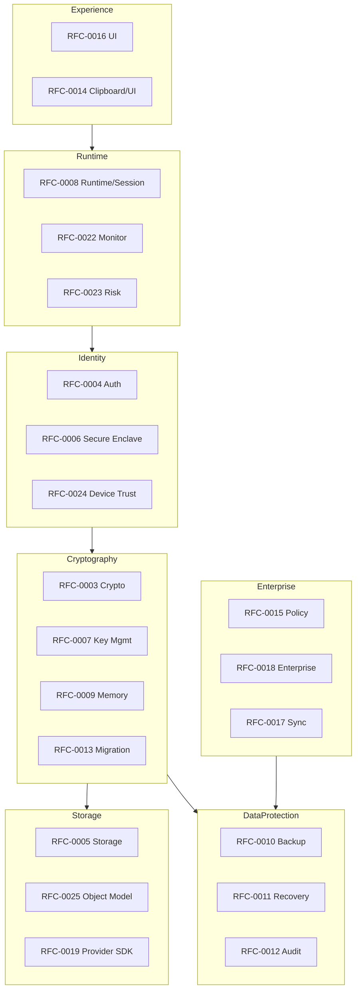

<!-- GENERATED by tools/generate_docs.py from tools/rfc_registry.py. Edit the registry and regenerate; do not hand-edit generated files. -->
# Architecture Index

The master hub for the Bithat Secure Vault (BSV) architecture repository. Every architecture artifact is discoverable from here.

## Indexes

- [RFC Index](../rfcs/README.md)
- [Component Index](./component-index.md)
- [Security Index](./security-index.md)
- [Threat Index](./threat-index.md)
- [Storage Index](./storage-index.md)
- [Diagram Index](../diagrams/README.md)
- [Decision Index](../decisions/README.md)
- [API Index](../api/README.md)
- [Testing Index](../testing/README.md)
- [Glossary](../glossary/README.md)

## Planning

- [Architecture Review](./ARCHITECTURE-REVIEW.md)
- [Implementation Roadmap](./implementation-roadmap.md)
- [RFC Dependency Graph](./dependency-graph.md)

## Layered View

> Navigation: [Docs Home](../README.md)
