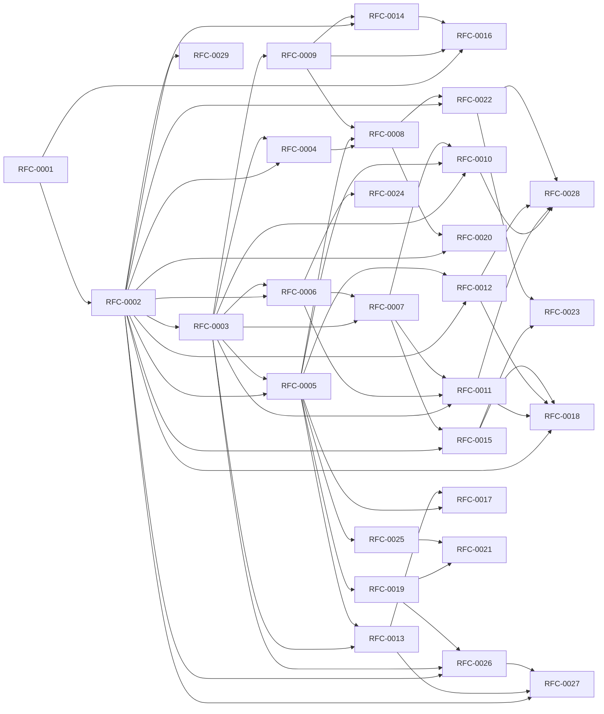

<!-- GENERATED by tools/generate_docs.py from tools/rfc_registry.py. Edit the registry and regenerate; do not hand-edit generated files. -->
# RFC Dependency Graph

Global dependency graph across all RFCs. An arrow `A --> B` means *B depends on A* (A is consumed by B).

> Navigation: [Architecture Index](./README.md)
