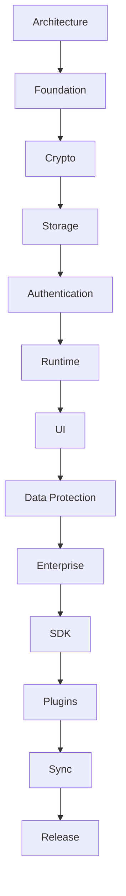

<!-- GENERATED by tools/generate_docs.py from tools/rfc_registry.py. Edit the registry and regenerate; do not hand-edit generated files. -->
# Implementation Roadmap

Phased technical roadmap. Each phase defines inputs, outputs, dependencies, deliverables, risks, and exit criteria. This is a documentation/planning artifact; **no application code is part of this repository**.

## Phase 1: Architecture

- **Inputs:** RFC-0001, RFC-0002
- **Outputs:** Approved RFC set, threat model, ADRs
- **Dependencies:** None
- **Deliverables:** Ratified architecture repository
- **Risks:** Ambiguity in scope; scope creep
- **Exit Criteria:** All P0 RFCs Accepted; review sign-off

## Phase 2: Foundation

- **Inputs:** Architecture phase outputs
- **Outputs:** Runtime skeleton, module boundaries (RFC-0008), OSAL contract (RFC-0005/0019)
- **Dependencies:** RFC-0005, RFC-0008, RFC-0019
- **Deliverables:** Storage provider contract + session lifecycle
- **Risks:** Wrong abstractions ossifying early
- **Exit Criteria:** OSAL certification suite defined; session state machine implemented

## Phase 3: Crypto

- **Inputs:** Foundation
- **Outputs:** Crypto Engine, key hierarchy, profiles (RFC-0003, RFC-0007)
- **Dependencies:** RFC-0003, RFC-0006, RFC-0007, RFC-0009
- **Deliverables:** Working encryption, key mgmt, secure memory
- **Risks:** Nonce reuse; weak RNG; memory leakage
- **Exit Criteria:** KAT suite passing; zeroization verified; no plaintext persistence

## Phase 4: Storage

- **Inputs:** Crypto
- **Outputs:** Object/attachment/index engines, transactions (RFC-0005, RFC-0025)
- **Dependencies:** RFC-0003, RFC-0005, RFC-0013, RFC-0025
- **Deliverables:** Crash-safe encrypted object store
- **Risks:** Corruption; migration failure
- **Exit Criteria:** Crash-injection tests pass; migration rollback verified

## Phase 5: Authentication

- **Inputs:** Crypto, Storage
- **Outputs:** Auth service, Secure Enclave integration (RFC-0004, RFC-0006)
- **Dependencies:** RFC-0004, RFC-0006, RFC-0011
- **Deliverables:** Passkey/Touch ID unlock + recovery
- **Risks:** Auth bypass; recovery abuse
- **Exit Criteria:** Unlock < 300 ms; recovery drill passes

## Phase 6: Runtime

- **Inputs:** Authentication
- **Outputs:** Session manager, lock controller, monitor, risk (RFC-0008/0022/0023)
- **Dependencies:** RFC-0008, RFC-0022, RFC-0023
- **Deliverables:** Fail-secure runtime with monitoring
- **Risks:** Missed lock events; false positives
- **Exit Criteria:** All lock triggers verified; risk responses tested

## Phase 7: UI

- **Inputs:** Runtime
- **Outputs:** SwiftUI shell, secure views, clipboard (RFC-0016, RFC-0014)
- **Dependencies:** RFC-0014, RFC-0016
- **Deliverables:** Usable secure UI
- **Risks:** On-screen/clipboard leakage
- **Exit Criteria:** Clipboard auto-clear verified; no plaintext in view state after lock

## Phase 8: Data Protection

- **Inputs:** Storage, Runtime
- **Outputs:** Backup/restore, audit engine (RFC-0010, RFC-0011, RFC-0012)
- **Dependencies:** RFC-0010, RFC-0011, RFC-0012
- **Deliverables:** Encrypted backups + immutable audit
- **Risks:** Backup tampering; audit gaps
- **Exit Criteria:** Backup/restore round-trip verified; audit chain validated

## Phase 9: Enterprise

- **Inputs:** Data Protection
- **Outputs:** Policy, RBAC, approval, SSO (RFC-0015, RFC-0018)
- **Dependencies:** RFC-0015, RFC-0018
- **Deliverables:** Enterprise controls
- **Risks:** Privilege escalation; policy bypass
- **Exit Criteria:** RBAC least-privilege verified; policy enforcement audited

## Phase 10: SDK

- **Inputs:** Storage, Enterprise
- **Outputs:** Developer SDK + codegen (RFC-0021), Object Model (RFC-0025)
- **Dependencies:** RFC-0019, RFC-0021, RFC-0025
- **Deliverables:** Stable, generated SDK
- **Risks:** API drift; compatibility breaks
- **Exit Criteria:** Generated bindings pass conformance; versioning policy in place

## Phase 11: Plugins

- **Inputs:** SDK, Runtime
- **Outputs:** Sandboxed plugin host (RFC-0020)
- **Dependencies:** RFC-0020, RFC-0021
- **Deliverables:** Capability-scoped plugin system
- **Risks:** Sandbox escape; secret leakage
- **Exit Criteria:** Plugins signed & sandboxed; no unauthorized secret access

## Phase 12: Sync

- **Inputs:** Enterprise, Storage
- **Outputs:** E2E sync + device trust (RFC-0017, RFC-0024)
- **Dependencies:** RFC-0017, RFC-0024
- **Deliverables:** Optional multi-device sync
- **Risks:** Server trust; conflict corruption
- **Exit Criteria:** Server sees only ciphertext; deterministic conflict resolution

## Phase 13: Release

- **Inputs:** All prior phases
- **Outputs:** Signing, notarization, SBOM, IR (RFC-0027, RFC-0028)
- **Dependencies:** RFC-0026, RFC-0027, RFC-0028
- **Deliverables:** Shippable, signed, supported release
- **Risks:** Supply-chain compromise; unsigned artifacts
- **Exit Criteria:** Signed + notarized; SBOM published; pen test clean; IR runbooks ready

> Navigation: [Architecture Index](./README.md)
