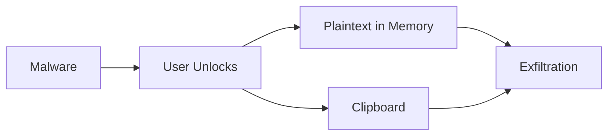

<!-- GENERATED by tools/generate_docs.py from tools/rfc_registry.py. Edit the registry and regenerate; do not hand-edit generated files. -->
# Threat Index

Consolidated pointer to the threat model. Threat identifiers are defined in [RFC-0002](../rfcs/RFC-0002/README.md).

| Family | Meaning | Source |
|---|---|---|
| TA-* | Threat Actors | RFC-0002 Part 1 |
| TM-* | STRIDE Threats | RFC-0002 Part 3 |
| TR-* | Runtime Threats | RFC-0003 Part 9 / RFC-0022 |
| RR-* | Risk Register | RFC-0002 Part 7 |
| AC-* | Abuse Cases | RFC-0002 Part 4 |

## Threat Flow (representative)

> Navigation: [Architecture Index](./README.md)
