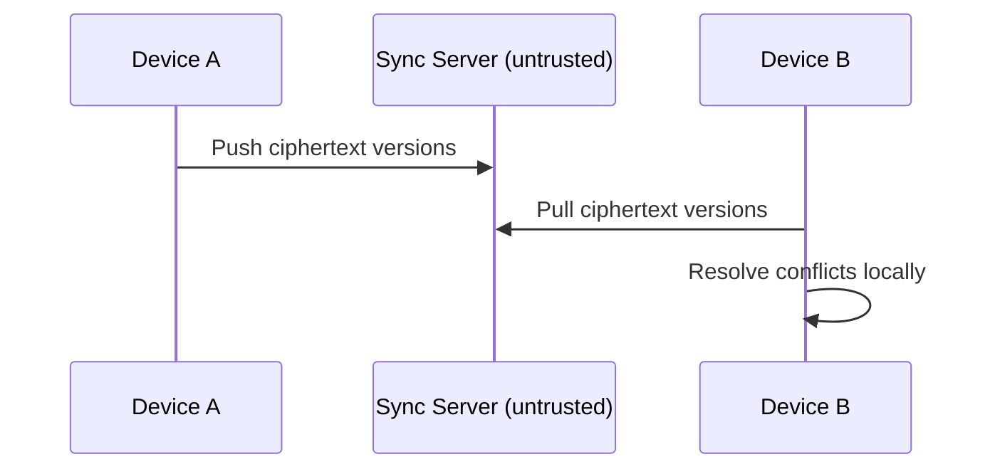

<!-- GENERATED by tools/generate_docs.py from tools/rfc_registry.py. Edit the registry and regenerate; do not hand-edit generated files. -->
# Synchronization Flow (v2)

> Navigation: [Diagram Index](./README.md)
