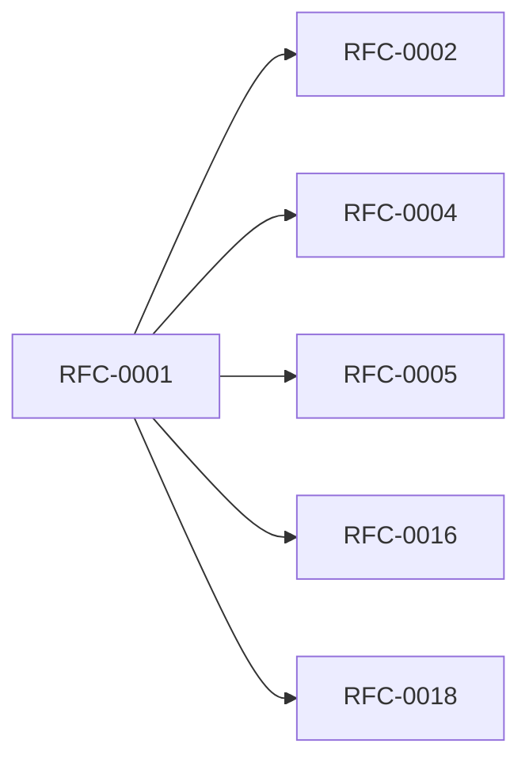

<!-- GENERATED by tools/generate_docs.py from tools/rfc_registry.py. Edit the registry and regenerate; do not hand-edit generated files. -->
# RFC-0001 — Product Vision & Requirements
| Field | Value |
|---|---|
| RFC | RFC-0001 |
| Category | Foundation |
| Status | Draft (migrated) |
| Origin | Migrated verbatim from `ROADMAP.md` |
| Parts | 1 |

## Abstract

Defines the product vision, mission, philosophy, target users, editions, core features, asset model, and functional/non-functional requirements for the Bithat Secure Vault (BSV), an offline-first infrastructure asset vault.

## Parts

1. [Part 01 — Product Vision & Requirements](./part-01.md)

## Cross-References
- **Depends on:** _none_
- **Consumed by:** [RFC-0002](../RFC-0002/README.md), [RFC-0004](../RFC-0004/README.md), [RFC-0005](../RFC-0005/README.md), [RFC-0016](../RFC-0016/README.md), [RFC-0018](../RFC-0018/README.md)
- **Uses:** _none_
- **Used by:** _none_
- **Implemented by:** _none_

## Dependency Diagram

## Supporting Documents

- [References](./references.md)
- [Glossary](./glossary.md)
- [Diagrams](./diagrams/)
- [Images](./images/)

---

> Navigation: [RFC Index](../README.md) · [Architecture Index](../../architecture/README.md)
