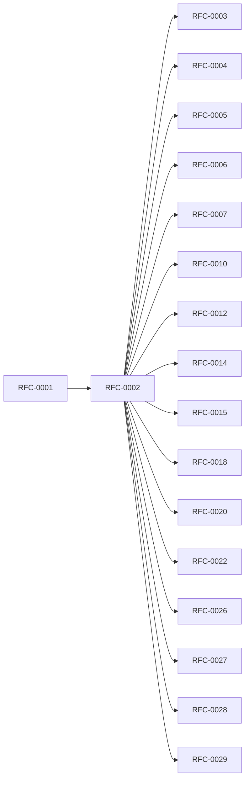

<!-- GENERATED by tools/generate_docs.py from tools/rfc_registry.py. Edit the registry and regenerate; do not hand-edit generated files. -->
# RFC-0002 — Threat Model
| Field | Value |
|---|---|
| RFC | RFC-0002 |
| Category | Security |
| Status | Draft (migrated) |
| Origin | Migrated verbatim from `ROADMAP.md` |
| Parts | 9 |

## Abstract

Establishes the formal threat model: security objectives, protected assets, attacker profiles, trust zones, STRIDE analysis, attack trees, security controls, security requirements (SR-*), quantitative risk assessment, trust architecture, and Security Architecture Decisions (SAD).

## Parts

1. [Part 01 — Executive Summary & Security Context](./part-01.md)
2. [Part 02 — System Context, Data Flow & Trust Boundaries](./part-02.md)
3. [Part 03 — STRIDE Threat Analysis](./part-03.md)
4. [Part 04 — Attack Trees, Kill Chains & Abuse Cases](./part-04.md)
5. [Part 05 — Security Controls & Defensive Architecture](./part-05.md)
6. [Part 06 — Security Requirements & Verification](./part-06.md)
7. [Part 07 — Quantitative Risk Assessment](./part-07.md)
8. [Part 08 — Trust Architecture & Trust Boundaries](./part-08.md)
9. [Part 09 — Security Architecture Decisions (SAD)](./part-09.md)

## Cross-References
- **Depends on:** [RFC-0001](../RFC-0001/README.md)
- **Consumed by:** [RFC-0003](../RFC-0003/README.md), [RFC-0004](../RFC-0004/README.md), [RFC-0005](../RFC-0005/README.md), [RFC-0006](../RFC-0006/README.md), [RFC-0007](../RFC-0007/README.md), [RFC-0010](../RFC-0010/README.md), [RFC-0012](../RFC-0012/README.md), [RFC-0014](../RFC-0014/README.md), [RFC-0015](../RFC-0015/README.md), [RFC-0018](../RFC-0018/README.md), [RFC-0020](../RFC-0020/README.md), [RFC-0022](../RFC-0022/README.md), [RFC-0026](../RFC-0026/README.md), [RFC-0027](../RFC-0027/README.md), [RFC-0028](../RFC-0028/README.md), [RFC-0029](../RFC-0029/README.md)
- **Uses:** _none_
- **Used by:** _none_
- **Implemented by:** _none_

## Dependency Diagram

## Supporting Documents

- [References](./references.md)
- [Glossary](./glossary.md)
- [Diagrams](./diagrams/)
- [Images](./images/)

---

> Navigation: [RFC Index](../README.md) · [Architecture Index](../../architecture/README.md)
