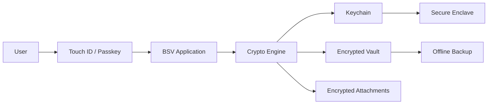
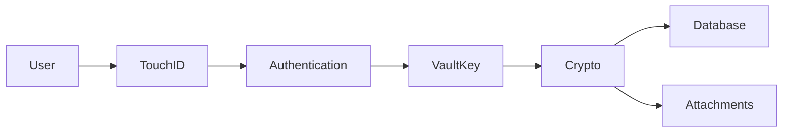
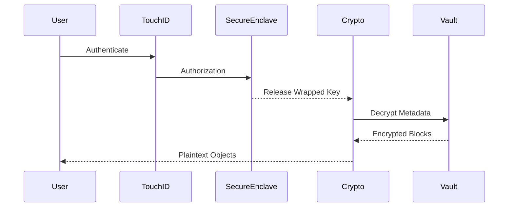
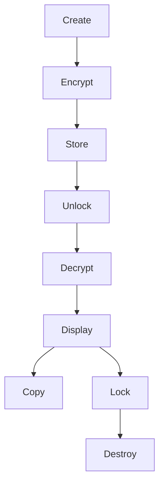

# RFC-0002 — Threat Model

## Part 2 of 9 — System Context, Data Flow & Trust Boundaries

> Navigation: [RFC Home](./README.md) · [RFC Index](../README.md) · [Architecture Index](../../architecture/README.md)

---

# RFC-0002 — Threat Model

# Part 2 — System Context, Data Flow & Trust Boundaries

---

# 13. System Overview

This section describes how information moves through the system.

Understanding data flow is essential because nearly every security control is applied to data in motion rather than data at rest.

The objective is to identify every location where sensitive information exists, even for a few milliseconds.

Those locations define the attack surface.

---

# 14. High-Level System Context

---

# Security Boundary

Inside Trusted Boundary

- Application
- Crypto Engine
- Keychain
- Secure Enclave
- Vault Database
- Attachment Store

Outside Trusted Boundary

- User Clipboard
- Browser
- Finder
- External Drives
- Internet
- Cloud Storage
- Email
- Third-party Applications

---

# 15. Data Flow Level 0

This represents the logical relationship only.

Sensitive data never flows directly from the user to storage.

All plaintext must first pass through the Crypto Engine.

---

# 16. Data Flow Level 1

Sensitive plaintext exists only between

Authentication

↓

Crypto

↓

Memory

↓

User Interface

---

# 17. Data Flow Level 2

Vault Unlock Sequence

Critical observation

The Secure Enclave never decrypts the vault.

It merely authorizes access to the wrapped Vault Key.

---

# 18. Data Classification During Flow

Stage 1

Encrypted

Location

Disk

Risk

Very Low

---

Stage 2

Encrypted

Location

RAM

Risk

Low

---

Stage 3

Vault Key

Location

RAM

Risk

High

---

Stage 4

Plaintext Secret

Location

RAM

Risk

Critical

---

Stage 5

Clipboard

Location

System

Risk

Very High

---

Stage 6

Screen

Location

GPU

Risk

High

---

# 19. Sensitive Data Lifecycle

Each transition represents a possible attack point.

---

# 20. Trust Boundary Analysis

Boundary A

User

↓

Touch ID

Risk

Spoofing

Mitigation

LocalAuthentication

Secure Enclave

---

Boundary B

Touch ID

↓

Application

Risk

Authentication bypass

Mitigation

System APIs only

No custom biometric logic

---

Boundary C

Application

↓

Crypto Engine

Risk

Memory interception

Mitigation

Minimal plaintext lifetime

---

Boundary D

Crypto Engine

↓

Database

Risk

Plaintext persistence

Mitigation

AES-GCM only

Never store plaintext

---

Boundary E

Application

↓

Clipboard

Risk

Clipboard theft

Mitigation

Auto-clear

User warning

Optional disable

---

Boundary F

Application

↓

Filesystem

Risk

Plaintext attachment

Mitigation

Temporary encrypted buffers only

---

# 21. Entry Points

Every entry point increases attack surface.

Current entry points

Application Launch

Touch ID

Passkey

Recovery Key

Import

Export

Backup

Restore

Search

Drag and Drop

Attachment Viewer

Quick Look

Clipboard

Context Menu

Spotlight Integration (future)

---

# 22. Exit Points

Clipboard

Export

Backup

Print

Drag and Drop

Share Sheet

Attachment Extraction

Temporary Files

Crash Dumps

Logs

Every exit point must be evaluated individually.

---

# 23. Memory Exposure Points

Sensitive information exists in RAM during

Unlock

Viewing Secret

Editing Secret

Copying Secret

Attachment Preview

Searching

Export

Backup

Memory must be treated as hostile.

---

# 24. Filesystem Exposure

Allowed

Encrypted Vault

Encrypted Attachments

Encrypted Backup

Logs without Secrets

Forbidden

Plaintext JSON

Plaintext SQLite

Plaintext PEM

Temporary Secret Files

Recovered Attachments

---

# 25. Network Exposure

Version 1

No Internet Required

Network connections are prohibited except

Software Update (future)

License Verification (Enterprise)

Crash Reporting (opt-in)

Everything else remains offline.

---

# 26. External Dependencies

Apple LocalAuthentication

CryptoKit

Security Framework

SQLite

Keychain Services

Secure Enclave

No dependency shall receive plaintext vault contents.

---

# 27. Third-Party Libraries

Third-party libraries shall never

Perform encryption

Handle authentication

Access plaintext secrets

Implement cryptographic primitives

Cryptographic operations must rely on Apple-provided APIs whenever possible.

---

# 28. Hardware Trust Model

Trusted

Secure Enclave

Apple Silicon Memory Protection

Hardware AES

FileVault

Untrusted

USB Devices

External SSD

Thunderbolt Devices

Network

Bluetooth

External Displays

---

# 29. Initial Attack Surface Inventory

| Component | Attack Surface | Initial Risk |
|-----------|---------------|--------------|
| Unlock Flow | Biometric bypass | High |
| Crypto Engine | Memory attacks | Critical |
| Clipboard | Secret leakage | Critical |
| Attachments | File extraction | High |
| Search | Metadata leakage | Medium |
| Backup | Offline theft | High |
| Export | Insider abuse | High |
| Import | Malicious files | High |
| Recovery Key | Theft | Critical |
| Logs | Information disclosure | Medium |

---

# 30. Design Constraints Derived From This Analysis

The following architectural constraints become mandatory.

DC-001

Secrets shall never be written to disk in plaintext.

---

DC-002

Clipboard shall automatically clear after a configurable timeout.

---

DC-003

Every decrypted object shall have the shortest practical lifetime in memory.

---

DC-004

Attachments shall be encrypted independently from the database.

---

DC-005

Unlock operations must never expose the Vault Key outside the Crypto Layer.

---

DC-006

Recovery Keys shall never be stored in plaintext.

---

DC-007

Crash reports shall never contain secrets.

---

DC-008

Logging shall never include credentials.

---

# 31. Preparation for STRIDE

The next section (Part 3) will apply Microsoft's STRIDE methodology to every major subsystem:

- Authentication
- Vault File
- Crypto Engine
- Database
- Attachments
- Clipboard
- Search
- Backup
- Recovery
- UI
- Memory
- Keychain
- Secure Enclave

Each subsystem will receive:

- Threat IDs
- Risk Scores
- Likelihood
- Impact
- Mitigations
- Residual Risk
- Verification Method

---

# End of Part 2
