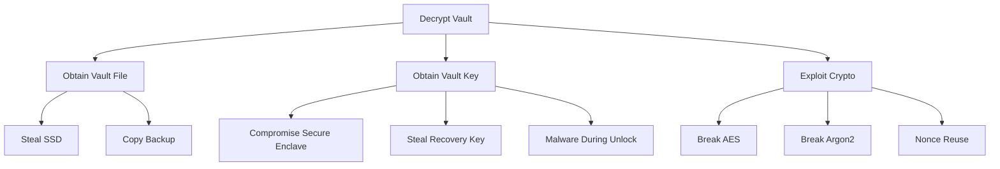
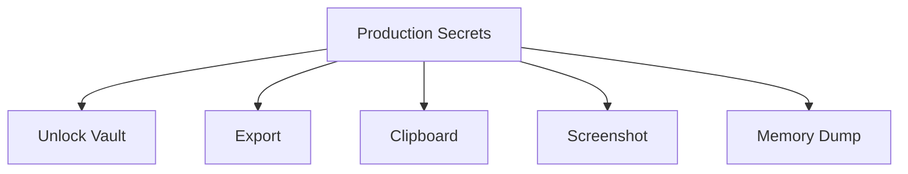
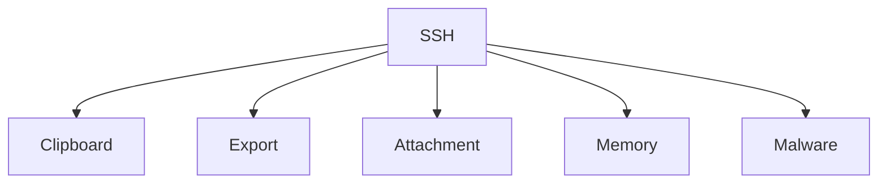

# RFC-0002 — Threat Model

## Part 4 of 9 — Attack Trees, Kill Chains & Abuse Cases

> Navigation: [RFC Home](./README.md) · [RFC Index](../README.md) · [Architecture Index](../../architecture/README.md)

---

# RFC-0002 — Threat Model

# Part 4 — Attack Trees, Kill Chains & Abuse Cases

Version 1.0

---

# 33. Purpose

Threats by themselves are not enough.

Security engineers must understand:

- how attacks begin,
- how they evolve,
- which assets become exposed,
- which controls stop them,
- where detection should occur.

This chapter models complete attacker journeys.

---

# 34. Attack Tree Methodology

Each attack tree contains

Goal

↓

Prerequisites

↓

Attack Steps

↓

Decision Points

↓

Mitigations

↓

Residual Risk

Attack trees are independent from implementation details.

---

# 35. Primary Security Objectives

The attacker attempts one or more of the following.

SO-01

Obtain plaintext secrets.

SO-02

Modify vault contents.

SO-03

Prevent legitimate access.

SO-04

Steal authentication factors.

SO-05

Steal recovery material.

SO-06

Persist inside the system.

SO-07

Exfiltrate infrastructure assets.

---

# Attack Tree 1

Goal

Decrypt Vault



Analysis

Breaking AES-256 is considered infeasible.

Breaking Argon2 is considered infeasible.

The realistic attack path is malware during unlock.

Therefore,

memory protection becomes more important than stronger encryption.

---

# Attack Tree 2

Goal

Steal Production Secrets



Most likely branch

Clipboard

↓

Clipboard History

↓

Malware

↓

Exfiltration

Mitigation

Clipboard timeout

Clipboard overwrite

Enterprise clipboard policy

---

# Attack Tree 3

Goal

Compromise Recovery

```mermaid
graph TD

Recovery

--> Printed Recovery Key

Recovery

--> Photograph

Recovery

--> Backup Copy

Recovery

--> Cloud Storage

Recovery

--> Social Engineering
```

Mitigations

Recovery package warnings

Split recovery

Optional Shamir Secret Sharing

Printed QR checksum

---

# Attack Tree 4

Goal

Modify Vault

```mermaid
graph TD

Vault

--> Replace Database

Vault

--> Rollback

Vault

--> Header Tampering

Vault

--> Attachment Swap
```

Mitigation

Authenticated Encryption

Version Counters

Integrity Verification

Generation Number

---

# Attack Tree 5

Goal

Steal Private Keys



Mitigation

No plaintext export

TouchID confirmation

Audit

Attachment encryption

---

# Attack Tree 6

Goal

Compromise Enterprise Deployment

```mermaid
graph TD

Enterprise

--> Insider

Enterprise

--> Stolen Laptop

Enterprise

--> Shared Vault

Enterprise

--> Approval Abuse

Enterprise

--> API Abuse
```

Mitigation

RBAC

Approval Workflow

Immutable Audit

Least Privilege

---

# 36. Kill Chain Analysis

Attack Scenario

Laptop Theft

Stage 1

Reconnaissance

Attacker discovers vault.

↓

Stage 2

Acquisition

Copies vault.

↓

Stage 3

Offline Attack

Attempts password guessing.

↓

Stage 4

Failure

Argon2

↓

Stage 5

Social Engineering

Attempts recovery key theft.

↓

Stage 6

Failure

Recovery protected offline.

Result

Attack unsuccessful.

---

# Kill Chain

Malware

Stage 1

User downloads malware.

↓

Stage 2

Persistence.

↓

Stage 3

User unlocks vault.

↓

Stage 4

Memory inspection.

↓

Stage 5

Clipboard monitoring.

↓

Stage 6

Secret exfiltration.

Risk

Critical.

Observation

No password manager can fully prevent this.

Mitigation

Reduce plaintext lifetime.

---

# Kill Chain

Supply Chain

Stage 1

Malicious dependency.

↓

Stage 2

Compiled into release.

↓

Stage 3

Secrets intercepted.

Mitigation

SBOM

Dependency verification

Signed releases

Reproducible builds

---

# 37. Abuse Cases

AC-001

Developer exports entire vault to Desktop.

Risk

Critical.

Mitigation

Warning

TouchID

Audit

Optional disable.

---

AC-002

Developer copies AWS Root Password.

Leaves for lunch.

Clipboard stolen.

Mitigation

Auto-clear.

---

AC-003

Developer emails vault backup.

Mitigation

Encrypted backup only.

---

AC-004

User stores recovery key inside the vault.

Result

Recovery impossible.

Mitigation

Application warning.

Recovery validation wizard.

---

AC-005

User stores Apple Certificate unencrypted.

Mitigation

Automatic attachment encryption.

---

AC-006

Developer disables FileVault.

Mitigation

Security warning.

Compliance dashboard.

---

# 38. Insider Threat Analysis

Threat

Authorized employee exports secrets.

Likelihood

Medium.

Impact

Critical.

Controls

RBAC

Export approval

Immutable audit

Watermarking

Behavior monitoring

---

# 39. Human Error Analysis

The following user mistakes are expected.

Saving recovery key in iCloud Notes.

Saving passwords in screenshots.

Sharing exported attachments.

Weak recovery storage.

Disabling automatic locking.

Ignoring expiration reminders.

The application shall guide users toward secure behavior.

---

# 40. Threat Prioritization

Priority 0

Must eliminate

Plaintext storage

Weak encryption

Unsigned updates

---

Priority 1

Must strongly mitigate

Clipboard leakage

Memory scraping

Export abuse

---

Priority 2

Acceptable residual risk

Malware during unlocked session

Root compromise

Nation-state hardware attacks

---

# 41. Security Decisions Derived

Based on this chapter, the following engineering decisions become mandatory.

✓ Touch ID required for export.

✓ Clipboard timeout mandatory.

✓ AES-GCM only.

✓ Attachment encryption mandatory.

✓ No plaintext temporary files.

✓ No browser extension in Version 1.

✓ Offline-first architecture.

✓ Recovery key generated automatically.

✓ Immutable audit events.

---

# Deliverables Produced by Part 4

The following specifications depend on these findings.

RFC-0003

Cryptography

RFC-0004

Authentication

RFC-0005

Storage Format

RFC-0008

Enterprise RBAC

RFC-0012

Audit Log

RFC-0018

Incident Response

---

# End of Part 4
