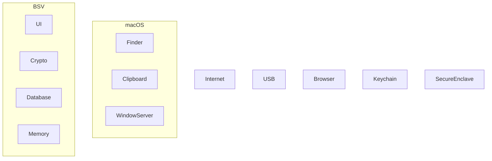

# RFC-0002 — Threat Model

## Part 8 of 9 — Trust Architecture & Trust Boundaries

> Navigation: [RFC Home](./README.md) · [RFC Index](../README.md) · [Architecture Index](../../architecture/README.md)

---

# RFC-0002 — Threat Model

# Part 8 — Trust Architecture & Trust Boundaries

Version 1.0

---

# 100. Purpose

Security is not determined only by encryption.

Security is primarily determined by trust.

Every component inside BSV shall have an explicitly defined trust level.

Nothing is trusted implicitly.

Trust must always be earned through cryptographic verification,
platform security guarantees,
or authenticated user interaction.

---

# 101. Trust Philosophy

BSV follows Zero Trust Architecture.

Core Principle

Never trust.

Always verify.

Every component shall prove its identity before interacting with another component.

---

# 102. Trust Levels

The platform defines six trust levels.

| Level | Name | Description |
|-------:|------|-------------|
| T0 | Untrusted | Internet, external devices |
| T1 | Semi-Trusted | Operating System |
| T2 | Authenticated | Logged-in User |
| T3 | Trusted Runtime | BSV Process |
| T4 | Trusted Security Services | Keychain |
| T5 | Hardware Root of Trust | Secure Enclave |

---

# 103. Trust Zone Diagram

---

# 104. Trust Boundary A

Internet

↓

Application

Status

Untrusted

Allowed Communication

Software Updates

License Verification

Optional Crash Reports

Requirements

TLS 1.3

Certificate Validation

Hostname Validation

Certificate Pinning (future)

---

# 105. Trust Boundary B

Finder

↓

Vault File

Threats

Tampering

Rollback

Deletion

Replacement

Mitigation

Authenticated Encryption

Integrity Validation

Generation Number

---

# 106. Trust Boundary C

Clipboard

↓

Other Applications

Status

Untrusted

Threats

Clipboard Monitoring

Clipboard History

Remote Desktop

Mitigations

Clipboard Timeout

Clipboard Overwrite

Clipboard Disable Policy

Clipboard Warning

---

# 107. Trust Boundary D

Application

↓

Keychain

Requirements

Keychain items shall never contain plaintext vault contents.

Keychain stores only wrapped key material.

Authentication policies shall be enforced by the operating system.

---

# 108. Trust Boundary E

Keychain

↓

Secure Enclave

The Secure Enclave SHALL

Never expose private material.

Never decrypt application data.

Never perform application logic.

Only authorize cryptographic operations.

---

# 109. Trust Boundary F

UI

↓

Crypto Engine

The UI layer SHALL NEVER

Perform encryption

Generate keys

Derive passwords

Access raw cryptographic primitives

UI communicates only through the Crypto Service interface.

---

# 110. Trust Boundary G

Crypto

↓

Database

Requirements

Database never receives plaintext.

Crypto layer owns serialization.

Database stores authenticated ciphertext only.

---

# 111. Trust Boundary H

Crypto

↓

Attachments

Each attachment is independently encrypted.

The storage layer cannot determine attachment type.

The storage layer cannot inspect attachment contents.

---

# 112. Trust Boundary I

Crypto

↓

Memory

Memory is considered hostile.

Requirements

Plaintext lifetime minimized.

Sensitive buffers isolated.

Zeroization after use.

No plaintext caching.

---

# 113. Trust Boundary J

Application

↓

Logging

Logging layer is permanently untrusted.

Logging SHALL NEVER receive

Passwords

Tokens

Certificates

Keys

Secrets

Recovery Material

Authentication Data

---

# 114. Trust Decisions

The following components SHALL NEVER be trusted.

Clipboard

Browser

Finder

Spotlight

Cloud Storage

USB Devices

Email Clients

Third-party Applications

Remote Desktop Software

Browser Extensions

AI Assistants

Shell History

Terminal Scrollback

---

# 115. Trusted Components

Only these components are trusted.

Crypto Engine

Secure Enclave

Keychain

Vault Integrity Validator

Authentication Service

Everything else must be considered potentially compromised.

---

# 116. Trust Escalation

No component may increase its own trust level.

Example

UI

↓

Cannot access Secure Enclave directly.

Only Authentication Service may request authorization.

---

# 117. Trust Revocation

Trust immediately ends when

Vault Lock

Sleep

Logout

Crash

Authentication Failure

Memory Warning

Session Timeout

Emergency Lock

All session keys destroyed immediately.

---

# 118. Least Privilege Model

Each module receives only the permissions required.

UI

Read Only

Crypto

Encrypt / Decrypt

Storage

Read / Write Ciphertext

Search

Metadata after Unlock

Audit

Security Events

Updater

Signed Updates Only

---

# 119. Component Isolation

Future versions should isolate

Crypto Engine

Database

Attachment Engine

Search Index

using separate processes.

Inter-process communication shall use authenticated channels.

---

# 120. Future Trust Model

Enterprise Edition should support

Hardware Security Keys

External HSM

TPM Integration (Windows)

Secure Boot Validation

Remote Attestation

Confidential Computing

---

# 121. Trust Architecture Principles

1. No implicit trust.

2. Hardware trust preferred over software trust.

3. Authentication before authorization.

4. Authorization before decryption.

5. Decryption before rendering.

6. Rendering never bypasses policy.

7. Storage never observes plaintext.

8. Logging never observes secrets.

9. Updates never bypass verification.

10. Every trust boundary must have at least one independent security control.

---

# Outputs Produced

This chapter establishes the trust architecture used by

RFC-0003 Cryptography

RFC-0004 Authentication

RFC-0005 Storage

RFC-0006 Key Management

RFC-0007 Secure Enclave

RFC-0012 Audit

RFC-0019 Enterprise Architecture

---

# End of Part 8
