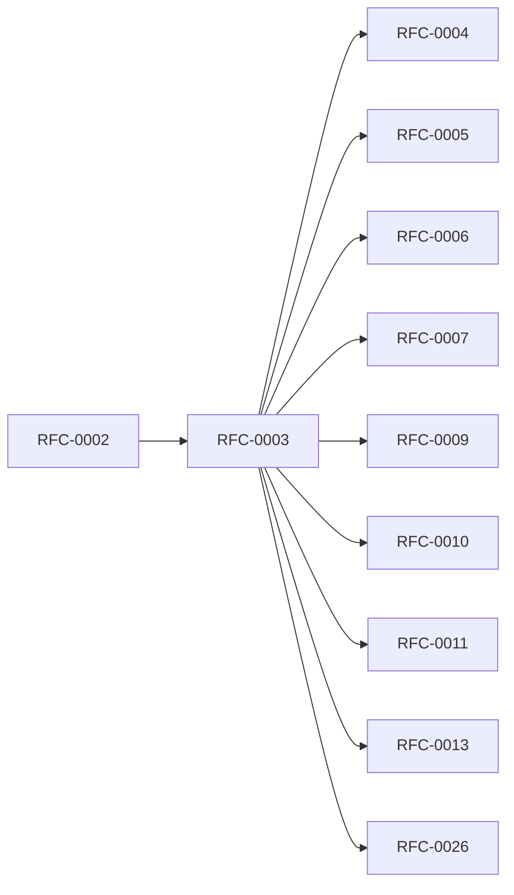

<!-- GENERATED by tools/generate_docs.py from tools/rfc_registry.py. Edit the registry and regenerate; do not hand-edit generated files. -->
# RFC-0003 — Cryptographic Architecture
| Field | Value |
|---|---|
| RFC | RFC-0003 |
| Category | Cryptography |
| Status | Draft (migrated) |
| Origin | Migrated verbatim from `ROADMAP.md` |
| Parts | 10 |

## Abstract

Defines every cryptographic primitive, the key hierarchy, cryptographic state machine, vault file format, formal protocols (CP-*), invariants (INV-*), secure memory architecture, Secure Enclave integration, runtime attack resistance, and cryptographic governance / algorithm agility.

## Parts

1. [Part 01 — Cryptographic Philosophy](./part-01.md)
2. [Part 02 — Key Management Architecture](./part-02.md)
3. [Part 03 — Cryptographic Operations & State Machine](./part-03.md)
4. [Part 04 — Vault File Format & Object Encryption](./part-04.md)
5. [Part 05 — Formal Cryptographic Protocols](./part-05.md)
6. [Part 06 — Cryptographic Invariants, Formal Guarantees & Verification](./part-06.md)
7. [Part 07 — Secure Memory Architecture](./part-07.md)
8. [Part 08 — Secure Enclave Integration](./part-08.md)
9. [Part 09 — Attack Resistance & Security Monitoring](./part-09.md)
10. [Part 10 — Cryptographic Governance & Algorithm Agility](./part-10.md)

## Cross-References
- **Depends on:** [RFC-0002](../RFC-0002/README.md)
- **Consumed by:** [RFC-0004](../RFC-0004/README.md), [RFC-0005](../RFC-0005/README.md), [RFC-0006](../RFC-0006/README.md), [RFC-0007](../RFC-0007/README.md), [RFC-0009](../RFC-0009/README.md), [RFC-0010](../RFC-0010/README.md), [RFC-0011](../RFC-0011/README.md), [RFC-0013](../RFC-0013/README.md), [RFC-0026](../RFC-0026/README.md)
- **Uses:** _none_
- **Used by:** _none_
- **Implemented by:** _none_

## Dependency Diagram

## Supporting Documents

- [References](./references.md)
- [Glossary](./glossary.md)
- [Diagrams](./diagrams/)
- [Images](./images/)

---

> Navigation: [RFC Index](../README.md) · [Architecture Index](../../architecture/README.md)
