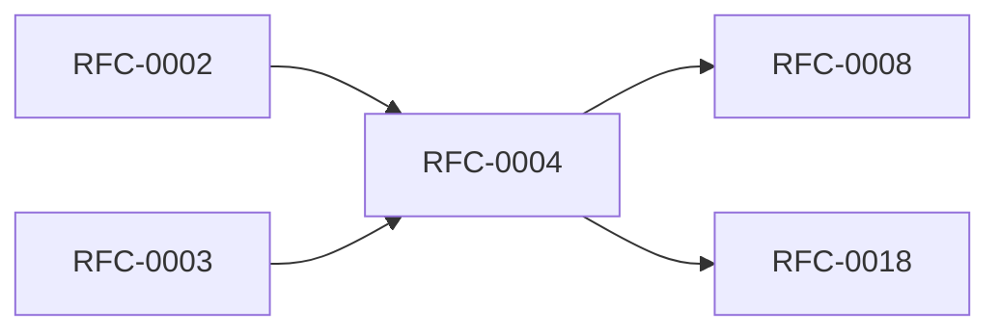

<!-- GENERATED by tools/generate_docs.py from tools/rfc_registry.py. Edit the registry and regenerate; do not hand-edit generated files. -->
# RFC-0004 — Authentication & Identity Architecture
| Field | Value |
|---|---|
| RFC | RFC-0004 |
| Category | Identity |
| Status | Draft (migrated) |
| Origin | Migrated verbatim from `ROADMAP.md` |
| Parts | 1 |

## Abstract

Defines identity philosophy, authentication methods (Passkey, Touch ID, device passcode, recovery key), the authentication state machine, and identity objects. NOTE: only Part 1 exists in the source; see the architecture review for the expansion backlog.

## Parts

1. [Part 01 — Identity Philosophy](./part-01.md)

> **Review note:** This RFC is under-developed in the source (single part). See the [Architecture Review](../../architecture/ARCHITECTURE-REVIEW.md) for the expansion backlog (passkey ceremony, recovery flow, session bootstrap, enterprise SSO).

## Cross-References
- **Depends on:** [RFC-0002](../RFC-0002/README.md), [RFC-0003](../RFC-0003/README.md)
- **Consumed by:** [RFC-0008](../RFC-0008/README.md), [RFC-0018](../RFC-0018/README.md)
- **Uses:** [RFC-0006](../RFC-0006/README.md)
- **Used by:** _none_
- **Implemented by:** _none_

## Dependency Diagram

## Supporting Documents

- [References](./references.md)
- [Glossary](./glossary.md)
- [Diagrams](./diagrams/)
- [Images](./images/)

---

> Navigation: [RFC Index](../README.md) · [Architecture Index](../../architecture/README.md)
