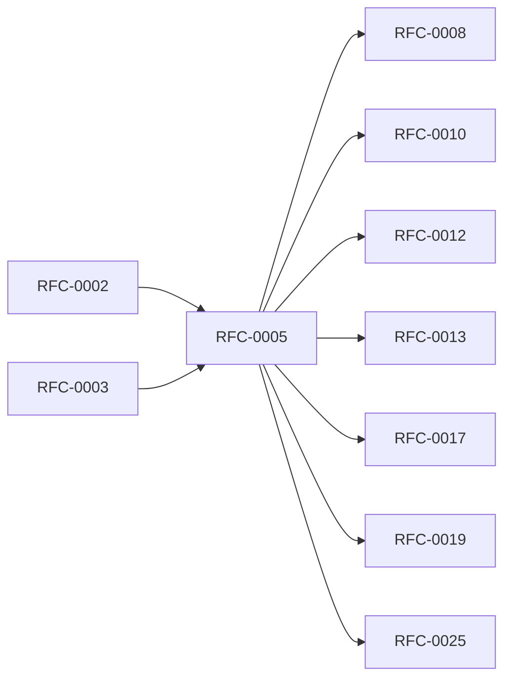

<!-- GENERATED by tools/generate_docs.py from tools/rfc_registry.py. Edit the registry and regenerate; do not hand-edit generated files. -->
# RFC-0005 — Vault Storage Engine Architecture
| Field | Value |
|---|---|
| RFC | RFC-0005 |
| Category | Storage |
| Status | Draft (migrated) |
| Origin | Migrated verbatim from `ROADMAP.md` |
| Parts | 7 |

## Abstract

Defines the durable, immutable, object-oriented storage engine: storage philosophy, physical layout, transaction engine and crash recovery, object engine, attachment engine, secure search index, and the Object Storage Abstraction Layer (OSAL).

## Parts

1. [Part 01 — Storage Philosophy](./part-01.md)
2. [Part 02 — Database Architecture & Physical Storage Layout](./part-02.md)
3. [Part 03 — Transaction Engine, Consistency & Crash Recovery](./part-03.md)
4. [Part 04 — Object Engine Architecture](./part-04.md)
5. [Part 05 — Attachment Engine Architecture](./part-05.md)
6. [Part 06 — Index Engine & Secure Search Architecture](./part-06.md)
7. [Part 07 — Storage Abstraction Layer (OSAL)](./part-07.md)

## Cross-References
- **Depends on:** [RFC-0002](../RFC-0002/README.md), [RFC-0003](../RFC-0003/README.md)
- **Consumed by:** [RFC-0008](../RFC-0008/README.md), [RFC-0010](../RFC-0010/README.md), [RFC-0012](../RFC-0012/README.md), [RFC-0013](../RFC-0013/README.md), [RFC-0017](../RFC-0017/README.md), [RFC-0019](../RFC-0019/README.md), [RFC-0025](../RFC-0025/README.md)
- **Uses:** _none_
- **Used by:** _none_
- **Implemented by:** _none_

## Dependency Diagram

## Supporting Documents

- [References](./references.md)
- [Glossary](./glossary.md)
- [Diagrams](./diagrams/)
- [Images](./images/)

---

> Navigation: [RFC Index](../README.md) · [Architecture Index](../../architecture/README.md)
