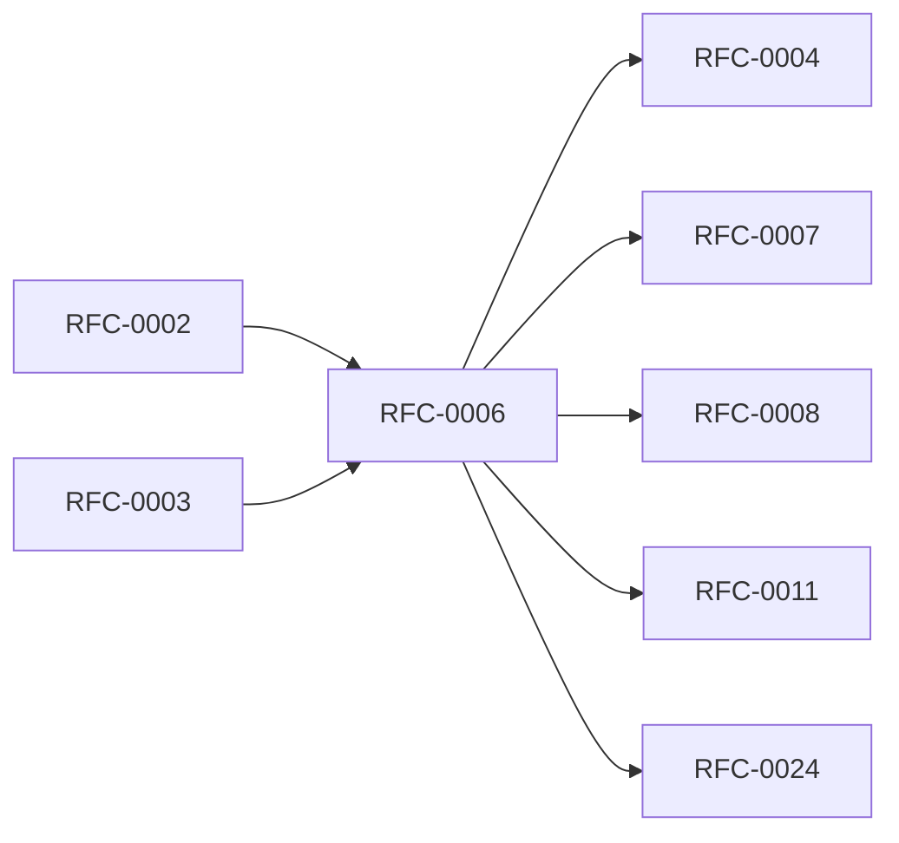

<!-- GENERATED by tools/generate_docs.py from tools/rfc_registry.py. Edit the registry and regenerate; do not hand-edit generated files. -->
# RFC-0006 — Secure Enclave & Hardware Root of Trust
| Field | Value |
|---|---|
| RFC | RFC-0006 |
| Category | Security |
| Status | Proposed |
| Origin | New proposal (architecture consolidation) |
| Parts | 1 |

## Abstract

Consolidates and extends the Secure Enclave material from RFC-0003 Part 8 into a dedicated specification for the hardware root of trust, device binding, key wrapping, authorization boundaries, and enterprise device management.

## Goals

- Establish the hardware trust chain as the platform root of trust.
- Guarantee the Secure Enclave authorizes but never decrypts vault data.
- Define device binding, migration, and reset semantics.
- Define enterprise device-management hooks without weakening crypto.

## Parts

1. [Part 01 — Design Proposal](./part-01.md)

## Cross-References
- **Depends on:** [RFC-0002](../RFC-0002/README.md), [RFC-0003](../RFC-0003/README.md)
- **Consumed by:** [RFC-0004](../RFC-0004/README.md), [RFC-0007](../RFC-0007/README.md), [RFC-0008](../RFC-0008/README.md), [RFC-0011](../RFC-0011/README.md), [RFC-0024](../RFC-0024/README.md)
- **Uses:** [RFC-0007](../RFC-0007/README.md)
- **Used by:** [RFC-0004](../RFC-0004/README.md), [RFC-0008](../RFC-0008/README.md)
- **Implemented by:** _none_

## Dependency Diagram

## Supporting Documents

- [References](./references.md)
- [Glossary](./glossary.md)
- [Diagrams](./diagrams/)
- [Images](./images/)

---

> Navigation: [RFC Index](../README.md) · [Architecture Index](../../architecture/README.md)
