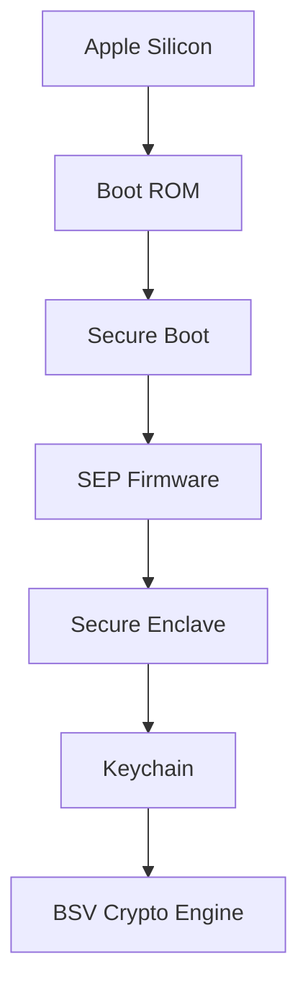
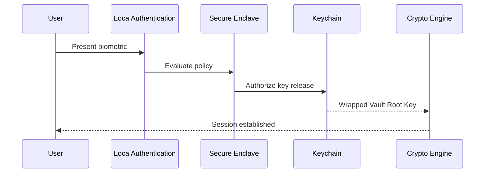

# RFC-0006 — Secure Enclave & Hardware Root of Trust

## Part 1 of 1 — Design Proposal

> Navigation: [RFC Home](./README.md) · [RFC Index](../README.md) · [Architecture Index](../../architecture/README.md)

---

# 1. Abstract

Consolidates and extends the Secure Enclave material from RFC-0003 Part 8 into a dedicated specification for the hardware root of trust, device binding, key wrapping, authorization boundaries, and enterprise device management.

# 2. Status & Motivation

This RFC was introduced during the architecture consolidation of the BSV platform. It formalizes capabilities that were previously referenced by other RFCs but never specified. See the [Architecture Review](../../architecture/ARCHITECTURE-REVIEW.md).

# 3. Goals

- Establish the hardware trust chain as the platform root of trust.
- Guarantee the Secure Enclave authorizes but never decrypts vault data.
- Define device binding, migration, and reset semantics.
- Define enterprise device-management hooks without weakening crypto.

# 4. Root of Trust

The platform trust chain MUST be Apple Silicon → Boot ROM → Secure Boot → SEP firmware → Secure Enclave → Keychain → Crypto Engine.

Any compromise above the Secure Enclave MUST NOT reveal wrapped keys.

# 5. Authorization Boundary

The Secure Enclave SHALL only generate hardware keys, wrap and unwrap the Vault Root Key, enforce Touch ID / passcode policy, and authorize operations.

The Secure Enclave SHALL NEVER decrypt vault objects, store secrets, or hold session state.

# 6. Device Binding

Each vault SHALL be bound to a device via a non-exportable, hardware-backed key.

Direct export of Secure Enclave private material MUST be impossible; migration MUST require the Recovery Package (RFC-0011) or enterprise-approved migration (RFC-0018).

# 7. Failure Handling

Secure Enclave unavailability, biometric change, cancelled authentication, or reset SHALL each produce a deterministic error and SHALL fail closed.

# 8. Enterprise Device Management

Enterprise deployments MAY enforce approved-hardware lists, device inventory, revocation, and MDM integration; these MUST NOT weaken cryptographic protections.

# 9. Requirements

- SE-REQ-001 The wrapped Vault Root Key SHALL never be exportable.
- SE-REQ-002 Unlock SHALL be impossible without Secure Enclave authorization when available.
- SE-REQ-003 Biometric enrollment changes SHALL invalidate the authorization context.
- SE-REQ-004 Secure Enclave reset SHALL require the Recovery Package to restore access.

# 10. Diagrams

### Hardware Trust Chain

### Unlock Authorization Sequence

# 11. Cross-References

## Cross-References
- **Depends on:** [RFC-0002](../RFC-0002/README.md), [RFC-0003](../RFC-0003/README.md)
- **Consumed by:** [RFC-0004](../RFC-0004/README.md), [RFC-0007](../RFC-0007/README.md), [RFC-0008](../RFC-0008/README.md), [RFC-0011](../RFC-0011/README.md), [RFC-0024](../RFC-0024/README.md)
- **Uses:** [RFC-0007](../RFC-0007/README.md)
- **Used by:** [RFC-0004](../RFC-0004/README.md), [RFC-0008](../RFC-0008/README.md)
- **Implemented by:** _none_

# 12. Open Questions & Future Work

- Refine acceptance criteria with the implementation team.
- Add sequence-level detail as dependent RFCs stabilize.

---

> End of RFC-0006 Part 1
