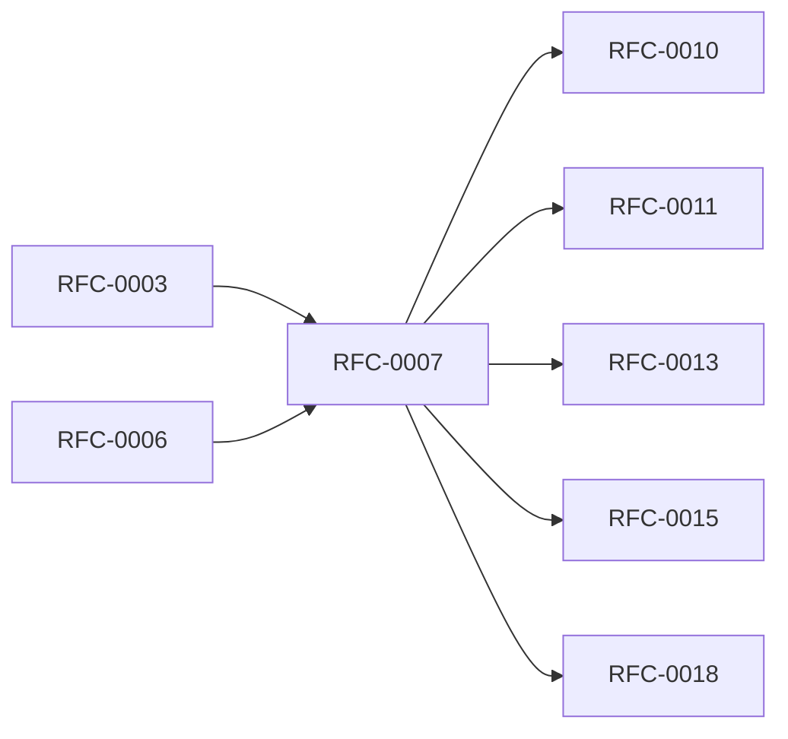

<!-- GENERATED by tools/generate_docs.py from tools/rfc_registry.py. Edit the registry and regenerate; do not hand-edit generated files. -->
# RFC-0007 — Key Management & Key Lifecycle
| Field | Value |
|---|---|
| RFC | RFC-0007 |
| Category | Cryptography |
| Status | Proposed |
| Origin | New proposal (architecture consolidation) |
| Parts | 1 |

## Abstract

Formalizes the lifecycle of every cryptographic key (CK-*): generation, storage, usage, rotation, and destruction; and defines the key rotation protocol, key inventory, and rotation policy.

## Goals

- Give every key a documented purpose, owner, and lifecycle.
- Define deterministic, resumable key rotation.
- Enforce key separation across cryptographic domains.

## Parts

1. [Part 01 — Design Proposal](./part-01.md)

## Cross-References
- **Depends on:** [RFC-0003](../RFC-0003/README.md), [RFC-0006](../RFC-0006/README.md)
- **Consumed by:** [RFC-0010](../RFC-0010/README.md), [RFC-0011](../RFC-0011/README.md), [RFC-0013](../RFC-0013/README.md), [RFC-0015](../RFC-0015/README.md), [RFC-0018](../RFC-0018/README.md)
- **Uses:** _none_
- **Used by:** [RFC-0006](../RFC-0006/README.md)
- **Implemented by:** _none_

## Dependency Diagram

## Supporting Documents

- [References](./references.md)
- [Glossary](./glossary.md)
- [Diagrams](./diagrams/)
- [Images](./images/)

---

> Navigation: [RFC Index](../README.md) · [Architecture Index](../../architecture/README.md)
