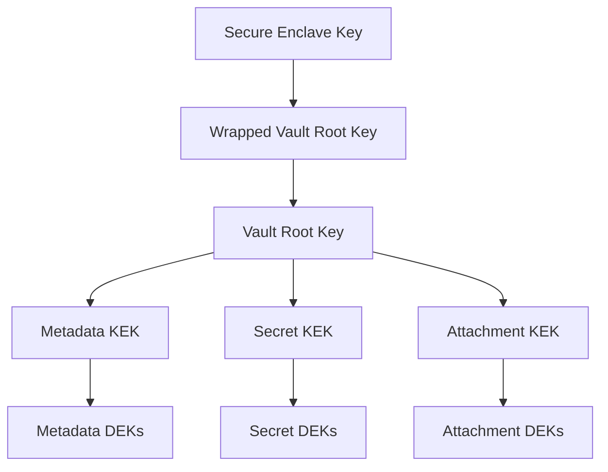
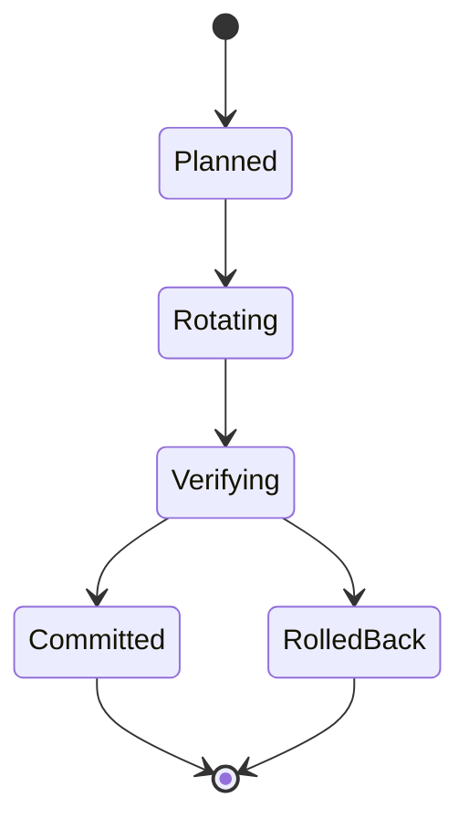

# RFC-0007 — Key Management & Key Lifecycle

## Part 1 of 1 — Design Proposal

> Navigation: [RFC Home](./README.md) · [RFC Index](../README.md) · [Architecture Index](../../architecture/README.md)

---

# 1. Abstract

Formalizes the lifecycle of every cryptographic key (CK-*): generation, storage, usage, rotation, and destruction; and defines the key rotation protocol, key inventory, and rotation policy.

# 2. Status & Motivation

This RFC was introduced during the architecture consolidation of the BSV platform. It formalizes capabilities that were previously referenced by other RFCs but never specified. See the [Architecture Review](../../architecture/ARCHITECTURE-REVIEW.md).

# 3. Goals

- Give every key a documented purpose, owner, and lifecycle.
- Define deterministic, resumable key rotation.
- Enforce key separation across cryptographic domains.

# 4. Key Inventory

The Key Manager SHALL maintain an inventory of every key (CK-001..CK-010 and successors) including purpose, owner, creation method, storage location, rotation policy, and destruction policy.

# 5. Key Separation

No key SHALL span two unrelated security domains.

The Vault Root Key SHALL NEVER encrypt application data directly; it wraps KEKs which wrap DEKs.

# 6. Rotation

Key rotation SHALL be atomic per object and resumable across interruptions, retaining the previous key until the new ciphertext is verified.

Rotation intervals MAY be governed by policy (RFC-0015).

# 7. Destruction

Key destruction SHALL zeroize key material and remove all wrapped references; destruction SHALL generate an audit event (RFC-0012).

# 8. Requirements

- KM-REQ-001 Every encrypted object SHALL have exactly one DEK.
- KM-REQ-002 Rotation SHALL be resumable and MUST NOT expose plaintext to disk.
- KM-REQ-003 Destroyed keys SHALL be zeroized and audited.

# 9. Diagrams

### Key Hierarchy

### Key Rotation State Machine

# 10. Cross-References

## Cross-References
- **Depends on:** [RFC-0003](../RFC-0003/README.md), [RFC-0006](../RFC-0006/README.md)
- **Consumed by:** [RFC-0010](../RFC-0010/README.md), [RFC-0011](../RFC-0011/README.md), [RFC-0013](../RFC-0013/README.md), [RFC-0015](../RFC-0015/README.md), [RFC-0018](../RFC-0018/README.md)
- **Uses:** _none_
- **Used by:** [RFC-0006](../RFC-0006/README.md)
- **Implemented by:** _none_

# 11. Open Questions & Future Work

- Refine acceptance criteria with the implementation team.
- Add sequence-level detail as dependent RFCs stabilize.

---

> End of RFC-0007 Part 1
