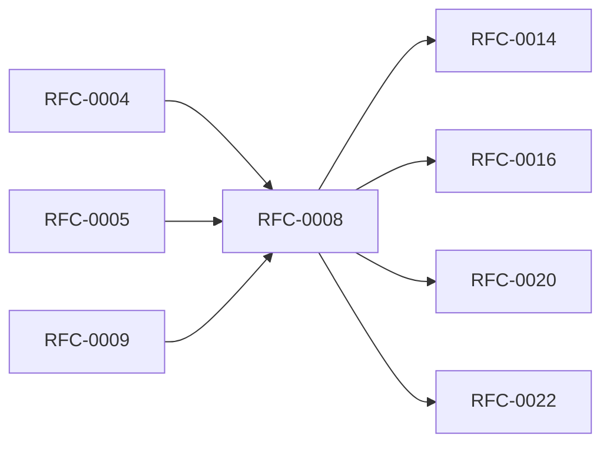

<!-- GENERATED by tools/generate_docs.py from tools/rfc_registry.py. Edit the registry and regenerate; do not hand-edit generated files. -->
# RFC-0008 — Runtime Architecture & Session Manager
| Field | Value |
|---|---|
| RFC | RFC-0008 |
| Category | Runtime |
| Status | Proposed |
| Origin | New proposal (architecture consolidation) |
| Parts | 1 |

## Abstract

Defines the application runtime: process/module topology, the session lifecycle and session keys, inter-module boundaries, and the automatic-lock policy that ties authentication, storage, and memory together.

## Goals

- Define a single authoritative session lifecycle.
- Guarantee fail-secure transitions on every abnormal event.
- Isolate modules behind explicit, least-privilege interfaces.

## Parts

1. [Part 01 — Design Proposal](./part-01.md)

## Cross-References
- **Depends on:** [RFC-0004](../RFC-0004/README.md), [RFC-0005](../RFC-0005/README.md), [RFC-0009](../RFC-0009/README.md)
- **Consumed by:** [RFC-0014](../RFC-0014/README.md), [RFC-0016](../RFC-0016/README.md), [RFC-0020](../RFC-0020/README.md), [RFC-0022](../RFC-0022/README.md)
- **Uses:** [RFC-0006](../RFC-0006/README.md)
- **Used by:** [RFC-0014](../RFC-0014/README.md), [RFC-0016](../RFC-0016/README.md)
- **Implemented by:** _none_

## Dependency Diagram

## Supporting Documents

- [References](./references.md)
- [Glossary](./glossary.md)
- [Diagrams](./diagrams/)
- [Images](./images/)

---

> Navigation: [RFC Index](../README.md) · [Architecture Index](../../architecture/README.md)
