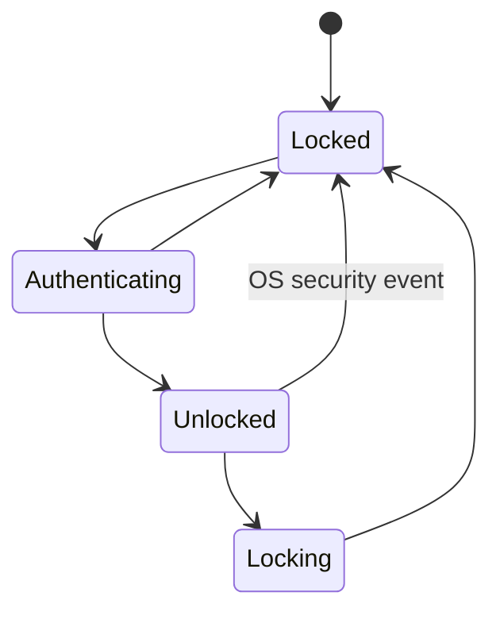
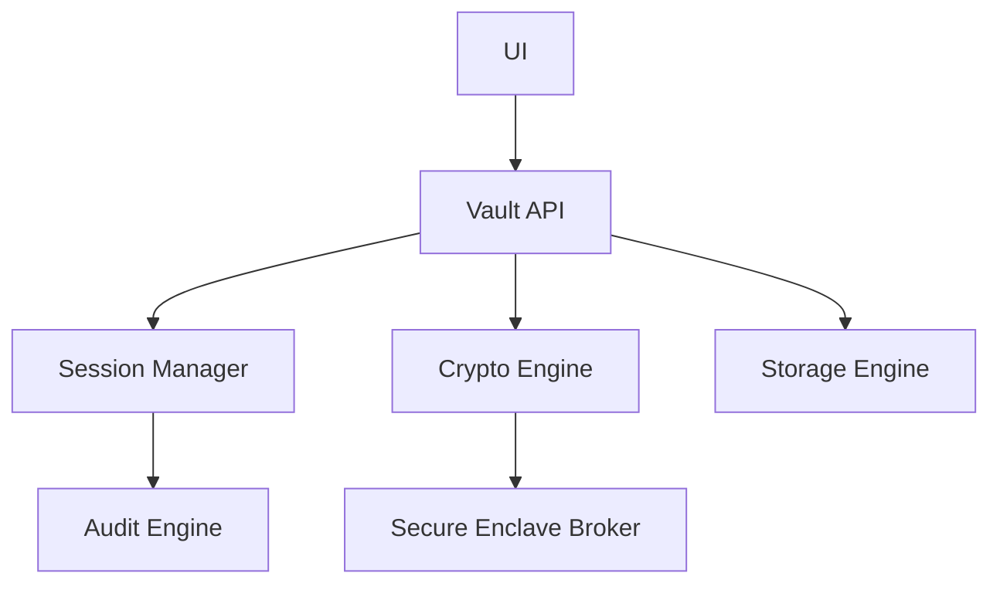

# RFC-0008 — Runtime Architecture & Session Manager

## Part 1 of 1 — Design Proposal

> Navigation: [RFC Home](./README.md) · [RFC Index](../README.md) · [Architecture Index](../../architecture/README.md)

---

# 1. Abstract

Defines the application runtime: process/module topology, the session lifecycle and session keys, inter-module boundaries, and the automatic-lock policy that ties authentication, storage, and memory together.

# 2. Status & Motivation

This RFC was introduced during the architecture consolidation of the BSV platform. It formalizes capabilities that were previously referenced by other RFCs but never specified. See the [Architecture Review](../../architecture/ARCHITECTURE-REVIEW.md).

# 3. Goals

- Define a single authoritative session lifecycle.
- Guarantee fail-secure transitions on every abnormal event.
- Isolate modules behind explicit, least-privilege interfaces.

# 4. Session Lifecycle

A session SHALL begin only after successful authentication (RFC-0004) and Secure Enclave authorization (RFC-0006).

A session SHALL end immediately on lock, sleep, screen lock, logout, crash, or timeout, destroying all session keys.

# 5. Module Topology

The runtime SHALL isolate UI, Crypto Engine, Storage Engine, and Audit behind explicit interfaces; UI SHALL NEVER perform cryptography or access the Secure Enclave directly.

# 6. Automatic Lock

The Lock Controller SHALL enforce immediate lock on OS security events and a configurable idle-timeout lock.

# 7. Fail-Secure

Any unexpected failure SHALL result in a locked vault with all plaintext destroyed.

# 8. Requirements

- RT-REQ-001 Session keys SHALL never persist.
- RT-REQ-002 Lock SHALL destroy all plaintext and session context.
- RT-REQ-003 UI SHALL communicate with crypto only through the Vault API.

# 9. Diagrams

### Session State Machine

### Runtime Module Topology

# 10. Cross-References

## Cross-References
- **Depends on:** [RFC-0004](../RFC-0004/README.md), [RFC-0005](../RFC-0005/README.md), [RFC-0009](../RFC-0009/README.md)
- **Consumed by:** [RFC-0014](../RFC-0014/README.md), [RFC-0016](../RFC-0016/README.md), [RFC-0020](../RFC-0020/README.md), [RFC-0022](../RFC-0022/README.md)
- **Uses:** [RFC-0006](../RFC-0006/README.md)
- **Used by:** [RFC-0014](../RFC-0014/README.md), [RFC-0016](../RFC-0016/README.md)
- **Implemented by:** _none_

# 11. Open Questions & Future Work

- Refine acceptance criteria with the implementation team.
- Add sequence-level detail as dependent RFCs stabilize.

---

> End of RFC-0008 Part 1
