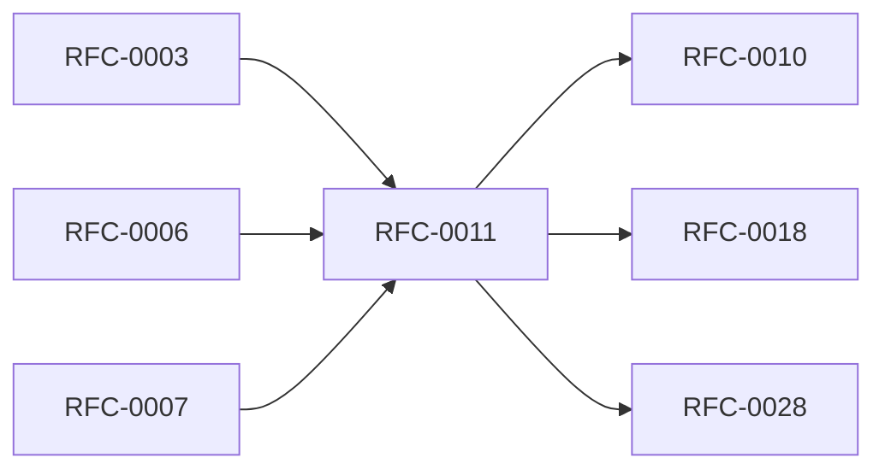

<!-- GENERATED by tools/generate_docs.py from tools/rfc_registry.py. Edit the registry and regenerate; do not hand-edit generated files. -->
# RFC-0011 — Recovery Protocol & Recovery Package
| Field | Value |
|---|---|
| RFC | RFC-0011 |
| Category | Data Protection |
| Status | Proposed |
| Origin | New proposal (architecture consolidation) |
| Parts | 1 |

## Abstract

Specifies the disaster-recovery package (one-time, printable, checksum-protected), the recovery protocol (CP-011), optional secret splitting, and recovery-abuse protection.

## Goals

- Enable deterministic recovery without weakening confidentiality.
- Keep recovery material outside the vault.
- Defend against recovery abuse.

## Parts

1. [Part 01 — Design Proposal](./part-01.md)

## Cross-References
- **Depends on:** [RFC-0003](../RFC-0003/README.md), [RFC-0006](../RFC-0006/README.md), [RFC-0007](../RFC-0007/README.md)
- **Consumed by:** [RFC-0010](../RFC-0010/README.md), [RFC-0018](../RFC-0018/README.md), [RFC-0028](../RFC-0028/README.md)
- **Uses:** _none_
- **Used by:** [RFC-0010](../RFC-0010/README.md)
- **Implemented by:** _none_

## Dependency Diagram

## Supporting Documents

- [References](./references.md)
- [Glossary](./glossary.md)
- [Diagrams](./diagrams/)
- [Images](./images/)

---

> Navigation: [RFC Index](../README.md) · [Architecture Index](../../architecture/README.md)
