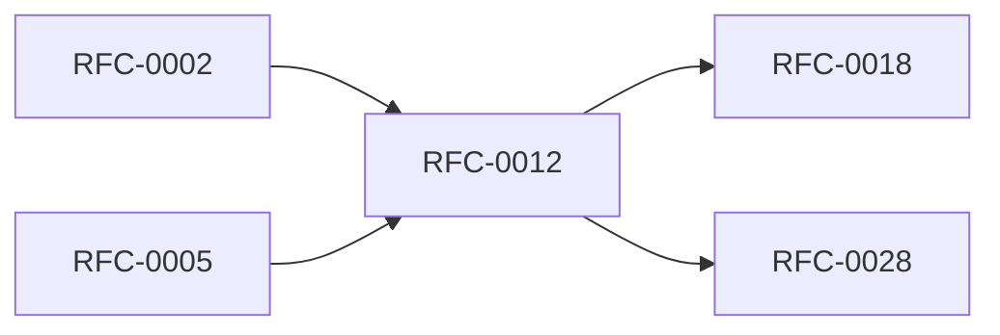

<!-- GENERATED by tools/generate_docs.py from tools/rfc_registry.py. Edit the registry and regenerate; do not hand-edit generated files. -->
# RFC-0012 — Audit Engine & Immutable Logging
| Field | Value |
|---|---|
| RFC | RFC-0012 |
| Category | Data Protection |
| Status | Proposed |
| Origin | New proposal (architecture consolidation) |
| Parts | 1 |

## Abstract

Defines the append-only, hash-chained audit log, audited event catalog, redaction rules, and future signature support — without ever recording plaintext secrets.

## Goals

- Provide immutable, verifiable security evidence.
- Never record secrets.
- Support enterprise compliance.

## Parts

1. [Part 01 — Design Proposal](./part-01.md)

## Cross-References
- **Depends on:** [RFC-0002](../RFC-0002/README.md), [RFC-0005](../RFC-0005/README.md)
- **Consumed by:** [RFC-0018](../RFC-0018/README.md), [RFC-0028](../RFC-0028/README.md)
- **Uses:** _none_
- **Used by:** _none_
- **Implemented by:** _none_

## Dependency Diagram

## Supporting Documents

- [References](./references.md)
- [Glossary](./glossary.md)
- [Diagrams](./diagrams/)
- [Images](./images/)

---

> Navigation: [RFC Index](../README.md) · [Architecture Index](../../architecture/README.md)
