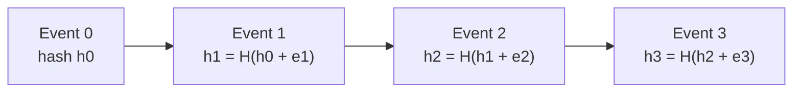

# RFC-0012 — Audit Engine & Immutable Logging

## Part 1 of 1 — Design Proposal

> Navigation: [RFC Home](./README.md) · [RFC Index](../README.md) · [Architecture Index](../../architecture/README.md)

---

# 1. Abstract

Defines the append-only, hash-chained audit log, audited event catalog, redaction rules, and future signature support — without ever recording plaintext secrets.

# 2. Status & Motivation

This RFC was introduced during the architecture consolidation of the BSV platform. It formalizes capabilities that were previously referenced by other RFCs but never specified. See the [Architecture Review](../../architecture/ARCHITECTURE-REVIEW.md).

# 3. Goals

- Provide immutable, verifiable security evidence.
- Never record secrets.
- Support enterprise compliance.

# 4. Audit Model

Audit records SHALL be append-only, hash-chained, and immutable; updates and deletes SHALL be forbidden.

# 5. Event Catalog

Audited events SHALL include unlock, lock, secret CRUD, export, import, backup, restore, recovery key generation/use, attachment view/export, and authentication failure.

# 6. Redaction

The redaction filter SHALL guarantee no passwords, keys, tokens, or decrypted values enter the log.

# 7. Requirements

- AU-REQ-001 Audit records SHALL be immutable.
- AU-REQ-002 Audit records SHALL never contain plaintext secrets.
- AU-REQ-003 Security-sensitive actions SHALL be audited.

# 8. Diagrams

### Audit Hash Chain

# 9. Cross-References

## Cross-References
- **Depends on:** [RFC-0002](../RFC-0002/README.md), [RFC-0005](../RFC-0005/README.md)
- **Consumed by:** [RFC-0018](../RFC-0018/README.md), [RFC-0028](../RFC-0028/README.md)
- **Uses:** _none_
- **Used by:** _none_
- **Implemented by:** _none_

# 10. Open Questions & Future Work

- Refine acceptance criteria with the implementation team.
- Add sequence-level detail as dependent RFCs stabilize.

---

> End of RFC-0012 Part 1
