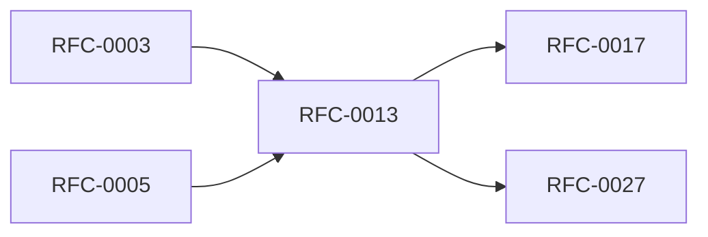

<!-- GENERATED by tools/generate_docs.py from tools/rfc_registry.py. Edit the registry and regenerate; do not hand-edit generated files. -->
# RFC-0013 — Migration Framework
| Field | Value |
|---|---|
| RFC | RFC-0013 |
| Category | Cryptography |
| Status | Proposed |
| Origin | New proposal (architecture consolidation) |
| Parts | 1 |

## Abstract

Extends RFC-0003 Part 10 into a full migration framework: crypto profile migration, schema migration, rolling migration, mixed-profile coexistence, and rollback.

## Goals

- Allow cryptographic and schema evolution without redesign.
- Guarantee atomic, resumable, reversible migration.
- Never expose plaintext during migration.

## Parts

1. [Part 01 — Design Proposal](./part-01.md)

## Cross-References
- **Depends on:** [RFC-0003](../RFC-0003/README.md), [RFC-0005](../RFC-0005/README.md)
- **Consumed by:** [RFC-0017](../RFC-0017/README.md), [RFC-0027](../RFC-0027/README.md)
- **Uses:** _none_
- **Used by:** _none_
- **Implemented by:** _none_

## Dependency Diagram

## Supporting Documents

- [References](./references.md)
- [Glossary](./glossary.md)
- [Diagrams](./diagrams/)
- [Images](./images/)

---

> Navigation: [RFC Index](../README.md) · [Architecture Index](../../architecture/README.md)
