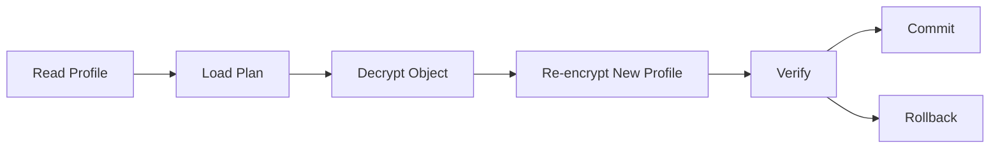

# RFC-0013 — Migration Framework

## Part 1 of 1 — Design Proposal

> Navigation: [RFC Home](./README.md) · [RFC Index](../README.md) · [Architecture Index](../../architecture/README.md)

---

# 1. Abstract

Extends RFC-0003 Part 10 into a full migration framework: crypto profile migration, schema migration, rolling migration, mixed-profile coexistence, and rollback.

# 2. Status & Motivation

This RFC was introduced during the architecture consolidation of the BSV platform. It formalizes capabilities that were previously referenced by other RFCs but never specified. See the [Architecture Review](../../architecture/ARCHITECTURE-REVIEW.md).

# 3. Goals

- Allow cryptographic and schema evolution without redesign.
- Guarantee atomic, resumable, reversible migration.
- Never expose plaintext during migration.

# 4. Migration Principles

Migration SHALL never expose plaintext to disk, SHALL create recovery checkpoints, and SHALL support rollback until commit.

# 5. Rolling Migration

Large vaults SHALL migrate object-by-object with per-object verification and commit for crash resilience.

# 6. Mixed Profiles

Multiple cryptographic profiles MAY coexist during migration.

# 7. Requirements

- MG-REQ-001 Migration SHALL be atomic per object.
- MG-REQ-002 Migration SHALL support rollback until commit.

# 8. Diagrams

### Migration Flow

# 9. Cross-References

## Cross-References
- **Depends on:** [RFC-0003](../RFC-0003/README.md), [RFC-0005](../RFC-0005/README.md)
- **Consumed by:** [RFC-0017](../RFC-0017/README.md), [RFC-0027](../RFC-0027/README.md)
- **Uses:** _none_
- **Used by:** _none_
- **Implemented by:** _none_

# 10. Open Questions & Future Work

- Refine acceptance criteria with the implementation team.
- Add sequence-level detail as dependent RFCs stabilize.

---

> End of RFC-0013 Part 1
