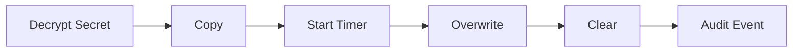

# RFC-0014 — Clipboard & Secure UI Interaction

## Part 1 of 1 — Design Proposal

> Navigation: [RFC Home](./README.md) · [RFC Index](../README.md) · [Architecture Index](../../architecture/README.md)

---

# 1. Abstract

Defines secure clipboard handling (timeout, overwrite, disable policy) and secure UI interaction (reveal, auto-hide, screen-capture awareness).

# 2. Status & Motivation

This RFC was introduced during the architecture consolidation of the BSV platform. It formalizes capabilities that were previously referenced by other RFCs but never specified. See the [Architecture Review](../../architecture/ARCHITECTURE-REVIEW.md).

# 3. Goals

- Bound clipboard exposure in time.
- Reduce on-screen exposure of secrets.

# 4. Clipboard Policy

Clipboard contents SHALL expire after a configurable timeout (default 30 s) and SHALL be overwritten before clearing; enterprise policy MAY disable the clipboard entirely.

# 5. Secure Views

Secrets SHALL be hidden by default with explicit reveal and auto-hide; the app SHALL NOT generate screenshots of secrets.

# 6. Requirements

- CB-REQ-001 Clipboard SHALL auto-clear after timeout.
- CB-REQ-002 Clipboard events SHALL be audited.

# 7. Diagrams

### Clipboard Flow

# 8. Cross-References

## Cross-References
- **Depends on:** [RFC-0002](../RFC-0002/README.md), [RFC-0009](../RFC-0009/README.md)
- **Consumed by:** [RFC-0016](../RFC-0016/README.md)
- **Uses:** [RFC-0008](../RFC-0008/README.md)
- **Used by:** _none_
- **Implemented by:** _none_

# 9. Open Questions & Future Work

- Refine acceptance criteria with the implementation team.
- Add sequence-level detail as dependent RFCs stabilize.

---

> End of RFC-0014 Part 1
