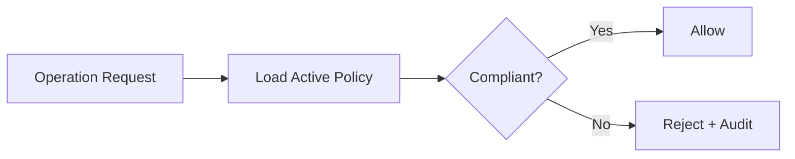

<!-- GENERATED by tools/generate_docs.py from tools/rfc_registry.py. Edit the registry and regenerate; do not hand-edit generated files. -->
# RFC-0015 — Policy Evaluation

> Part of [RFC-0015](../README.md).
