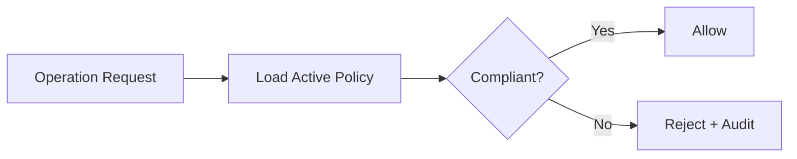

# RFC-0015 — Policy Engine

## Part 1 of 1 — Design Proposal

> Navigation: [RFC Home](./README.md) · [RFC Index](../README.md) · [Architecture Index](../../architecture/README.md)

---

# 1. Abstract

Defines a policy engine evaluating cryptographic, authentication, clipboard, export, and retention policies, with enterprise distribution and precedence rules.

# 2. Status & Motivation

This RFC was introduced during the architecture consolidation of the BSV platform. It formalizes capabilities that were previously referenced by other RFCs but never specified. See the [Architecture Review](../../architecture/ARCHITECTURE-REVIEW.md).

# 3. Goals

- Centralize policy evaluation.
- Enable enterprise policy distribution.
- Reject weak configurations.

# 4. Policy Domains

Policies MAY specify approved algorithms, minimum key lengths, clipboard behavior, export controls, lock timeouts, and retention.

# 5. Evaluation

Every sensitive operation SHALL be evaluated against active policy; weak or disallowed configurations SHALL be rejected.

# 6. Precedence

Enterprise policy SHALL take precedence over user preferences where configured.

# 7. Requirements

- PE-REQ-001 Weak algorithms SHALL be rejected by policy.
- PE-REQ-002 Enterprise policy SHALL be enforceable and auditable.

# 8. Diagrams

### Policy Evaluation

# 9. Cross-References

## Cross-References
- **Depends on:** [RFC-0002](../RFC-0002/README.md), [RFC-0007](../RFC-0007/README.md)
- **Consumed by:** [RFC-0018](../RFC-0018/README.md), [RFC-0023](../RFC-0023/README.md)
- **Uses:** _none_
- **Used by:** _none_
- **Implemented by:** _none_

# 10. Open Questions & Future Work

- Refine acceptance criteria with the implementation team.
- Add sequence-level detail as dependent RFCs stabilize.

---

> End of RFC-0015 Part 1
