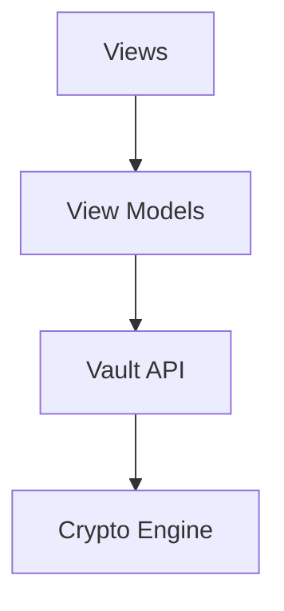

# RFC-0016 — User Interface Architecture

## Part 1 of 1 — Design Proposal

> Navigation: [RFC Home](./README.md) · [RFC Index](../README.md) · [Architecture Index](../../architecture/README.md)

---

# 1. Abstract

Defines the native macOS UI architecture, navigation model, secure rendering, and interaction patterns aligned with the security model.

# 2. Status & Motivation

This RFC was introduced during the architecture consolidation of the BSV platform. It formalizes capabilities that were previously referenced by other RFCs but never specified. See the [Architecture Review](../../architecture/ARCHITECTURE-REVIEW.md).

# 3. Goals

- Deliver a native, beautiful, secure-by-default experience.
- Keep the UI free of cryptographic responsibility.

# 4. UI Boundaries

The UI SHALL communicate only through the Vault API and SHALL never perform cryptography, key generation, or Secure Enclave access.

# 5. Secure Rendering

Sensitive fields SHALL be hidden by default and cleared from view state on lock.

# 6. Requirements

- UI-REQ-001 UI SHALL not hold plaintext beyond render lifetime.
- UI-REQ-002 UI SHALL clear sensitive view state on lock.

# 7. Diagrams

### UI Layering

# 8. Cross-References

## Cross-References
- **Depends on:** [RFC-0001](../RFC-0001/README.md), [RFC-0009](../RFC-0009/README.md), [RFC-0014](../RFC-0014/README.md)
- **Consumed by:** _none_
- **Uses:** [RFC-0008](../RFC-0008/README.md)
- **Used by:** _none_
- **Implemented by:** _none_

# 9. Open Questions & Future Work

- Refine acceptance criteria with the implementation team.
- Add sequence-level detail as dependent RFCs stabilize.

---

> End of RFC-0016 Part 1
