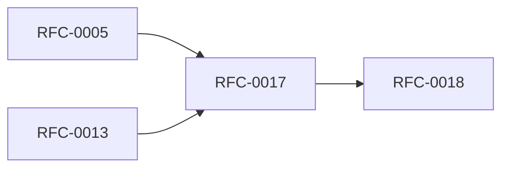

<!-- GENERATED by tools/generate_docs.py from tools/rfc_registry.py. Edit the registry and regenerate; do not hand-edit generated files. -->
# RFC-0017 — Synchronization Protocol
| Field | Value |
|---|---|
| RFC | RFC-0017 |
| Category | Enterprise |
| Status | Proposed |
| Origin | New proposal (architecture consolidation) |
| Parts | 1 |

## Abstract

Defines the optional (v2) end-to-end encrypted synchronization protocol: object-level sync, conflict resolution, capability negotiation, and zero server trust.

## Goals

- Enable optional multi-device sync without trusting the server.
- Resolve conflicts deterministically.

## Parts

1. [Part 01 — Design Proposal](./part-01.md)

## Cross-References
- **Depends on:** [RFC-0005](../RFC-0005/README.md), [RFC-0013](../RFC-0013/README.md)
- **Consumed by:** [RFC-0018](../RFC-0018/README.md)
- **Uses:** [RFC-0024](../RFC-0024/README.md)
- **Used by:** [RFC-0018](../RFC-0018/README.md)
- **Implemented by:** _none_

## Dependency Diagram

## Supporting Documents

- [References](./references.md)
- [Glossary](./glossary.md)
- [Diagrams](./diagrams/)
- [Images](./images/)

---

> Navigation: [RFC Index](../README.md) · [Architecture Index](../../architecture/README.md)
