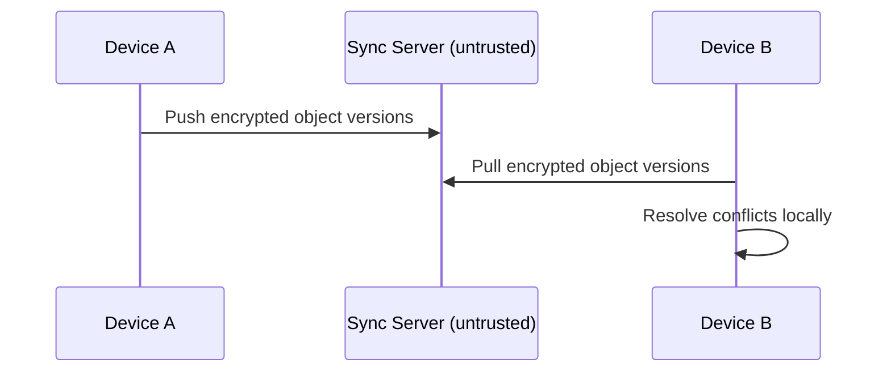

# RFC-0017 — Synchronization Protocol

## Part 1 of 1 — Design Proposal

> Navigation: [RFC Home](./README.md) · [RFC Index](../README.md) · [Architecture Index](../../architecture/README.md)

---

# 1. Abstract

Defines the optional (v2) end-to-end encrypted synchronization protocol: object-level sync, conflict resolution, capability negotiation, and zero server trust.

# 2. Status & Motivation

This RFC was introduced during the architecture consolidation of the BSV platform. It formalizes capabilities that were previously referenced by other RFCs but never specified. See the [Architecture Review](../../architecture/ARCHITECTURE-REVIEW.md).

# 3. Goals

- Enable optional multi-device sync without trusting the server.
- Resolve conflicts deterministically.

# 4. Trust Model

The synchronization server SHALL be treated as untrusted; it SHALL only store ciphertext and metadata required for transport.

# 5. Object Sync

Synchronization SHALL operate on immutable object versions using UUID references (RFC-0005).

# 6. Conflict Resolution

Conflicts SHALL be resolved deterministically with version vectors; future editions MAY use CRDTs.

# 7. Requirements

- SY-REQ-001 The sync server SHALL only ever see ciphertext.
- SY-REQ-002 Conflict resolution SHALL be deterministic.

# 8. Diagrams

### Synchronization Flow

# 9. Cross-References

## Cross-References
- **Depends on:** [RFC-0005](../RFC-0005/README.md), [RFC-0013](../RFC-0013/README.md)
- **Consumed by:** [RFC-0018](../RFC-0018/README.md)
- **Uses:** [RFC-0024](../RFC-0024/README.md)
- **Used by:** [RFC-0018](../RFC-0018/README.md)
- **Implemented by:** _none_

# 10. Open Questions & Future Work

- Refine acceptance criteria with the implementation team.
- Add sequence-level detail as dependent RFCs stabilize.

---

> End of RFC-0017 Part 1
