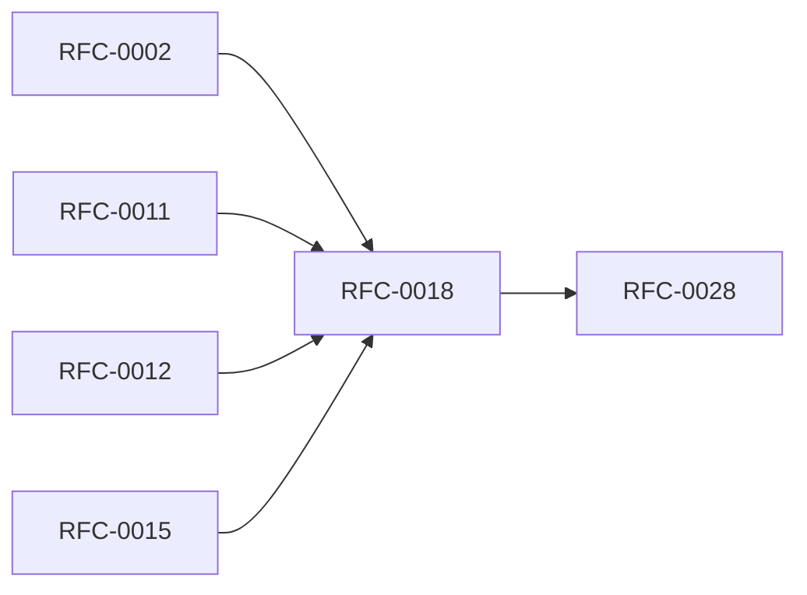

<!-- GENERATED by tools/generate_docs.py from tools/rfc_registry.py. Edit the registry and regenerate; do not hand-edit generated files. -->
# RFC-0018 — Enterprise Architecture & RBAC
| Field | Value |
|---|---|
| RFC | RFC-0018 |
| Category | Enterprise |
| Status | Proposed |
| Origin | New proposal (architecture consolidation) |
| Parts | 1 |

## Abstract

Defines enterprise capabilities: shared vaults, RBAC, approval workflows, SSO/SCIM, and administrative attribution — built on the policy, audit, and recovery subsystems.

## Goals

- Enforce least privilege across shared vaults.
- Make administrative actions attributable and auditable.

## Parts

1. [Part 01 — Design Proposal](./part-01.md)

## Cross-References
- **Depends on:** [RFC-0002](../RFC-0002/README.md), [RFC-0011](../RFC-0011/README.md), [RFC-0012](../RFC-0012/README.md), [RFC-0015](../RFC-0015/README.md)
- **Consumed by:** [RFC-0028](../RFC-0028/README.md)
- **Uses:** [RFC-0017](../RFC-0017/README.md)
- **Used by:** _none_
- **Implemented by:** _none_

## Dependency Diagram

## Supporting Documents

- [References](./references.md)
- [Glossary](./glossary.md)
- [Diagrams](./diagrams/)
- [Images](./images/)

---

> Navigation: [RFC Index](../README.md) · [Architecture Index](../../architecture/README.md)
