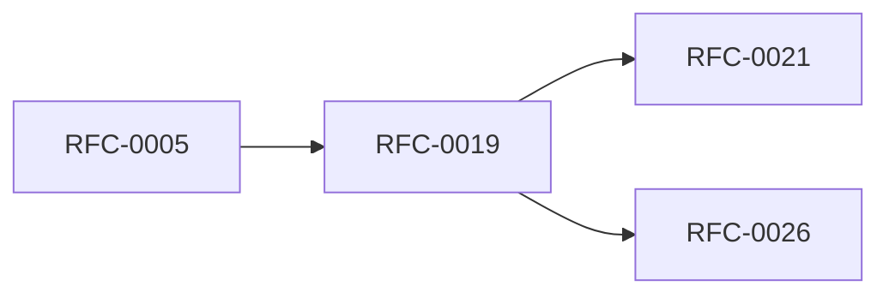

<!-- GENERATED by tools/generate_docs.py from tools/rfc_registry.py. Edit the registry and regenerate; do not hand-edit generated files. -->
# RFC-0019 — Storage Provider SDK & Provider Certification
| Field | Value |
|---|---|
| RFC | RFC-0019 |
| Category | Storage |
| Status | Proposed |
| Origin | New proposal (architecture consolidation) |
| Parts | 1 |

## Abstract

Formalizes the OSAL provider contract (RFC-0005 Part 7) into an SDK and a certification suite that every storage backend MUST pass.

## Goals

- Make storage backends interchangeable and verifiable.
- Define a conformance bar for providers.

## Parts

1. [Part 01 — Design Proposal](./part-01.md)

## Cross-References
- **Depends on:** [RFC-0005](../RFC-0005/README.md)
- **Consumed by:** [RFC-0021](../RFC-0021/README.md), [RFC-0026](../RFC-0026/README.md)
- **Uses:** _none_
- **Used by:** _none_
- **Implemented by:** _none_

## Dependency Diagram

## Supporting Documents

- [References](./references.md)
- [Glossary](./glossary.md)
- [Diagrams](./diagrams/)
- [Images](./images/)

---

> Navigation: [RFC Index](../README.md) · [Architecture Index](../../architecture/README.md)
