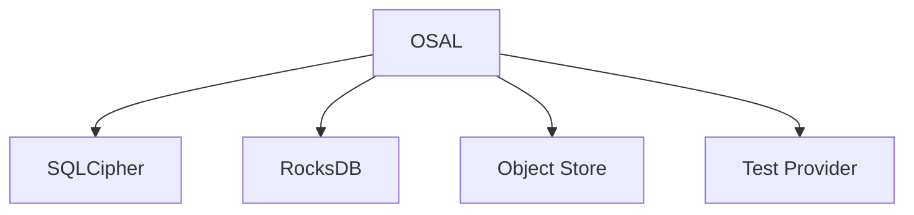

# RFC-0019 — Storage Provider SDK & Provider Certification

## Part 1 of 1 — Design Proposal

> Navigation: [RFC Home](./README.md) · [RFC Index](../README.md) · [Architecture Index](../../architecture/README.md)

---

# 1. Abstract

Formalizes the OSAL provider contract (RFC-0005 Part 7) into an SDK and a certification suite that every storage backend MUST pass.

# 2. Status & Motivation

This RFC was introduced during the architecture consolidation of the BSV platform. It formalizes capabilities that were previously referenced by other RFCs but never specified. See the [Architecture Review](../../architecture/ARCHITECTURE-REVIEW.md).

# 3. Goals

- Make storage backends interchangeable and verifiable.
- Define a conformance bar for providers.

# 4. Provider Contract

Every provider SHALL implement the OSAL interface and expose discoverable capabilities.

# 5. Certification

A provider SHALL NOT be considered supported until it passes the full certification suite (CRUD, transactions, recovery, streaming, integrity, performance).

# 6. Requirements

- SP-REQ-001 Providers SHALL implement identical interfaces.
- SP-REQ-002 Providers SHALL pass the certification suite.

# 7. Diagrams

### Provider Architecture

# 8. Cross-References

## Cross-References
- **Depends on:** [RFC-0005](../RFC-0005/README.md)
- **Consumed by:** [RFC-0021](../RFC-0021/README.md), [RFC-0026](../RFC-0026/README.md)
- **Uses:** _none_
- **Used by:** _none_
- **Implemented by:** _none_

# 9. Open Questions & Future Work

- Refine acceptance criteria with the implementation team.
- Add sequence-level detail as dependent RFCs stabilize.

---

> End of RFC-0019 Part 1
