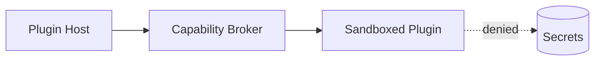

# RFC-0020 — Plugin Architecture

## Part 1 of 1 — Design Proposal

> Navigation: [RFC Home](./README.md) · [RFC Index](../README.md) · [Architecture Index](../../architecture/README.md)

---

# 1. Abstract

Defines a sandboxed plugin architecture with capability-scoped permissions, signed plugins, and a stable extension API that never exposes plaintext secrets.

# 2. Status & Motivation

This RFC was introduced during the architecture consolidation of the BSV platform. It formalizes capabilities that were previously referenced by other RFCs but never specified. See the [Architecture Review](../../architecture/ARCHITECTURE-REVIEW.md).

# 3. Goals

- Enable extensibility without expanding the trusted computing base.
- Sandbox and sign every plugin.

# 4. Isolation

Plugins SHALL run sandboxed with least-privilege, capability-scoped access and SHALL NEVER receive plaintext secrets unless explicitly and auditably authorized.

# 5. Signing

Plugins SHALL be signed and verified before load.

# 6. Requirements

- PL-REQ-001 Plugins SHALL be sandboxed and signed.
- PL-REQ-002 Plugin secret access SHALL be explicit and audited.

# 7. Diagrams

### Plugin Model

# 8. Cross-References

## Cross-References
- **Depends on:** [RFC-0002](../RFC-0002/README.md), [RFC-0008](../RFC-0008/README.md)
- **Consumed by:** _none_
- **Uses:** [RFC-0021](../RFC-0021/README.md)
- **Used by:** _none_
- **Implemented by:** _none_

# 9. Open Questions & Future Work

- Refine acceptance criteria with the implementation team.
- Add sequence-level detail as dependent RFCs stabilize.

---

> End of RFC-0020 Part 1
