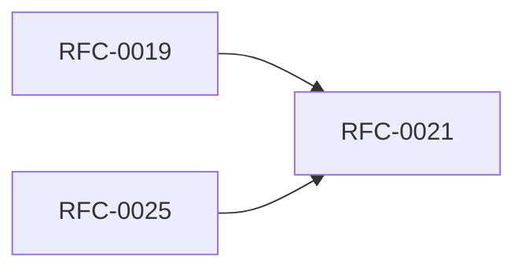

<!-- GENERATED by tools/generate_docs.py from tools/rfc_registry.py. Edit the registry and regenerate; do not hand-edit generated files. -->
# RFC-0021 — Developer SDK & Code Generation
| Field | Value |
|---|---|
| RFC | RFC-0021 |
| Category | Extensibility |
| Status | Proposed |
| Origin | New proposal (architecture consolidation) |
| Parts | 1 |

## Abstract

Defines the developer SDK surface, code-generation from the object model and API definitions, and versioning/compatibility policy.

## Goals

- Provide a stable, generated SDK aligned with the object model.
- Guarantee API compatibility across versions.

## Parts

1. [Part 01 — Design Proposal](./part-01.md)

## Cross-References
- **Depends on:** [RFC-0019](../RFC-0019/README.md), [RFC-0025](../RFC-0025/README.md)
- **Consumed by:** _none_
- **Uses:** _none_
- **Used by:** [RFC-0020](../RFC-0020/README.md)
- **Implemented by:** _none_

## Dependency Diagram

## Supporting Documents

- [References](./references.md)
- [Glossary](./glossary.md)
- [Diagrams](./diagrams/)
- [Images](./images/)

---

> Navigation: [RFC Index](../README.md) · [Architecture Index](../../architecture/README.md)
