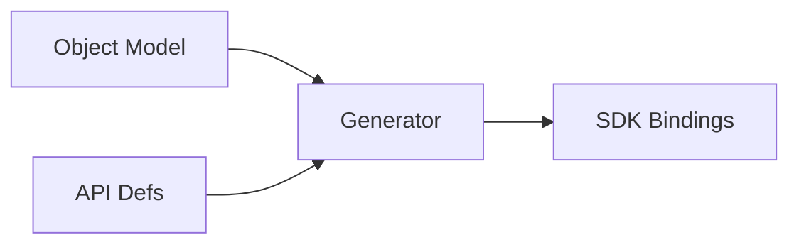

# RFC-0021 — Developer SDK & Code Generation

## Part 1 of 1 — Design Proposal

> Navigation: [RFC Home](./README.md) · [RFC Index](../README.md) · [Architecture Index](../../architecture/README.md)

---

# 1. Abstract

Defines the developer SDK surface, code-generation from the object model and API definitions, and versioning/compatibility policy.

# 2. Status & Motivation

This RFC was introduced during the architecture consolidation of the BSV platform. It formalizes capabilities that were previously referenced by other RFCs but never specified. See the [Architecture Review](../../architecture/ARCHITECTURE-REVIEW.md).

# 3. Goals

- Provide a stable, generated SDK aligned with the object model.
- Guarantee API compatibility across versions.

# 4. SDK Surface

The SDK SHALL expose vault, object, attachment, and search operations through stable, versioned interfaces.

# 5. Code Generation

Client bindings SHALL be generated from the object model (RFC-0025) and API definitions to prevent drift.

# 6. Requirements

- SDK-REQ-001 SDK interfaces SHALL be versioned.
- SDK-REQ-002 Bindings SHALL be generated, not hand-written, where feasible.

# 7. Diagrams

### Code Generation Pipeline

# 8. Cross-References

## Cross-References
- **Depends on:** [RFC-0019](../RFC-0019/README.md), [RFC-0025](../RFC-0025/README.md)
- **Consumed by:** _none_
- **Uses:** _none_
- **Used by:** [RFC-0020](../RFC-0020/README.md)
- **Implemented by:** _none_

# 9. Open Questions & Future Work

- Refine acceptance criteria with the implementation team.
- Add sequence-level detail as dependent RFCs stabilize.

---

> End of RFC-0021 Part 1
