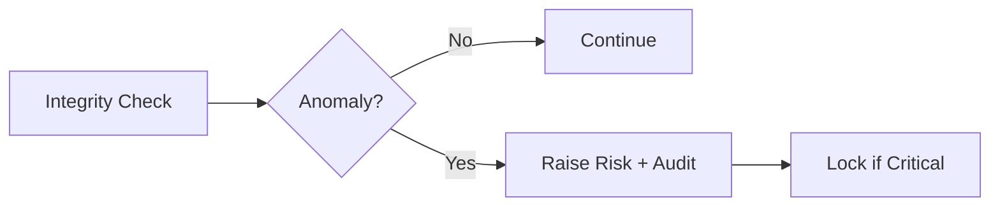

<!-- GENERATED by tools/generate_docs.py from tools/rfc_registry.py. Edit the registry and regenerate; do not hand-edit generated files. -->
# RFC-0022 — Runtime Monitor Flow

> Part of [RFC-0022](../README.md).
