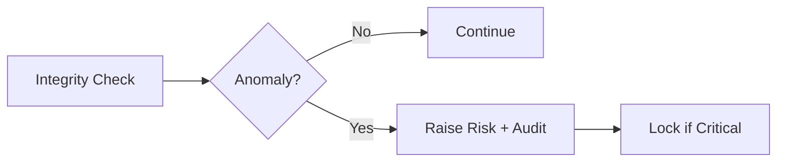

# RFC-0022 — Threat Detection & Runtime Monitor

## Part 1 of 1 — Design Proposal

> Navigation: [RFC Home](./README.md) · [RFC Index](../README.md) · [Architecture Index](../../architecture/README.md)

---

# 1. Abstract

Extends RFC-0003 Part 9 into a runtime monitor: integrity checks, debugger/injection detection, and defensive responses feeding the risk engine.

# 2. Status & Motivation

This RFC was introduced during the architecture consolidation of the BSV platform. It formalizes capabilities that were previously referenced by other RFCs but never specified. See the [Architecture Review](../../architecture/ARCHITECTURE-REVIEW.md).

# 3. Goals

- Detect abnormal runtime conditions.
- Preserve evidence and fail closed under attack.

# 4. Integrity Monitoring

The monitor SHALL verify executable and library integrity at startup and periodically at runtime.

# 5. Detection & Response

Confirmed debugger attachment or injection SHALL lock the vault, destroy sensitive buffers, and emit an audit event.

# 6. Requirements

- TD-REQ-001 Integrity failures SHALL invalidate the session.
- TD-REQ-002 Detection events SHALL be audited.

# 7. Diagrams

### Runtime Monitor Flow

# 8. Cross-References

## Cross-References
- **Depends on:** [RFC-0002](../RFC-0002/README.md), [RFC-0008](../RFC-0008/README.md)
- **Consumed by:** [RFC-0023](../RFC-0023/README.md), [RFC-0028](../RFC-0028/README.md)
- **Uses:** _none_
- **Used by:** _none_
- **Implemented by:** _none_

# 9. Open Questions & Future Work

- Refine acceptance criteria with the implementation team.
- Add sequence-level detail as dependent RFCs stabilize.

---

> End of RFC-0022 Part 1
