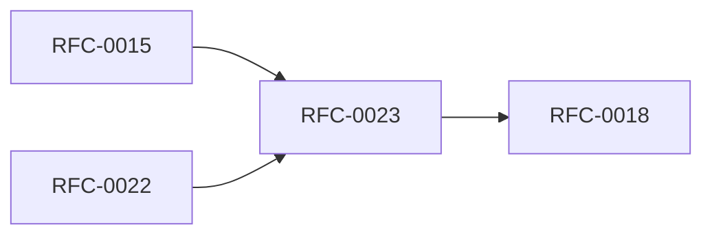

<!-- GENERATED by tools/generate_docs.py from tools/rfc_registry.py. Edit the registry and regenerate; do not hand-edit generated files. -->
# RFC-0023 — Risk Engine
| Field | Value |
|---|---|
| RFC | RFC-0023 |
| Category | Security |
| Status | Proposed |
| Origin | New proposal (architecture consolidation) |
| Parts | 1 |

## Abstract

Defines the per-session risk score, inputs, thresholds, and graduated responses (re-auth, hide, disable export, lock).

## Goals

- Quantify session risk continuously.
- Trigger graduated, policy-driven responses.

## Parts

1. [Part 01 — Design Proposal](./part-01.md)

## Cross-References
- **Depends on:** [RFC-0015](../RFC-0015/README.md), [RFC-0022](../RFC-0022/README.md)
- **Consumed by:** [RFC-0018](../RFC-0018/README.md)
- **Uses:** _none_
- **Used by:** _none_
- **Implemented by:** _none_

## Dependency Diagram

## Supporting Documents

- [References](./references.md)
- [Glossary](./glossary.md)
- [Diagrams](./diagrams/)
- [Images](./images/)

---

> Navigation: [RFC Index](../README.md) · [Architecture Index](../../architecture/README.md)
