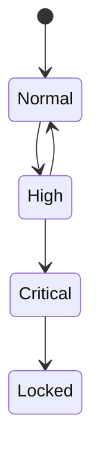

# RFC-0023 — Risk Engine

## Part 1 of 1 — Design Proposal

> Navigation: [RFC Home](./README.md) · [RFC Index](../README.md) · [Architecture Index](../../architecture/README.md)

---

# 1. Abstract

Defines the per-session risk score, inputs, thresholds, and graduated responses (re-auth, hide, disable export, lock).

# 2. Status & Motivation

This RFC was introduced during the architecture consolidation of the BSV platform. It formalizes capabilities that were previously referenced by other RFCs but never specified. See the [Architecture Review](../../architecture/ARCHITECTURE-REVIEW.md).

# 3. Goals

- Quantify session risk continuously.
- Trigger graduated, policy-driven responses.

# 4. Risk Scoring

Each session SHALL maintain a risk score derived from authentication failures, integrity events, and policy signals.

# 5. Responses

HIGH risk MAY require re-authentication and disable export; CRITICAL risk SHALL lock the vault.

# 6. Requirements

- RK-REQ-001 CRITICAL risk SHALL lock the vault.
- RK-REQ-002 Risk responses SHALL be policy-driven.

# 7. Diagrams

### Risk Levels

# 8. Cross-References

## Cross-References
- **Depends on:** [RFC-0015](../RFC-0015/README.md), [RFC-0022](../RFC-0022/README.md)
- **Consumed by:** [RFC-0018](../RFC-0018/README.md)
- **Uses:** _none_
- **Used by:** _none_
- **Implemented by:** _none_

# 9. Open Questions & Future Work

- Refine acceptance criteria with the implementation team.
- Add sequence-level detail as dependent RFCs stabilize.

---

> End of RFC-0023 Part 1
