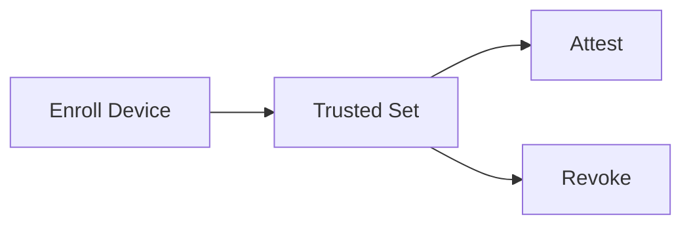

# RFC-0024 — Device Trust Set

## Part 1 of 1 — Design Proposal

> Navigation: [RFC Home](./README.md) · [RFC Index](../README.md) · [Architecture Index](../../architecture/README.md)

---

# 1. Abstract

Defines multi-device trust: enrollment, the trusted device set, attestation, and revocation for future multi-device and enterprise scenarios.

# 2. Status & Motivation

This RFC was introduced during the architecture consolidation of the BSV platform. It formalizes capabilities that were previously referenced by other RFCs but never specified. See the [Architecture Review](../../architecture/ARCHITECTURE-REVIEW.md).

# 3. Goals

- Manage a verifiable set of trusted devices.
- Support enrollment, attestation, and revocation.

# 4. Enrollment

New devices SHALL be enrolled through an authenticated ceremony producing a device-bound key (RFC-0006).

# 5. Revocation

Revoked devices SHALL lose the ability to unlock; revocation SHALL be audited.

# 6. Requirements

- DT-REQ-001 Device enrollment SHALL be authenticated.
- DT-REQ-002 Device revocation SHALL be audited.

# 7. Diagrams

### Device Trust Set

# 8. Cross-References

## Cross-References
- **Depends on:** [RFC-0006](../RFC-0006/README.md)
- **Consumed by:** [RFC-0017](../RFC-0017/README.md)
- **Uses:** _none_
- **Used by:** [RFC-0017](../RFC-0017/README.md)
- **Implemented by:** _none_

# 9. Open Questions & Future Work

- Refine acceptance criteria with the implementation team.
- Add sequence-level detail as dependent RFCs stabilize.

---

> End of RFC-0024 Part 1
