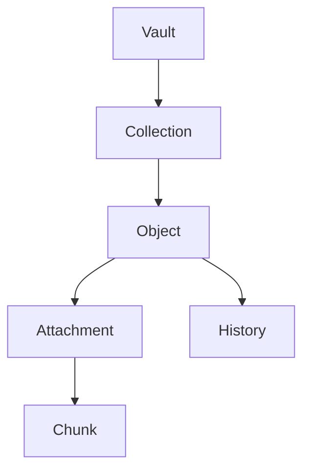

# RFC-0025 — Object Model

## Part 1 of 1 — Design Proposal

> Navigation: [RFC Home](./README.md) · [RFC Index](../README.md) · [Architecture Index](../../architecture/README.md)

---

# 1. Abstract

Consolidates the canonical object model referenced across RFC-0005: object categories, fields, versioning, relationships, and extensibility rules that require no schema redesign.

# 2. Status & Motivation

This RFC was introduced during the architecture consolidation of the BSV platform. It formalizes capabilities that were previously referenced by other RFCs but never specified. See the [Architecture Review](../../architecture/ARCHITECTURE-REVIEW.md).

# 3. Goals

- Provide one canonical object model for the platform.
- Support new object types without schema change.

# 4. Object Categories

The model SHALL support password, secure note, SSH key, certificate, credential, token, wallet, identity, license, and attachment types, and custom types without schema change.

# 5. Versioning & Relationships

Objects SHALL be immutable and versioned, referencing one another only by UUID.

# 6. Requirements

- OM-REQ-001 Objects SHALL be immutable and versioned.
- OM-REQ-002 New object types SHALL require no schema redesign.

# 7. Diagrams

### Object Graph

# 8. Cross-References

## Cross-References
- **Depends on:** [RFC-0005](../RFC-0005/README.md)
- **Consumed by:** [RFC-0021](../RFC-0021/README.md)
- **Uses:** _none_
- **Used by:** _none_
- **Implemented by:** _none_

# 9. Open Questions & Future Work

- Refine acceptance criteria with the implementation team.
- Add sequence-level detail as dependent RFCs stabilize.

---

> End of RFC-0025 Part 1
