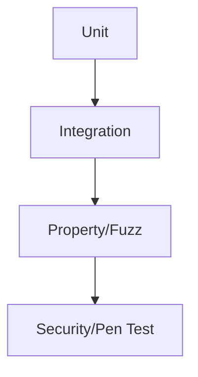

# RFC-0026 — Testing & Verification Specification

## Part 1 of 1 — Design Proposal

> Navigation: [RFC Home](./README.md) · [RFC Index](../README.md) · [Architecture Index](../../architecture/README.md)

---

# 1. Abstract

Defines the platform testing strategy: unit, integration, property, fuzz, crash-injection, penetration, and known-answer tests, plus verification traceability to security requirements.

# 2. Status & Motivation

This RFC was introduced during the architecture consolidation of the BSV platform. It formalizes capabilities that were previously referenced by other RFCs but never specified. See the [Architecture Review](../../architecture/ARCHITECTURE-REVIEW.md).

# 3. Goals

- Make every security requirement verifiable.
- Define release-blocking test gates.

# 4. Test Levels

The strategy SHALL include unit, integration, property-based, fuzz, crash-injection, penetration, and known-answer tests.

# 5. Traceability

Every security requirement (SR-*) SHALL map to at least one verification method and test case.

# 6. Gates

A release SHALL be blocked by any failing critical verification.

# 7. Requirements

- TE-REQ-001 Every SR SHALL have a verification method.
- TE-REQ-002 Critical test failures SHALL block release.

# 8. Diagrams

### Verification Pyramid

# 9. Cross-References

## Cross-References
- **Depends on:** [RFC-0002](../RFC-0002/README.md), [RFC-0003](../RFC-0003/README.md), [RFC-0019](../RFC-0019/README.md)
- **Consumed by:** [RFC-0027](../RFC-0027/README.md)
- **Uses:** _none_
- **Used by:** _none_
- **Implemented by:** _none_

# 10. Open Questions & Future Work

- Refine acceptance criteria with the implementation team.
- Add sequence-level detail as dependent RFCs stabilize.

---

> End of RFC-0026 Part 1
