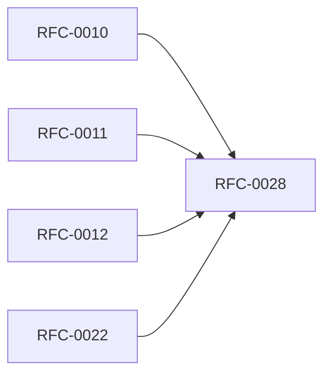

<!-- GENERATED by tools/generate_docs.py from tools/rfc_registry.py. Edit the registry and regenerate; do not hand-edit generated files. -->
# RFC-0028 — Incident Response & Operations
| Field | Value |
|---|---|
| RFC | RFC-0028 |
| Category | Security |
| Status | Proposed |
| Origin | New proposal (architecture consolidation) |
| Parts | 1 |

## Abstract

Defines operational runbooks and incident response: detection, containment, eradication, recovery, and post-incident review, leveraging audit, backup, and recovery subsystems.

## Goals

- Provide actionable incident response procedures.
- Tie operations to audit, backup, and recovery.

## Parts

1. [Part 01 — Design Proposal](./part-01.md)

## Cross-References
- **Depends on:** [RFC-0010](../RFC-0010/README.md), [RFC-0011](../RFC-0011/README.md), [RFC-0012](../RFC-0012/README.md), [RFC-0022](../RFC-0022/README.md)
- **Consumed by:** _none_
- **Uses:** _none_
- **Used by:** _none_
- **Implemented by:** _none_

## Dependency Diagram

## Supporting Documents

- [References](./references.md)
- [Glossary](./glossary.md)
- [Diagrams](./diagrams/)
- [Images](./images/)

---

> Navigation: [RFC Index](../README.md) · [Architecture Index](../../architecture/README.md)
