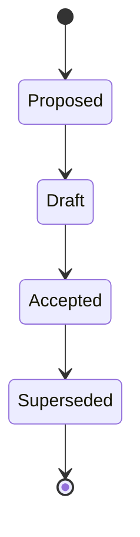

# RFC-0029 — Architecture Governance

## Part 1 of 1 — Design Proposal

> Navigation: [RFC Home](./README.md) · [RFC Index](../README.md) · [Architecture Index](../../architecture/README.md)

---

# 1. Abstract

Defines how the architecture evolves: the RFC process, ADR process, review boards, versioning, and change control for the repository.

# 2. Status & Motivation

This RFC was introduced during the architecture consolidation of the BSV platform. It formalizes capabilities that were previously referenced by other RFCs but never specified. See the [Architecture Review](../../architecture/ARCHITECTURE-REVIEW.md).

# 3. Goals

- Make architectural change controlled and traceable.
- Define review and approval gates.

# 4. RFC Process

New architecture SHALL be proposed via an RFC using the standard template and SHALL progress Proposed → Draft → Accepted.

# 5. ADR Process

Every permanent decision SHALL be recorded as an ADR capturing context, decision, and consequences.

# 6. Change Control

Changing an Accepted decision SHALL require a superseding RFC or ADR.

# 7. Requirements

- GV-REQ-001 Architectural changes SHALL follow the RFC process.
- GV-REQ-002 Decisions SHALL be recorded as ADRs.

# 8. Diagrams

### RFC Lifecycle

# 9. Cross-References

## Cross-References
- **Depends on:** [RFC-0002](../RFC-0002/README.md)
- **Consumed by:** _none_
- **Uses:** _none_
- **Used by:** _none_
- **Implemented by:** _none_

# 10. Open Questions & Future Work

- Refine acceptance criteria with the implementation team.
- Add sequence-level detail as dependent RFCs stabilize.

---

> End of RFC-0029 Part 1
